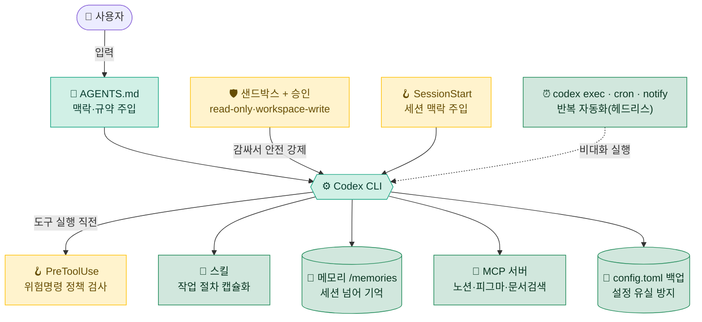

<div align="center">

# 🧰 Codex CLI 실전 셋업 툴킷

**OpenAI Codex CLI(`codex`) 설정 · AGENTS.md · 샌드박스 · 훅 · MCP · 자동화 실전 모음**

_단순 "이렇게 하세요"가 아니라 — **무엇을 / 왜 썼고 / 무엇이 좋아졌는지**까지._


### 🌐 [웹으로 보기 — 문서 사이트 바로가기](https://ihan0316.github.io/codex-code-toolkit/)

사이드바·검색·다이어그램이 있는 웹 문서로 따라 하기 편합니다. (저장소 markdown을 그대로 렌더 — 단일 소스)

저장소: [github.com/Ihan0316/codex-code-toolkit](https://github.com/Ihan0316/codex-code-toolkit)

</div>

---

> [!NOTE]
> 이 저장소는 특정 회사·프로젝트 코드가 아니라, **누구나 자기 환경에 그대로 옮겨 쓸 수 있는 일반화된 셋업 패턴**만 담았습니다.
> 개인 경로·자격증명·내부 식별자는 모두 placeholder(`<...>`)로 치환했습니다. 경로는 macOS/Linux 기준(`~/.codex/...`)이며, Windows는 **WSL2 안에서 동일**하게 동작합니다.

## 📑 목차

- [전체 그림 한 장](#️-전체-그림-한-장)
- [한눈에 보기](#-한눈에-보기)
- [왜 이런 셋업인가 — 설계 원칙 3가지](#-왜-이런-셋업인가--설계-원칙-3가지)
- [도입 순서 & 체감 효과](#-도입-순서--체감-효과)
- [디렉토리 구조](#-디렉토리-구조)
- [적용 전 주의 (보안)](#-적용-전-주의-보안)
- [라이선스 / 출처](#-라이선스--출처)

---

## 🗺️ 전체 그림 한 장

**AGENTS.md**가 맥락을 주입하면 **샌드박스+승인**이 Codex를 감싸 안전을 강제하고, **lifecycle 훅**이 실행 지점마다 개입합니다. 그 위로 **스킬·메모리·MCP**가 능력·기억·연결을, **codex exec·cron·notify**가 반복 자동화를, **config.toml 백업**이 보존을 맡습니다.



---

## 👀 한눈에 보기

| 영역 | 무엇 | 핵심 이득 | 문서 |
|---|---|---|---|
| 🛡️ **안전** | 샌드박스·승인·lifecycle 훅으로 감싸는 3중 안전장치 | 워크스페이스 밖 쓰기·네트워크는 승인, 위험 명령은 훅이 차단, 세션 맥락 자동 주입 | [01-sandbox-approvals](docs/01-sandbox-approvals.md) |
| 🧩 **스킬** | 작업별 전문 절차를 캡슐화한 `SKILL.md` 모듈 | "일일 보고 만들어줘" 한마디로 검증된 절차 적용 | [02-skills](docs/02-skills.md) |
| 🧠 **메모리 & AGENTS.md** | 계층형 `AGENTS.md` + `/memories` 영속 기억 | 세션이 바뀌어도 취향·결정·규약 유지 | [03-memory](docs/03-memory.md) |
| ⏰ **자동 루틴** | `codex exec`·cron·notify로 도는 헤드리스 작업 | 일간·주간 보고 자동, 턴 완료 외부 알림 | [04-automation](docs/04-automation.md) |
| 🔌 **MCP 서버** | 외부 도구 연결(노션·피그마·문서검색) | Codex가 실제 외부 시스템 직접 조작 | [05-mcp](docs/05-mcp.md) |
| 🧠 **추론 강도 & 컨텍스트** | `model_reasoning_effort` · `/compact` | 난제엔 깊게, 반복엔 얕게 — 토큰·정확도 조절 | [06-reasoning-context](docs/06-reasoning-context.md) |
| ⚙️ **설정·프로필·백업** | `config.toml` · 프로필 · 주간 백업 | 환경 재현성, 설정 유실 방지 | [07-config-backup](docs/07-config-backup.md) |
| 🔄 **양 머신 동기화** | 회사 Linux ↔ 집 Mac 설정 일치 | 어느 컴퓨터에서 켜도 같은 환경 | [08-sync-infra](docs/08-sync-infra.md) |
| 🤖 **서브에이전트** | 작업을 서브에이전트·`codex exec` 팬아웃으로 분산 | 대규모 리뷰/리서치/마이그레이션 병렬 | [09-subagents](docs/09-subagents.md) |
| 🧩 **확장 생태계** | skills·MCP·`/apps`·`/plugins` 설치·관리 | 도구를 묶음으로 켜고 끄기 | [10-ecosystem](docs/10-ecosystem.md) |
| 🗺️ **전체 인벤토리** | 무엇이 담기고 무엇이 빠졌나 (커버리지 맵) | "전부 담겼나"에 대한 답 | [11-inventory](docs/11-inventory.md) |

> [!TIP]
> 처음이라면 → **[00. 빠른 시작](docs/00-quickstart.md)** 부터 보세요. 10분이면 핵심 3개(AGENTS.md·샌드박스·메모리)를 켤 수 있습니다.

---

## 💡 왜 이런 셋업인가 — 설계 원칙 3가지

Codex는 기본만 써도 강력하지만, **반복 업무·실수 방지·맥락 유지**는 직접 손봐야 합니다.

<table>
<tr>
<td width="33%" valign="top">

### 1️⃣ 실수는 시스템이 막는다

사람의 주의력에 기대지 않습니다. 워크스페이스 밖 쓰기·네트워크는 **샌드박스가 기본 차단**하고, 위험한 명령은 **PreToolUse 훅이 자동 검사**합니다.

</td>
<td width="33%" valign="top">

### 2️⃣ 맥락은 기억하게 만든다

매번 "나는 이런 사람이고 이 프로젝트는…"을 다시 설명하지 않도록 **AGENTS.md 계층 · `/memories` · SessionStart 훅**으로 자동 주입.

</td>
<td width="33%" valign="top">

### 3️⃣ 반복은 자동화한다

일간/주간 보고, 설정 백업을 **`codex exec` + cron**에 위임. 안 하면 서서히 망가지는 일을 시스템에 맡깁니다.

</td>
</tr>
</table>

---

## 🚀 도입 순서 & 체감 효과

> 위에서부터 차례로. 앞 3개만 켜도 체감이 확 바뀝니다.

| 순서 | 항목 | 체감 효과 | 난이도 | 문서 |
|:---:|---|:---:|:---:|---|
| 1 | AGENTS.md 글로벌 지침 | ⭐⭐⭐ | 🟢 쉬움 | [00](docs/00-quickstart.md) |
| 2 | 샌드박스·승인 프리셋 (Read Only → Auto) | ⭐⭐⭐ | 🟢 쉬움 | [01](docs/01-sandbox-approvals.md) |
| 3 | 메모리 & AGENTS.md 계층 | ⭐⭐⭐ | 🟡 중간 | [03](docs/03-memory.md) |
| 4 | PreToolUse 위험명령 훅 | ⭐⭐ | 🟡 중간 | [01](docs/01-sandbox-approvals.md) |
| 5 | SessionStart 컨텍스트 훅 | ⭐⭐ | 🟡 중간 | [01](docs/01-sandbox-approvals.md) |
| 6 | 스킬 설치 | ⭐⭐ | 🟢 쉬움 | [02](docs/02-skills.md) |
| 7 | 자동 보고·백업 (codex exec·cron) | ⭐⭐ | 🟡 중간 | [04](docs/04-automation.md) · [07](docs/07-config-backup.md) |
| 8 | MCP 연결 | ⭐⭐ | 🟡 중간 | [05](docs/05-mcp.md) |
| 9 | 추론 강도 조절 | ⭐ | 🟢 쉬움 | [06](docs/06-reasoning-context.md) |
| 10 | 양 머신 동기화 | ⭐ | 🔴 어려움 | [08](docs/08-sync-infra.md) |

---

## 📁 디렉토리 구조

```
codex-code-toolkit/
├── README.md                     # 이 파일 — 전체 지도
├── docs/                         # 영역별 상세 문서 (왜 / 무엇 / 장점)
│   ├── 00-quickstart.md          #  ↳ 10분 빠른 시작
│   ├── 01-sandbox-approvals.md   #  ↳ 샌드박스·승인·훅 — 안전장치
│   ├── 02-skills.md              #  ↳ 스킬 — 작업 절차 캡슐화
│   ├── 03-memory.md              #  ↳ 메모리 & AGENTS.md
│   ├── 04-automation.md          #  ↳ codex exec·cron·notify 자동 루틴
│   ├── 05-mcp.md                 #  ↳ 외부 시스템 연결
│   ├── 06-reasoning-context.md   #  ↳ 추론 강도 & 컨텍스트 관리
│   ├── 07-config-backup.md       #  ↳ config·프로필·백업
│   ├── 08-sync-infra.md          #  ↳ 양 머신 동기화 패턴
│   ├── 09-subagents.md           #  ↳ 서브에이전트 & 병렬 실행
│   ├── 10-ecosystem.md           #  ↳ 확장 생태계 (skills·MCP·apps·plugins)
│   └── 11-inventory.md           #  ↳ 전체 인벤토리 & 커버리지 맵
└── examples/                     # 복붙해서 바로 쓰는 산티타이즈 예제
    ├── config.toml               # 샌드박스·승인·MCP·훅 등록 예시
    ├── AGENTS.md.example         # 글로벌 지침 템플릿
    ├── notify.py                 # 턴 완료 외부 알림 핸들러
    ├── backup-codex-config.sh    # 주간 백업 스크립트
    ├── hooks/                    # 훅 스크립트 (guard-bash.py·session-context.sh·hooks.json)
    ├── skills/                   # SKILL.md 예제 (daily-report)
    ├── prompts/                  # 커스텀 프롬프트 예 (deprecated 안내)
    └── scheduled-tasks/          # cron 루틴 정의 예시
```

---

## 🔐 적용 전 주의 (보안)

> [!WARNING]
> - 이 저장소의 예제에는 **실제 토큰·노션 ID·회사/프로젝트명이 전혀 없습니다.** 본인 환경에 옮길 때 `<...>` placeholder만 채우세요.
> - **`~/.codex/auth.json`(자격증명)은 절대 git에 커밋하지 마세요.** 머신마다 `codex` 최초 실행 후 **Sign in with ChatGPT**(또는 headless용 `CODEX_API_KEY` 환경변수)로 발급받는 것이 정석입니다.
> - MCP 서버 토큰은 config에 직접 쓰지 말고 **환경변수로**(`bearer_token_env_var` / `env_vars`) 참조하세요.
> - 훅은 임의 코드를 실행합니다. 남의 훅을 그대로 쓰기 전에 **내용을 읽고 이해하세요.** 프로젝트 훅은 **신뢰된 디렉터리에서만** 로드됩니다.

---

## 📜 라이선스 / 출처

- 라이선스: **[MIT](LICENSE)** — 직접 작성한 훅·문서·설정 예제는 자유롭게 가져다 쓰세요.
- **Codex CLI는 OpenAI 제품입니다** — 소스 [`openai/codex`](https://github.com/openai/codex), 공식 문서 [developers.openai.com/codex](https://developers.openai.com/codex). 본 툴킷은 비공식 한국어 셋업 가이드이며, 세부 동작은 **Codex 버전에 따라 다를 수 있습니다** — `codex --help`로 확인하세요.
- 외부 스킬/MCP 서버는 각 출처의 라이선스를 따릅니다. 문서에 출처를 명시했습니다.

<div align="center">

---

**[📖 빠른 시작으로 →](docs/00-quickstart.md)**

</div>
