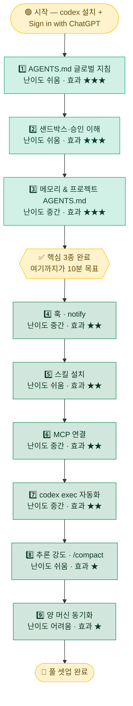

# 🚀 00. 빠른 시작

Codex CLI를 처음 깔았거나, 이 툴킷을 자기 환경에 옮기려는 사람을 위한 **최소 경로**입니다. 전부 다 켤 필요는 없습니다. 위에서부터 순서대로, **앞 3개만 켜도 매일의 체감이 확 바뀝니다.**

> [!NOTE]
> 이 문서는 "무엇을 어떤 순서로 켜면 가장 빠르게 효과를 보는가"에만 집중합니다. 각 항목의 상세 원리·옵션·실패 사례는 링크된 개별 문서에서 다룹니다. 여기서는 **10분 안에 핵심 3개를 켜는 것**이 목표입니다.

---

## 🧭 전체 흐름 한눈에

아래 순서는 **체감 효과가 큰 것 → 작은 것**, **쉬운 것 → 어려운 것** 순으로 정렬되어 있습니다. 숫자가 작을수록 먼저 켜는 것을 권장합니다.



> [!TIP]
> 위 다이어그램에서 **에메랄드색(1~3)** 이 "꼭 켜야 하는 핵심"이고, **초록색(4~9)** 은 "필요할 때 하나씩 추가"입니다. 노란색 게이트(`핵심 3종 완료`)까지만 도달해도 일상 작업의 대부분이 개선됩니다.

---

## 0️⃣ 전제

시작 전에 아래 세 가지만 확인합니다.

- **codex 설치** — 아래 셋 중 편한 방법 하나
- **Sign in with ChatGPT** — `codex` 첫 실행 시 브라우저 로그인(Plus/Pro/Business/Edu/Enterprise). headless·CI라면 `CODEX_API_KEY` 환경변수도 가능
- **글로벌 설정 폴더 위치 확인** — `~/.codex/`

```bash
# 셋 중 하나 (본인 환경에 맞게)
curl -fsSL https://chatgpt.com/codex/install.sh | sh   # 공식 설치 스크립트
npm install -g @openai/codex                            # npm
brew install --cask codex                               # Homebrew (macOS)
```

| OS | 글로벌 설정 폴더 경로 | 예시 |
|---|---|---|
| 🍎 **macOS** / 🐧 **Linux** | `~/.codex/` | `/home/<USER>/.codex/` |
| 🪟 **Windows** | WSL2 안에서 `~/.codex/` | WSL2 배포판 홈의 `~/.codex/` |

> [!IMPORTANT]
> 이 폴더는 Codex가 **모든 프로젝트에 공통으로 읽어 들이는 글로벌 영역**입니다(`CODEX_HOME`, 기본 `~/.codex`). 앞으로 나오는 `~/.codex/...` 경로는 전부 이 폴더 기준입니다. 폴더가 아직 없다면 `codex`를 한 번 실행하면 자동 생성됩니다.

> [!WARNING]
> Windows 11은 **네이티브가 아니라 WSL2 경유**가 기본입니다. 이 툴킷의 경로·훅 스크립트는 전부 macOS/Linux(그리고 WSL2 안)를 전제로 하며, 자동화 스크립트는 **bash/python**입니다(PowerShell 아님).

<details>
<summary>📂 폴더가 안 보이거나 경로를 모를 때</summary>

- `.`으로 시작하는 폴더는 숨김 처리됩니다. macOS Finder에서는 <kbd>Cmd</kbd>+<kbd>Shift</kbd>+<kbd>.</kbd> 로 숨김 파일을 켤 수 있습니다.
- 터미널(WSL2 포함)에서는 다음으로 경로를 확인합니다.

```bash
echo "${CODEX_HOME:-$HOME/.codex}"
ls -la ~/.codex
```

- 주요 파일: `config.toml`(설정), `AGENTS.md`(글로벌 지침), `auth.json`(자격증명 — **절대 커밋 금지**), `history.jsonl`, `sessions/`, `prompts/`.

</details>

---

## 1️⃣ 가장 먼저 — 글로벌 지침(AGENTS.md)

`~/.codex/AGENTS.md` 에 **"나는 누구이고, 어떻게 답해줬으면 좋겠는지"** 를 적습니다. 이 파일은 모든 세션 시작마다 자동으로 조립·주입되는 시스템 프롬프트 역할을 합니다.

→ [examples/AGENTS.md.example](../examples/AGENTS.md.example) 복사 후 본인에 맞게 수정하세요.

```bash
# 예시: 템플릿을 글로벌 위치로 복사 (경로는 본인 환경에 맞게)
cp <repo>/examples/AGENTS.md.example ~/.codex/AGENTS.md
```

프로젝트 안에서는 슬래시 명령 `/init` 으로 현재 디렉터리에 `AGENTS.md` scaffold를 바로 만들 수도 있습니다.

**효과**: 매 대화마다 "한국어로 답해줘", "내 환경은 WSL2야"를 반복할 필요가 없어집니다. 한 번 적어두면 모든 세션이 그 맥락 위에서 시작합니다.

> [!TIP]
> 처음부터 완벽하게 쓰려 하지 마세요. **언어·환경·답변 톤** 세 줄만 적어도 충분히 효과적입니다. 쓰다 보면 "이건 매번 설명하네" 싶은 것이 보이는데, 그때마다 한 줄씩 추가하는 방식이 가장 오래갑니다.

<details>
<summary>✍️ 어떤 것을 적으면 좋은가 — 예시 항목</summary>

- **언어**: "모든 자연어 출력은 한국어로."
- **환경**: "macOS / WSL2, bash, 한글 경로 혼재."
- **응답 스타일**: "짧고 명확하게, 불필요한 자평 금지."
- **역할/배경**: "나는 컴퓨터 비전 백그라운드의 주니어 개발자."
- **금지 사항**: "비가역 작업(삭제·강제 푸시)은 먼저 확인받을 것."

이 항목들은 곧 등장할 **메모리 & 프로젝트 AGENTS.md(3번)** 과 함께 쓰면 효과가 배가됩니다. 글로벌 `~/.codex/AGENTS.md`는 "변하지 않는 나의 기본값", 프로젝트 `AGENTS.md`는 "레포별로 쌓이는 규약"을 담당합니다.

</details>

---

## 2️⃣ 샌드박스·승인 이해하기

Codex는 **샌드박스 + 승인**이라는 안전 계층을 항상 켠 채로 실행합니다. 이걸 이해하는 것만으로도 "왜 편집이 막히지?", "왜 자꾸 물어보지?"가 사라지고, 상황에 맞는 프리셋을 고를 수 있게 됩니다.

→ [01-sandbox-approvals.md](01-sandbox-approvals.md) 에서 프리셋·플래그·훅을 통째로 다룹니다.

두 개의 대표 프리셋만 기억하면 됩니다. TUI에서 슬래시 명령 `/permissions`(구 `/approvals`)로 언제든 전환할 수 있습니다.

| 프리셋 | 무엇을 하나 | 대응 설정 |
|---|---|---|
| 🔒 **Read Only** | 읽기·질문만. 편집·실행·네트워크는 승인 필요 | `approval_policy="untrusted"` + `sandbox_mode="read-only"` |
| ⚙️ **Auto** | 워크스페이스 안 읽기·편집·명령은 자동, 밖·네트워크는 승인 | `approval_policy="on-request"` + `sandbox_mode="workspace-write"` |

**효과**: 낯선 레포는 **Read Only**로 안전하게 둘러보고, 신뢰하는 내 프로젝트는 **Auto**로 승격해 승인 피로를 줄입니다.

> [!TIP]
> Codex는 보수적으로 시작합니다. 디렉터리를 신뢰하기 전(onboarding 또는 `/permissions` → **"Trust this directory"**)까지는 read-only입니다. 신뢰하면 Auto로 올라갑니다. CLI에서는 `codex --full-auto`(= `workspace-write` + `on-request`)가 편의 조합입니다.

> [!WARNING]
> **Full Access**(전체 디스크·네트워크, 프롬프트 없음)나 `--dangerously-bypass-approvals-and-sandbox`(별칭 `--yolo`)는 안전 경계를 모두 제거합니다. Docker 등 자체 격리 환경이 아니라면 쓰지 마세요.

---

## 3️⃣ 메모리 켜기 + 프로젝트 AGENTS.md

두 가지가 함께 갑니다.

- **메모리**: 슬래시 명령 `/memories` 로 세션을 넘어 취향·결정을 기억하도록 설정합니다. 어제 내린 결정, 반복되는 규칙을 매번 다시 설명하지 않아도 됩니다.
- **프로젝트 AGENTS.md**: 레포 루트(또는 하위 디렉터리)에 `AGENTS.md`를 두면 그 프로젝트의 제약·규약이 팀과 함께 코드로 커밋됩니다. Codex는 git 루트→cwd 방향으로 각 층의 파일을 **이어 붙이고, 깊은 디렉터리를 더 우선**합니다.

→ [03-memory.md](03-memory.md)

**효과**: "이 레포는 permissive 라이선스만", "데이터셋 호칭은 이렇게" 같은 규약이 세션·팀원을 넘어 유지됩니다. 글로벌 지침(1번)과 역할이 나뉩니다 — 글로벌은 나, 프로젝트 AGENTS.md는 레포.

> [!TIP]
> 프로젝트 규약은 "큰 문서 하나"가 아니라 **필요한 디렉터리마다 짧은 `AGENTS.md`** 로 나누면, 가장 구체적인 규칙이 그 자리에서 우선 적용됩니다. 합산 크기는 기본 **32 KiB**(`project_doc_max_bytes`)에서 잘리니 장황함은 피하세요.

<details>
<summary>🧠 무엇을 적고, 무엇을 적지 말아야 하나</summary>

**적으면 좋은 것**

- 반복되는 결정 (예: "배포 모델은 X로 확정", "라이브러리는 permissive 라이선스만")
- 프로젝트 고유 제약 (경로, 데이터셋 호칭 규칙, 외부 시스템 ID 등)
- 사용자 정정 패턴 (분류가 어긋났을 때의 올바른 규칙)

**적지 말아야 할 것**

- 자격증명·토큰·긴 해시 ID (평문 파일입니다)
- 자주 바뀌는 휘발성 상태 (오늘의 진행률 등 — 일일 보고로)

> [!IMPORTANT]
> 프로젝트 `AGENTS.md`는 **코드와 함께 커밋되어 팀에 공유**됩니다. 공개 저장소라면 개인정보·내부 식별자를 placeholder(`<...>`)로 치환하세요. `auth.json`은 어떤 경우에도 커밋하지 않습니다.

</details>

---

## 4️⃣ (선택) 훅 · notify

같은 "개입 지점"이지만 목적이 다릅니다.

- **훅(`[hooks]`)**: `PreToolUse` 같은 라이프사이클 이벤트에서 스크립트를 실행해 **위험 명령을 차단**하거나 컨텍스트를 주입합니다. → [examples/hooks/guard-bash.py](../examples/hooks/guard-bash.py) 를 `PreToolUse`에 연결.
- **notify**: 턴이 끝나면(`agent-turn-complete`) 외부 프로그램에 JSON을 넘겨 **데스크톱 알림**을 띄웁니다. → [examples/notify.py](../examples/notify.py).

→ 훅은 [01-sandbox-approvals.md](01-sandbox-approvals.md), notify는 [04-automation.md](04-automation.md).

> [!WARNING]
> 훅은 **임의 코드를 실행**합니다. 남이 만든 훅을 등록하기 전에 반드시 **내용을 직접 읽고 무엇을 차단/허용하는지 이해**하세요. 이 툴킷의 예제 훅도 마찬가지입니다.

> [!NOTE]
> 훅 시스템은 `notify`보다 신규·문서화가 덜 된 편입니다. 본인 Codex 버전에서 `codex --help` 또는 슬래시 `/hooks`로 지원 여부를 먼저 확인하세요. (버전에 따라 다를 수 있음)

---

## 5️⃣ (선택) 필요한 스킬만 설치

문서·보고·시각화 등 **자주 하는 작업**이 있으면 해당 스킬을 `.agents/skills/<이름>/SKILL.md` (프로젝트) 또는 `~/.agents/skills/` (사용자)에 둡니다. 스킬은 "검증된 작업 절차"를 캡슐화한 모듈이라, 한마디 지시로 일관된 결과를 얻습니다. 슬래시 `/skills`로 목록을 봅니다.

→ [examples/skills/daily-report/SKILL.md](../examples/skills/daily-report/SKILL.md) · [02-skills.md](02-skills.md)

> [!TIP]
> 모든 스킬을 한꺼번에 깔 필요는 없습니다. **실제로 자주 하는 작업부터** 하나씩 추가하세요. 안 쓰는 스킬이 많아지면 오히려 어떤 스킬이 언제 발동되는지 파악이 어려워집니다.

---

## 6️⃣ (선택) MCP 연결

외부 도구·데이터소스(문서 검색, Figma 등)를 Codex에 물리려면 MCP 서버를 연결합니다. CLI 한 줄이면 `~/.codex/config.toml`에 기록됩니다.

```bash
codex mcp add context7 -- npx -y @upstash/context7-mcp   # stdio 서버
codex mcp list                                            # 구성된 서버 확인
```

→ [05-mcp.md](05-mcp.md) (구성된 툴은 슬래시 `/mcp`로 확인)

> [!TIP]
> 필요한 서버만 켜세요. 스타트업 타임아웃(`startup_timeout_sec`, 기본 10초)이 있는 서버를 여러 개 물리면 세션 시작이 느려질 수 있습니다.

---

## 7️⃣ (선택) codex exec 자동화

`codex exec`는 **비대화(headless)** 실행입니다. 진행상황은 stderr, **최종 메시지만 stdout**으로 나와 파이프·리다이렉트·cron에 딱 맞습니다. 승인은 항상 `never`입니다.

```bash
codex exec "리포지토리 구조 요약하고 위험한 5곳 나열"
npm test 2>&1 | codex exec "실패한 테스트 요약하고 수정안 제시"
```

→ [04-automation.md](04-automation.md)

> [!NOTE]
> `codex exec`에서는 `--full-auto`가 제거되었습니다. 쓰기가 필요하면 `--sandbox workspace-write`를 명시하세요.

---

## 8️⃣ (선택) 추론 강도 · /compact

긴 세션에서 토큰과 지연을 관리하는 두 손잡이입니다.

- **추론 강도** `model_reasoning_effort`(`minimal|low|medium|high|xhigh`): 낮추면 토큰·지연 절감, 높이면 난제 정확도↑. 슬래시 `/model`에서 전환.
- **`/compact`**: 대화를 요약해 토큰을 회수. 자동 압축은 `model_auto_compact_token_limit`.

→ [06-reasoning-context.md](06-reasoning-context.md)

> [!TIP]
> 쉬운 반복 작업은 `low`, 어려운 설계·디버깅은 `high`로 그때그때 바꾸는 것이 가장 경제적입니다. 항상 `xhigh`로 두면 토큰만 태웁니다.

---

## 9️⃣ (선택) 양 머신 동기화

두 대 이상에서 같은 셋업을 쓰려면 `~/.codex/`의 **버전 관리 가능한 부분만** 동기화합니다.

→ [08-sync-infra.md](08-sync-infra.md)

> [!CAUTION]
> `auth.json`(자격증명), `history.jsonl`, `sessions/`, `.system` 캐시는 **동기화·커밋에서 반드시 제외**하세요. 백업·동기화 대상은 `config.toml`, `AGENTS.md`, `prompts/`, `~/.agents/skills`(또는 레거시 `~/.codex/skills`)입니다.

---

## 🪜 추천 도입 순서

전체 9단계를 **난이도·체감 효과**와 함께 정리했습니다. 위에서부터 차례로 켜되, **1~3번까지가 우선순위 최상위**입니다.

| 순서 | 항목 | 체감 효과 | 난이도 | 분류 | 문서 |
|:---:|---|:---:|:---:|:---:|---|
| 1 | AGENTS.md 글로벌 지침 | ⭐⭐⭐ | 🟢 쉬움 | 🔑 핵심 | [03](03-memory.md) |
| 2 | 샌드박스·승인 이해 | ⭐⭐⭐ | 🟢 쉬움 | 🔑 핵심 | [01](01-sandbox-approvals.md) |
| 3 | 메모리 & 프로젝트 AGENTS.md | ⭐⭐⭐ | 🟡 중간 | 🔑 핵심 | [03](03-memory.md) |
| 4 | 훅 · notify | ⭐⭐ | 🟡 중간 | ➕ 추가 | [01](01-sandbox-approvals.md) · [04](04-automation.md) |
| 5 | 스킬 설치 | ⭐⭐ | 🟢 쉬움 | ➕ 추가 | [02](02-skills.md) |
| 6 | MCP 연결 | ⭐⭐ | 🟡 중간 | ➕ 추가 | [05](05-mcp.md) |
| 7 | codex exec 자동화 | ⭐⭐ | 🟡 중간 | ➕ 추가 | [04](04-automation.md) |
| 8 | 추론 강도 · /compact | ⭐ | 🟢 쉬움 | ➕ 추가 | [06](06-reasoning-context.md) |
| 9 | 양 머신 동기화 | ⭐ | 🔴 어려움 | ➕ 추가 | [08](08-sync-infra.md) |

> [!TIP]
> **10분 목표**는 1·2·3번까지입니다. AGENTS.md 작성(3분) → 프리셋(Read Only↔Auto) 이해·전환(3분) → 메모리·프로젝트 규약 잡기(4분) 정도면 핵심 골격이 완성됩니다. 나머지 4~9번은 필요를 느낄 때마다 하나씩 붙이세요.

<details>
<summary>🧩 난이도·효과는 어떻게 읽나</summary>

- **체감 효과(⭐)**: 일상 작업에서 "켜기 전 / 후"의 차이가 얼마나 큰지를 나타냅니다. ⭐⭐⭐은 거의 모든 세션에서 매번 이득을 봅니다.
- **난이도(🟢/🟡/🔴)**: 🟢은 파일 하나 복사·수정 또는 프리셋 전환 수준, 🟡은 설정 등록·구조 이해가 필요, 🔴은 두 머신 간 경로·자격증명 제외·동기화까지 맞춰야 하는 수준입니다.
- **분류(🔑/➕)**: 🔑은 "거의 모두에게 권장되는 기본기", ➕는 "본인 작업 패턴에 맞을 때 추가"입니다.

순서는 권장값일 뿐 절대 규칙이 아닙니다. 예컨대 팀 레포에서 작업이 많다면 **3번(프로젝트 AGENTS.md)을 1번 직후로 앞당겨** 켜는 것도 합리적입니다.

</details>

> [!NOTE]
> Windows 사용자는 위 모든 단계를 **WSL2 안에서 동일하게** 수행합니다. 경로(`~/.codex/...`)와 스크립트(bash/python)는 그대로이며, 네이티브 PowerShell에서 실행하지 않습니다.

---

<div align="center">

[⬅️ 이전: 메인으로](../README.md) · [🏠 목차](../README.md) · [다음: 01. 샌드박스·승인·훅 ➡️](01-sandbox-approvals.md)

</div>
