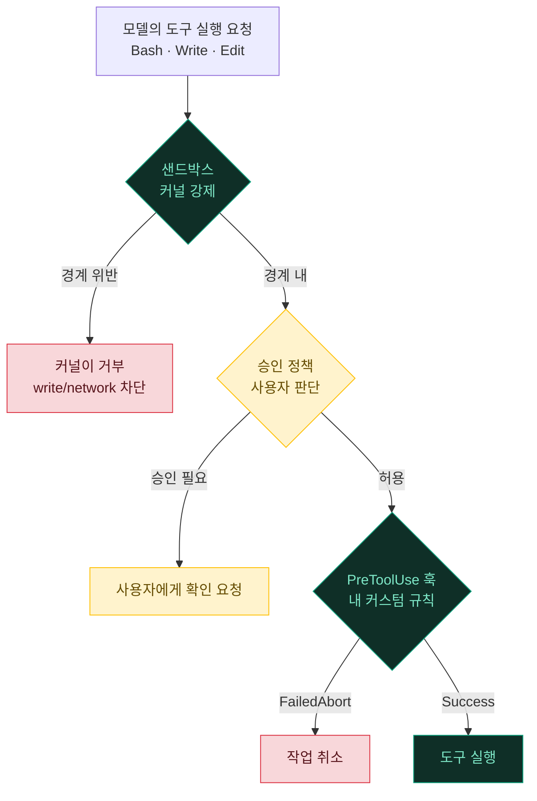
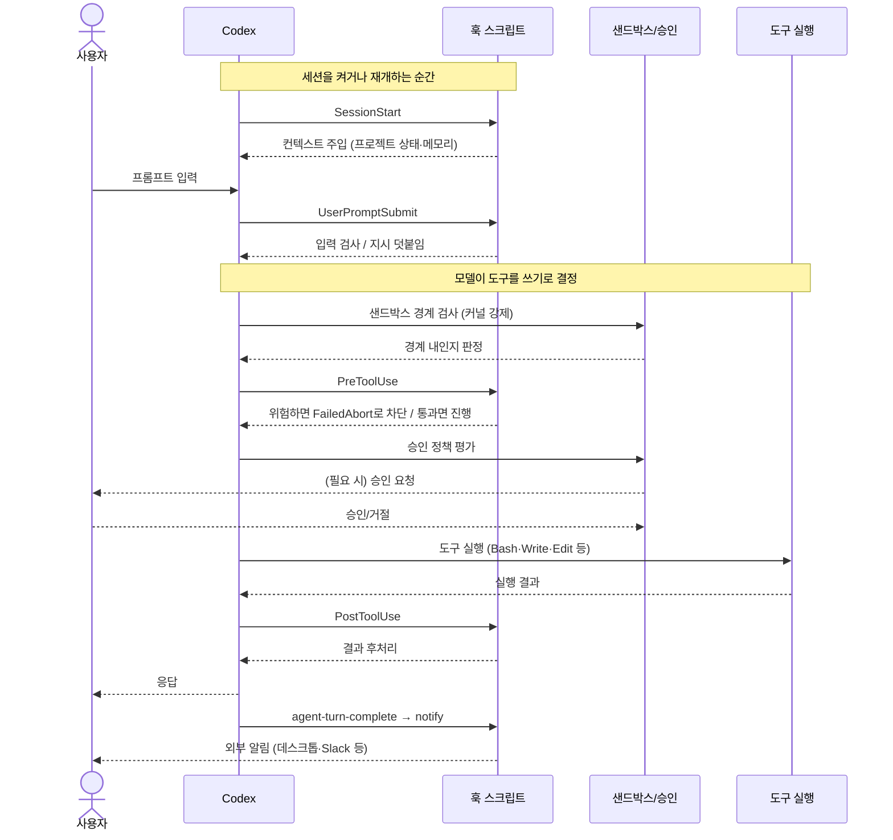

# 01. 샌드박스·승인·훅 — 자동으로 끼어드는 안전장치

> Codex의 안전은 "모델이 알아서 조심하겠지"라는 신뢰가 아니라 **운영체제 수준의 강제**에서 나옵니다. 1차 방어선은 사용자가 짜는 훅이 아니라 **항상 켜져 있는 샌드박스 + 승인 정책**이고, 그 위에 커스터마이즈 가능한 **lifecycle hooks**와 **notify** 알림이 얹힙니다. 이 문서는 "누가 무엇을 언제 막는가"를 층층이 풀어냅니다.

---

## 🛡️ 왜 샌드박스가 1차 방어인가

Claude Code에서는 "훅"이 안전의 중심축이었습니다. Codex는 다릅니다. Codex는 **훅을 켜지 않아도** 이미 모든 명령이 OS 샌드박스와 승인 정책을 통과해야 실행됩니다. 훅은 그 위에 얹는 **선택적 커스터마이즈 계층**입니다.

이 순서가 중요합니다. 안전을 "모델에게 부탁하는 것"에서 "커널이 강제하는 것"으로 끌어내렸기 때문입니다.

> [!IMPORTANT]
> 프롬프트(지시)는 **확률적으로 무시될 수 있습니다.** 아무리 "위험한 명령은 하지 마"라고 적어도, 모델은 어떤 추론 끝에 `rm -rf`를 실제로 실행할 수 있습니다. 반면 샌드박스는 **커널이 강제**합니다. 모델이 무슨 생각을 하든, 쓰기가 금지된 경로에 대한 write 시스템콜은 운영체제가 거부합니다. "지시"는 설득이고 "샌드박스"는 물리 법칙입니다. Codex가 위험 차단을 프롬프트가 아니라 샌드박스·승인 계층에 둔 이유가 이것입니다.

방어를 층으로 그리면 이렇게 됩니다. 안쪽 층이 뚫려도 바깥 층이 남습니다.



세 줄 요약:

- **샌드박스** = 커널이 강제하는 하드 경계(무엇을 읽고/쓰고/네트워크할 수 있는가). LLM 판단 비의존.
- **승인 정책** = 경계 안에서도 "사람에게 물을지" 결정하는 소프트 게이트.
- **훅** = 그 흐름 사이에 내가 끼워 넣는 커스텀 로직(추가 차단·맥락 주입·알림).

---

## 📦 샌드박스 모드 3종

`sandbox_mode`(CLI `--sandbox`/`-s`)로 고릅니다. 기본은 가장 보수적인 `read-only`입니다.

| 모드 | 파일 읽기 | 파일 쓰기 | 네트워크 | 쓰임새 |
|---|---|---|---|---|
| 🟢 `read-only` (기본) | 전체 | ❌ 차단 | ❌ 차단 | 코드 탐색·질문·리뷰. 아무것도 바꾸지 않음 |
| 🟡 `workspace-write` | 전체 | cwd + `$TMPDIR` + `/tmp` | ❌ 기본 차단 | 실제 편집·빌드. 대화형 작업의 표준 |
| 🔴 `danger-full-access` | 전체 | 전체 | ✅ 허용 | 샌드박스 완전 해제. 자체 격리 환경에서만 |

**`read-only`** — 모든 파일을 읽을 수 있지만 쓰기와 네트워크는 커널이 막습니다. "분석만" 시킬 때 가장 안전합니다.

**`workspace-write`** — 작업 디렉터리(cwd)와 임시 폴더에만 쓰기를 허용합니다. 워크스페이스 **밖**은 여전히 읽기 전용이고, 네트워크는 기본 차단입니다. 실제 코딩 작업의 표준 모드입니다.

**`danger-full-access`** — 파일·네트워크 경계가 전부 사라집니다. 이름 그대로 위험합니다. Docker 컨테이너처럼 **바깥에 이미 격리 계층이 있는** 경우, 또는 샌드박스를 지원하지 않는 환경(구형 커널 등)에서만 씁니다.

### `[sandbox_workspace_write]` 세부 조정

`workspace-write`의 세부 동작은 별도 테이블로 조정합니다.

```toml
sandbox_mode = "workspace-write"

[sandbox_workspace_write]
writable_roots = ["/Users/<you>/.pyenv/shims"]  # cwd 밖에 추가로 쓰기 허용할 경로
network_access = false          # 기본 차단 — 패키지 설치 등이 필요하면 true
exclude_tmpdir_env_var = false  # true면 $TMPDIR를 쓰기 목록에서 제외
exclude_slash_tmp = false       # true면 /tmp를 쓰기 목록에서 제외
```

> [!WARNING]
> `workspace-write`라도 writable root 안의 **`.git/`과 `.codex/`는 읽기 전용**으로 유지됩니다. 그래서 `git commit`처럼 `.git`에 쓰는 작업은 기본적으로 차단되어 **승인을 거칩니다.** 이는 실수가 아니라 설계입니다 — 커밋 히스토리는 되돌리기 어려운 상태 변경이므로, 모델이 조용히 커밋을 남발하지 못하게 한 겹 더 잠가 둔 것입니다.

### 플랫폼별 구현

같은 `sandbox_mode`라도 뒤에서 커널을 다루는 방식은 OS마다 다릅니다.

| 플랫폼 | 구현 | 비고 |
|---|---|---|
| macOS 12+ | Apple **Seatbelt** (`sandbox-exec`) | 성숙·기본 지원 |
| Linux | **Landlock** + **seccomp** | 커널 5.13+ 권장 |
| Windows | 실험적 | **WSL2 안에서 동일**하게 Linux 경로로 동작 |

> [!NOTE]
> Windows 네이티브 샌드박스는 아직 실험적입니다. 이 툴킷은 macOS/Linux를 기본 전제로 하며, Windows 사용자는 **WSL2** 안에서 Codex를 돌리면 Linux(Landlock)와 똑같은 보호를 받습니다.

---

## 🚦 승인 정책

샌드박스가 "무엇이 물리적으로 가능한가"를 정한다면, 승인 정책(`approval_policy`, CLI `--ask-for-approval`/`-a`)은 "가능한 것 중 무엇을 사람에게 물을까"를 정합니다.

| 정책 | 동작 | 쓰임새 |
|---|---|---|
| `untrusted` | '신뢰된' 읽기 전용 명령 외에는 실행 전 승인 | 가장 보수적. 낯선 저장소 탐색 |
| `on-request` | 모델이 필요하다고 판단할 때만 승인 요청 | 대화형 권장 기본값 |
| `never` | 절대 묻지 않음. 실패는 모델에 바로 반환 | 헤드리스·자동화. `codex exec`는 항상 이 모드 |

> [!WARNING]
> 구버전의 `on-failure`(샌드박스 실행이 실패하면 재시도 승인을 요청)는 **현재 docs에서 deprecated**입니다. 대화형에서는 `on-request`, 비대화형에서는 `never`를 쓰세요. 오래된 예제에서 `on-failure`를 보더라도 그대로 복붙하지 마세요. (더 세밀하게는 `approval_policy = { granular = { ... } }` 객체 형태도 있지만, 대부분은 위 세 값으로 충분합니다.)

### 프리셋 — 샌드박스와 승인을 한 쌍으로

TUI는 두 축(샌드박스 × 승인)을 매번 따로 고르지 않도록 **프리셋**으로 묶어 보여줍니다. `/permissions`(구 `/approvals`) 슬래시 명령으로 전환합니다.

| 프리셋 (TUI 표시명) | = 승인 정책 | = 샌드박스 | 한마디로 |
|---|---|---|---|
| **Read Only** | `untrusted` | `read-only` | 읽기·질문만. 편집/실행/네트워크는 승인 |
| **Auto** (구 "Agent") | `on-request` | `workspace-write` | 워크스페이스 안은 자동, 밖·네트워크는 승인 |
| **Full Access** | `never` | `danger-full-access` | 전체 디스크·네트워크, 프롬프트 없음(위험) |

> [!TIP]
> Codex는 보수적으로 시작합니다. 디렉터리를 **신뢰(trust)하기 전**에는 온보딩에서든 `/permissions` → "Trust this directory"로든 무조건 **Read Only**입니다. 신뢰를 부여하면 **Auto**로 승격됩니다. 즉 "낯선 코드를 클론해서 처음 열었을 때 아무것도 못 건드리는 것"은 버그가 아니라 의도된 첫 방어입니다.

### CLI 플래그 조합

프리셋을 명령줄에서 바로 지정하는 단축 플래그도 있습니다.

| 플래그 | 의미 |
|---|---|
| `--sandbox <mode>` / `-s` | 샌드박스 모드 직접 지정 |
| `--ask-for-approval <policy>` / `-a` | 승인 정책 직접 지정 |
| `--full-auto` | `--sandbox workspace-write` + `--ask-for-approval on-request`의 축약 |
| `--dangerously-bypass-approvals-and-sandbox` (별칭 `--yolo`) | 샌드박스·프롬프트 **모두 해제**(비권장) |

```bash
codex --sandbox read-only --ask-for-approval on-request   # 읽기+질문, 편집은 승인
codex --full-auto                                          # 워크스페이스 자동 편집
codex exec --sandbox workspace-write "리팩터링 실행"        # 헤드리스 자동(승인은 항상 never)
codex --yolo                                               # ⚠️ 모든 안전장치 해제
```

> [!CAUTION]
> `--dangerously-bypass-approvals-and-sandbox`(`--yolo`)는 이름에 이미 경고가 들어 있습니다. 커널 샌드박스와 승인 프롬프트를 **동시에** 끄므로, 이 상태의 모델은 시스템 어디든 쓰고 어떤 네트워크든 열 수 있습니다. Docker처럼 바깥에 격리가 있는 CI 컨테이너가 아니라면 개인 머신에서 쓰지 마세요.

> [!NOTE]
> `codex exec`(헤드리스)에서는 `--full-auto`가 **제거**되어 있습니다. 대신 `--sandbox workspace-write`를 직접 주세요. `--full-auto`는 대화형 `codex`에서만 유효합니다. — 버전에 따라 다를 수 있으니 `codex exec --help`로 확인하세요.

---

## 🔄 한 턴의 생명주기 — 샌드박스·승인·훅이 만나는 자리

세 계층이 실제로 **한 번의 도구 호출**에서 어떤 순서로 개입하는지 봐야 전체 그림이 잡힙니다. 사용자가 프롬프트를 한 번 넣었을 때의 흐름입니다.



> [!NOTE]
> `SessionStart`만 "한 턴"의 바깥, 세션이 열리는 시점에 한 번 돕니다. 나머지 훅은 매 턴 반복됩니다. 핵심은 **순서**입니다 — 샌드박스 경계 검사가 먼저, 그다음 `PreToolUse` 훅, 그다음 승인 정책, 그리고 실제 실행입니다. 훅이 통과시켜도 샌드박스가 막을 수 있고, 샌드박스를 통과해도 승인 정책이 사람에게 물을 수 있습니다. 세 겹이 **AND**로 걸립니다.

---

## 🪝 Lifecycle hooks — 커스터마이즈 개입 지점

샌드박스·승인이 "항상 켜진 하드 계층"이라면, 훅은 그 흐름 사이에 **내가 정한 스크립트**를 끼워 넣는 소프트 계층입니다. `~/.codex/hooks.json` 또는 `config.toml`의 `[hooks]`에 등록합니다.

> [!NOTE]
> Codex 훅은 **떠오르는 기능**입니다. `notify`보다 신규이고 문서화가 덜 되어 있어, 본인 Codex 버전에서 지원 여부가 다를 수 있습니다. `codex --help` 또는 `/hooks` 슬래시 명령으로 현재 버전에서 활성인지 먼저 확인하세요. (`features.hooks`로 기능이 게이트되기도 합니다.)

### 이벤트 10종

| 이벤트 | 시점 | 대표 용도 |
|---|---|---|
| 🔴 `PreToolUse` | 도구 실행 직전 | 위험 명령 차단(`FailedAbort`) |
| 🟠 `PermissionRequest` | 승인 요청이 뜰 때 | 자동 승인/거절 정책 |
| 🔵 `PostToolUse` | 도구 실행 직후 | 결과 후처리·검증 |
| 🟣 `PreCompact` / `PostCompact` | 대화 압축 전/후 | 압축 지시 재주입 |
| 🟢 `SessionStart` | 세션 시작/재개 | 프로젝트 상태 컨텍스트 주입 |
| 🟡 `UserPromptSubmit` | 사용자 입력마다 | 입력 검사·명확성 평가 |
| ⚪ `SubagentStart` / `SubagentStop` | 서브에이전트 시작/종료 | 병렬 작업 로깅 |
| 🟤 `Stop` | 턴 종료 | 정리·요약 |

### `[hooks]` (config.toml) 예시

각 이벤트는 **matcher 그룹의 배열**입니다. 각 그룹은 선택적 `matcher`(정규식) + 핸들러 배열(`hooks`)로 이뤄집니다.

```toml
[[hooks.PreToolUse]]
matcher = "^Bash$"          # Bash 도구에만 적용 (정규식)

[[hooks.PreToolUse.hooks]]
type = "command"            # 핸들러 종류
command = '/usr/bin/python3 "$(git rev-parse --show-toplevel)/.codex/hooks/guard-bash.py"'
timeout = 30                # 초 단위
statusMessage = "Bash 명령 검사 중"
```

### `hooks.json` 동등형

같은 내용을 JSON으로도 쓸 수 있습니다. 최상위 `hooks` 객체 아래 같은 이벤트 키를 둡니다.

```jsonc
{
  "hooks": {
    "PreToolUse": [
      {
        "matcher": "^Bash$",
        "hooks": [{
          "type": "command",
          "command": "/usr/bin/python3 \"$(git rev-parse --show-toplevel)/.codex/hooks/guard-bash.py\"",
          "timeout": 30,
          "statusMessage": "Bash 명령 검사 중"
        }]
      }
    ]
  }
}
```

> [!WARNING]
> **한 레이어에 `[hooks]`(toml)와 `hooks.json`이 동시에** 있으면 Codex가 경고합니다. 사용자 레벨(`~/.codex/`)이든 프로젝트 레벨(`<repo>/.codex/`)이든, 한 위치에서는 **둘 중 하나만** 쓰세요. 프로젝트 훅은 **신뢰된 프로젝트에서만** 로드됩니다.

### 핸들러 type과 command 필드

| `type` | 의미 |
|---|---|
| `command` | 외부 프로그램/스크립트 실행 (가장 일반적) |
| `prompt` | 모델에게 주입할 프롬프트 |
| `agent` | 서브에이전트 위임 |

`command` 핸들러의 주요 필드: `command`(필수), `commandWindows`(Windows 대체 명령), `timeout`(초), `async`(bool — 비동기 실행), `statusMessage`(진행 표시 문구).

### 훅 결과의 의미

훅 스크립트의 종료 상태는 세 가지로 해석됩니다.

| 결과 | 의미 |
|---|---|
| ✅ `Success` | 통과. 다음 훅·작업 계속 |
| ⚠️ `FailedContinue` | **이 훅만** 실패. 이후 훅·작업은 계속 |
| 🛑 `FailedAbort` | 이후 훅 중단 + **작업 취소** (위험 차단은 이것) |

> [!IMPORTANT]
> 위험 명령을 막고 싶다면 훅이 **`FailedAbort`**로 끝나야 합니다. `FailedContinue`는 "이 훅은 실패했지만 계속 진행해"라는 뜻이라 **차단 효과가 없습니다.** 둘을 혼동하면 "막으려 했는데 그대로 실행"되는 사고가 납니다. 위험 정책 훅을 짤 때 가장 흔한 실수입니다.

### 관리형 훅 (managed hooks)

팀·조직 차원에서 훅을 강제하려면 관리자가 `requirements.toml`에 잠금을 겁니다.

```toml
# 관리자 배포용 requirements.toml (config.toml에 두면 효과 없음)
allow_managed_hooks_only = true   # user/project/session 훅 무시, managed 훅만 실행
```

`allow_managed_hooks_only = true`이면 사용자·프로젝트·세션 훅이 전부 무시되고 **managed 훅만** 돕니다. 개별 사용자가 보안 훅을 우회하지 못하게 하는 장치입니다. `/hooks` 슬래시 명령으로 현재 활성 훅을 조회·관리합니다.

**참고 예제**:
- 훅 등록 전체 예시 → [../examples/hooks/hooks.json](../examples/hooks/hooks.json)
- `PreToolUse` 위험 명령 정책 → [../examples/hooks/guard-bash.py](../examples/hooks/guard-bash.py)
- `SessionStart` 컨텍스트 주입 → [../examples/hooks/session-context.sh](../examples/hooks/session-context.sh)

---

## 🔔 notify — 턴 완료 외부 알림

훅과 별개로, Codex에는 오래전부터 검증된 **`notify`** 훅이 있습니다. 턴이 끝나면 외부 프로그램을 실행해 데스크톱 알림·Slack 메시지 등을 보낼 수 있습니다.

```toml
notify = ["python3", "/Users/<you>/.codex/notify.py"]
```

- Codex가 지원 이벤트가 발생하면 이 프로그램을 실행하고, **JSON을 마지막 argv 인자(`sys.argv[1]`)로** 전달합니다.
- **현재 발생 이벤트는 `agent-turn-complete` 하나뿐**입니다(턴 완료). 앞으로 늘어날 수 있습니다.

전달되는 JSON 스키마(kebab-case 키):

```json
{
  "type": "agent-turn-complete",
  "thread-id": "<thread-uuid>",
  "turn-id": "12345",
  "cwd": "/Users/<you>/project",
  "input-messages": ["Rename `foo` to `bar` ..."],
  "last-assistant-message": "..."
}
```

> [!TIP]
> **`notify`와 `[tui] notifications`는 다른 것**입니다. `notify`는 외부 **프로그램**을 실행해(데스크톱 배너·Slack·이메일 등 무엇이든) 알림을 만드는 훅이고, `[tui] notifications = ["agent-turn-complete"]`는 터미널 자체의 벨/OSC9 알림입니다. "자리를 비운 사이 긴 작업이 끝나면 폰으로 알림 받기" 같은 건 `notify` 쪽입니다.

**참고 예제**: [../examples/notify.py](../examples/notify.py) — `agent-turn-complete`를 받아 데스크톱 알림을 띄우는 핸들러.

---

## ⚙️ 등록 방법과 작성 규칙

훅은 두 위치 × 두 표현으로 등록합니다. `config.toml`의 `[hooks]` 또는 별도 `hooks.json`, 그리고 사용자(`~/.codex/`) 또는 프로젝트(`<repo>/.codex/`) 레벨입니다.

```toml
# ~/.codex/config.toml — 한 파일에서 샌드박스·승인·훅·notify를 함께 선언
sandbox_mode = "workspace-write"
approval_policy = "on-request"
notify = ["python3", "/Users/<you>/.codex/notify.py"]

[sandbox_workspace_write]
network_access = false

[[hooks.PreToolUse]]
matcher = "^Bash$"
[[hooks.PreToolUse.hooks]]
type = "command"
command = '/usr/bin/python3 "$HOME/.codex/hooks/guard-bash.py"'
timeout = 10
```

전체 설정 예시는 [../examples/config.toml](../examples/config.toml)를 참고하세요.

### 🧱 훅 작성 핵심 규칙

| 규칙 | 설명 |
|---|---|
| 언어 | 스크립트는 **bash/python**으로 작성합니다(PowerShell 아님). Windows는 WSL2 안에서 동일. |
| 입력 | 훅은 도구 호출 정보(도구명·인자 등)를 표준 입력/인자로 받습니다. 파싱해서 판단하세요. |
| 차단 | **차단하려면 `FailedAbort`**로 끝내고 사유를 출력. `Success`는 통과, `FailedContinue`는 차단이 아님. |
| 경로 | `$HOME`·`git rev-parse --show-toplevel` 등으로 **동적 해석**. 사용자명·절대경로 하드코딩 금지. |
| 속도 | 매 도구 호출마다 돌 수 있으니 짧게. `timeout`을 짧게(예: 10초) 잡으세요. |

> [!CAUTION]
> 훅은 **매 도구 호출마다** 실행될 수 있어 성능이 곧 사용성입니다. 외부 네트워크 호출, 무거운 패키지 import, 광범위한 파일 스캔을 훅 안에 넣으면 모든 명령이 느려집니다. `timeout`을 짧게 잡아 훅이 멈춰도 세션이 멈추지 않게 하고, 무거운 작업은 `async = true`나 백그라운드로 빼세요. 그리고 훅은 결정론적 안전장치이므로 **절대 조용히 죽지 않게** — 실패 경로에서도 명시적으로 `Success`/`FailedContinue`를 반환하도록 설계합니다.

<details>
<summary>🔍 왜 훅 하나에 로직을 몰아넣지 않는가</summary>

훅은 매 이벤트마다 돌기 때문에, "하나의 거대한 검사 스크립트"보다 **작고 좁은 훅 여러 개**가 유리합니다. `matcher`로 적용 도구를 좁히면(예: `PreToolUse`를 `^Bash$`에만) 파일 읽기 같은 무해한 도구에는 훅이 아예 돌지 않아 오버헤드가 사라집니다. "전부 다 거는 것"보다 "필요한 도구에만 좁게 거는 것"이 성능·안정성 모두에 유리합니다. 위험 차단, 맥락 주입, 알림은 목적이 다르므로 각각 별도 훅으로 분리하는 편이 유지보수도 쉽습니다.

</details>

---

## 🧭 샌드박스 vs 훅 — 무엇을 어디에

같은 "안전"이라도 어느 계층에 둘지가 중요합니다. 아래 기준으로 나눕니다.

| 목적 | 어디에 둘까 | 이유 |
|---|---|---|
| 파일 쓰기·네트워크 경계 | **샌드박스** (`sandbox_mode`) | 커널이 강제 → LLM·훅이 우회 불가. 가장 강함 |
| 특정 위험 명령 패턴 차단 | **PreToolUse 훅** (`FailedAbort`) | 샌드박스가 허용하는 범위 안에서 세밀한 정책 |
| "사람에게 물을지" 판단 | **승인 정책** (`approval_policy`) | 경계 안이라도 되돌리기 어려운 작업은 확인 |
| 세션 시작 시 맥락 주입 | **SessionStart 훅** | 안전이 아니라 편의·컨텍스트 |
| 턴 완료 알림 | **notify** | 실행 흐름에 개입하지 않는 부수 효과 |
| 조직 차원 강제 정책 | **managed 훅** (`requirements.toml`) | 개별 사용자가 우회 불가 |

> [!IMPORTANT]
> 우선순위 원칙: **되돌릴 수 없고 치명적인 것일수록 아래 계층(샌드박스)으로 내려라.** 훅은 강력하지만 사용자가 끄거나 우회할 수 있는 소프트 계층입니다. 정말 위험한 경계(디스크 전체 쓰기, 임의 네트워크)는 훅에 의존하지 말고 샌드박스 모드 자체로 막고, 훅은 "샌드박스가 허용하는 범위 안에서의 세밀한 커스터마이즈"에 쓰세요. 훅으로 막을 수 있는 것을 샌드박스로도 막을 수 있다면, 샌드박스가 정답입니다.

---

<div align="center">

[⬅️ 이전: 00. 빠른 시작](00-quickstart.md) · [🏠 목차](../README.md) · [다음: 02. 스킬 ➡️](02-skills.md)

</div>
