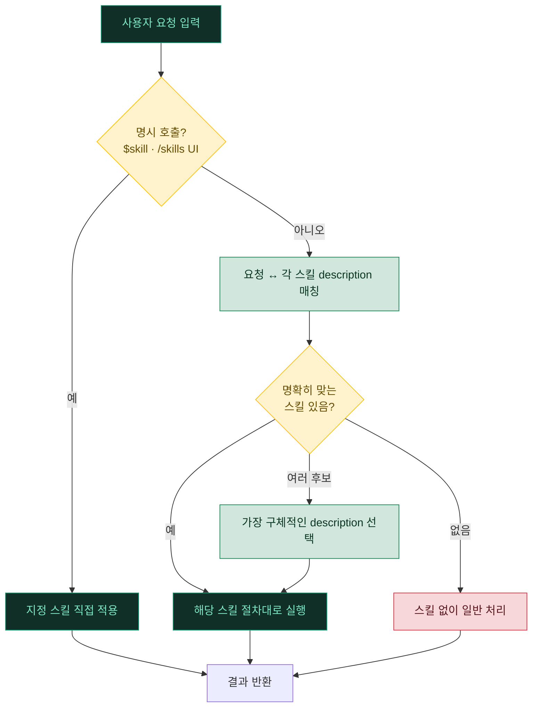
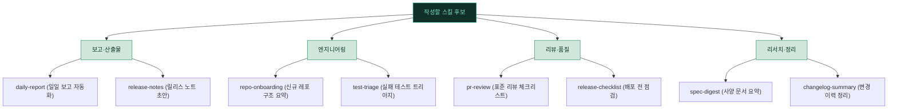
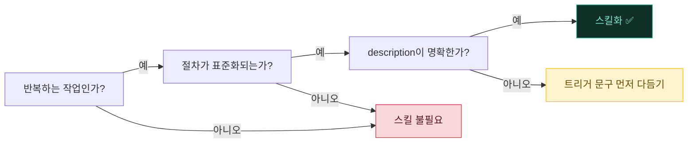

# 02. 스킬 — 작업 절차 캡슐화

> 같은 요청에 **매번 다른 방식**으로 답하는 대신, **한 번 검증한 절차**를 모듈로 굳혀 재사용합니다. Codex의 스킬은 `SKILL.md` 한 장으로 "이런 작업은 이렇게 해라"를 캡슐화합니다.

---

## 🧩 스킬이란?

스킬은 "이런 작업은 이렇게 해라"는 **검증된 절차 + 도구 묶음**을 마크다운(+선택적 스크립트)으로 캡슐화한 모듈입니다. 사용자가 관련 작업을 요청하면 Codex가 알아서 해당 스킬을 불러 그 절차대로 수행합니다.

| 항목 | 내용 |
|---|---|
| 📁 **위치** | 프로젝트 `.agents/skills/<name>/SKILL.md` · 사용자 `~/.agents/skills/<name>/SKILL.md` (자세한 우선순위는 아래) |
| 🚀 **호출** | 대화에서 `$<skill>` 로 직접 참조하거나 `/skills` UI에서 고르고, 아니면 Codex가 `description`을 보고 **자동 선택** |
| 🎯 **핵심** | 각 스킬의 `description`이 트리거 정확도를 좌우 → "언제 써야 하는지"를 구체적으로 적는 게 가장 중요 |

> [!IMPORTANT]
> 스킬의 품질은 본문(절차)보다 `description`이 먼저 결정합니다. `description`이 모호하면 **정작 필요할 때 발동하지 않거나, 엉뚱한 순간에 끼어듭니다.** 트리거 문구는 "사용자가 실제로 쓸 법한 표현"을 그대로 나열하는 게 정확도를 높입니다.

**왜 쓰나**: "일일 보고서 만들어줘" 한마디에, 매번 다른 방식이 아니라 **항상 같은 검증된 절차**가 적용됩니다. 좋은 작업 방식을 한 번 정의해두면 사람이 매번 같은 지시를 반복할 필요가 없습니다.

---

## 🗂️ 스킬이 사는 곳 (탐색 위치와 우선순위)

Codex는 여러 계층에서 스킬을 모읍니다. 프로젝트에 커밋한 스킬은 팀이 공유하고, 사용자 홈의 스킬은 어느 레포에서든 따라옵니다.

| 계층 | 경로 | 성격 |
|---|---|---|
| 🏢 프로젝트(권장) | `<repo>/.agents/skills/` | cwd → 레포 루트 방향으로 스캔, **중첩 디렉터리 OK**. 코드와 함께 커밋되어 팀 공유 |
| 🏢 프로젝트(대안) | `<repo>/.codex/skills/` | 위와 동일한 프로젝트 스코프. `.codex` 아래에 모아두는 배치 |
| 👤 사용자 | `~/.agents/skills/` | 내 모든 프로젝트에서 따라오는 개인 스킬 |
| 🧳 레거시 사용자 | `~/.codex/skills/` | 하위호환용. 신규는 `~/.agents/skills` 권장 |
| 🛡️ 관리자 | `/etc/codex/skills/` | 조직 배포용(관리형). 개인이 편집하지 않음 |

> [!TIP]
> "이 절차는 이 레포에서만 쓴다"면 `<repo>/.agents/skills/`에, "내가 어디서든 쓴다"면 `~/.agents/skills/`에 둡니다. 개인 스킬을 프로젝트에 커밋하면 팀 전체가 트리거를 공유하게 되므로, 범위를 먼저 정하고 위치를 고르세요.

> [!NOTE]
> Windows는 **WSL2 안에서 동일**하게 동작합니다. WSL2의 리눅스 홈(`~/.agents/skills`)과 레포 경로를 그대로 사용하세요.

---

## 🧬 SKILL.md 해부

스킬의 최소 단위는 `SKILL.md` 한 장입니다. **YAML frontmatter의 `name`·`description`은 필수**, 그 아래 마크다운 본문이 Codex가 따를 절차입니다.

```markdown
---
name: skill-name
description: 언제/왜 이 스킬이 발동하는지 — 자동 매칭 기준이 되는 트리거 문구
---

# 하는 일
<한 줄 요약>

## 절차
1. 먼저 ~를 확인한다.
2. 그다음 ~를 실행한다. (사용할 도구/명령을 명시)
3. 결과를 ~ 형식으로 정리한다.
```

필요하면 스킬 폴더에 보조 자원을 함께 둘 수 있습니다(모두 **선택**).

```
~/.agents/skills/daily-report/
├── SKILL.md            # 필수: frontmatter(name·description) + 절차 본문
├── scripts/            # 선택: 스킬이 호출하는 실행 스크립트(bash/python)
│   └── collect.sh
├── references/         # 선택: 절차가 참조하는 체크리스트·규약 문서
├── assets/             # 선택: 템플릿·이미지 등 산출물 자원
└── agents/
    └── openai.yaml     # 선택: 스킬 메타데이터
```

동작하는 전체 예시는 [../examples/skills/daily-report/SKILL.md](../examples/skills/daily-report/SKILL.md) 를 참고하세요.

> [!IMPORTANT]
> `scripts/`에 넣는 실행 파일은 **bash 또는 python**으로 작성합니다(PowerShell 아님). 스킬이 명령을 실행할 때도 [01. 샌드박스·승인·훅](01-sandbox-approvals.md)의 승인/샌드박스 정책이 그대로 적용되므로, 파괴적 명령은 승인 단계에서 걸립니다.

---

## 🔀 스킬 발동 흐름

사용자의 요청이 들어오면, Codex는 각 스킬의 `description`과 요청을 대조해 가장 잘 맞는 스킬을 고릅니다. `$<skill>` 참조나 `/skills` UI로 명시하면 매칭 단계를 건너뜁니다.



> [!TIP]
> 어떤 스킬이 발동할지 헷갈릴 때는 `$<skill>`로 **명시 호출**하거나 `/skills`에서 직접 고르면 매칭 단계를 건너뛰어 확실합니다. 반대로 평소에는 자동 선택에 맡기고, 오발동이 잦은 스킬만 `description`을 다듬는 게 효율적입니다.

---

## ⭐ 어떤 절차를 스킬로 굳히나

Codex 스킬은 "자주 반복하는 정형 작업"을 굳힐 때 가장 빛납니다. 아래는 직접 작성해 둘 만한 대표 후보들입니다. 번들 카탈로그가 아니라 **당신이 만드는 절차**라는 점이 핵심입니다.



| 스킬(예시) | 용도 | 트리거로 넣을 표현(예) |
|---|---|---|
| 📊 `daily-report` | 오늘 한 작업·커밋을 정해진 형식으로 요약 | "일일 보고 만들어줘", "오늘 한 일 정리" |
| 🔎 `pr-review` | 팀 규약대로 보안·성능·정확성 체크 | "이 변경 리뷰해줘", "머지 전 점검" |
| 🚦 `test-triage` | 실패 테스트를 원인별로 분류·수정안 제시 | "실패한 테스트 정리", "왜 깨졌는지" |
| 🧭 `repo-onboarding` | 처음 보는 레포의 구조·위험 지점 요약 | "이 저장소 구조 알려줘" |
| 🚀 `release-checklist` | 배포 직전 표준 점검 절차 실행 | "배포 전 확인", "릴리스 준비" |

> [!NOTE]
> 자신의 주력 작업 두세 갈래를 먼저 정하고, 그 갈래에 해당하는 스킬부터 만드는 게 시행착오를 줄입니다. 처음부터 모든 걸 스킬로 만들 필요는 없습니다 — 손이 세 번 이상 간 절차가 첫 후보입니다.

---

## ✅ 스킬 만들지 판단 기준

새 스킬을 만들지 말지 고민될 때는 아래 세 가지를 차례로 따져봅니다. 셋 다 "예"면 스킬화 후보입니다.



1. **반복하는 작업인가** — 한 번 하고 말 거면 스킬화는 과투자입니다.
2. **절차가 표준화되는가** — "항상 이 순서로 하는 게 맞다"가 있으면 스킬 후보입니다. 매번 판단이 갈리는 작업은 스킬로 굳히면 오히려 경직됩니다.
3. **description이 명확한가** — 트리거가 애매하면 엉뚱할 때 발동하거나 정작 필요할 때 안 뜹니다.

> [!WARNING]
> 트리거가 겹치는 스킬을 여러 개 두면 **서로 오발동**합니다. 예를 들어 `description`에 "문서 작성"처럼 광범위한 문구가 둘 이상 있으면, 매칭 단계에서 의도와 다른 스킬이 선택될 수 있습니다. 새 스킬을 추가할 때는 기존 스킬과 트리거가 충돌하지 않는지 먼저 확인하세요.

---

## 🛠️ 직접 만들기

스킬을 만드는 데 특별한 도구는 필요 없습니다. 스킬 위치에 폴더를 만들고 `SKILL.md`를 쓰면 끝입니다. 핵심은 frontmatter의 `description`입니다.

```bash
mkdir -p ~/.agents/skills/<my-skill>
$EDITOR ~/.agents/skills/<my-skill>/SKILL.md
```

```markdown
---
name: <my-skill>
description: <언제 이 스킬을 써야 하는지 — 구체적 트리거 문구를 나열>
---

## 절차
1. ...
2. ...
```

작성 후 `/skills`에서 목록에 잡히는지 확인하고, `$<my-skill>`로 한 번 명시 호출해 절차가 의도대로 도는지 검증합니다.

> [!TIP]
> `description`에는 **사용자가 실제로 칠 법한 표현을 그대로** 넣으세요. "이 저장소 구조 알려줘", "실패한 테스트 정리해줘"처럼 자연어 트리거를 여러 개 나열할수록 자동 선택 정확도가 올라갑니다. 추상적인 한 줄("개발 관련 작업")보다 구체적인 여러 줄이 훨씬 잘 잡힙니다.

### 작성 시 주의

- ⚠️ **트리거 중복 회피**: 기존 스킬과 `description`이 겹치면 오발동의 원인이 됩니다. 추가 전에 한 번 점검합니다.
- ⚠️ **절차는 단계별로**: 본문에는 "무엇을, 어떤 순서로, 어떤 도구로" 하는지를 명시합니다. 모호하면 스킬이 발동해도 결과가 흔들립니다.
- ⚠️ **너무 넓게 잡지 않기**: 한 스킬이 모든 걸 하려 들면 트리거가 광범위해져 오발동합니다. 한 스킬은 한 가지 일을 잘하게 좁히는 편이 안전합니다.
- ⚠️ **자격증명 금지**: `SKILL.md`·`scripts/`에 토큰·키를 하드코딩하지 마세요. 프로젝트 스킬은 커밋되어 팀에 공유됩니다.

---

## 🧾 (참고) 커스텀 프롬프트 — 스킬로 대체 권장

Codex에는 스킬 이전부터 있던 **커스텀 프롬프트**(`~/.codex/prompts/*.md`)가 있습니다. `.md` 파일명이 명령 이름이 되고, `/prompts:<name>` 으로 호출합니다.

<details>
<summary><b>커스텀 프롬프트 문법</b> (펼치기)</summary>

| 요소 | 설명 |
|---|---|
| 파일 | `~/.codex/prompts/<name>.md` — 파일명이 곧 명령 이름 |
| 호출 | `/prompts:<name>` |
| 위치 인자 | `$1` ~ `$9` (호출 시 순서대로 전달) |
| 전체 인자 | `$ARGUMENTS` (뒤에 붙인 인자 전체) |
| 명명형 인자 | `$FILE` 처럼 **대문자** 이름, 호출 시 `FILE=값` 형태로 전달 |
| frontmatter | `description`, `argument-hint` |

```markdown
---
description: 지정한 파일을 규약대로 리뷰
argument-hint: <파일 경로>
---

$1 파일을 우리 팀 리뷰 체크리스트에 따라 점검하고,
보안·성능·정확성 순으로 지적사항을 정리해줘.
```

프롬프트는 **세션 시작 시 로드**되므로, 추가·편집 후에는 세션을 재시작해야 반영됩니다. (프로젝트 레벨 `.codex/prompts`는 문서화되어 있지 않음 — 버전에 따라 다를 수 있음.)

예시: [../examples/prompts/review.md](../examples/prompts/review.md)

</details>

> [!NOTE]
> 커스텀 프롬프트는 **현재 docs 기준 deprecated**입니다 — 재사용 가능한 작업 절차는 **스킬로 만드는 것이 권장**됩니다. 프롬프트는 인자를 끼워 넣는 단순 치환에 가깝고, 스킬은 자동 선택·보조 스크립트·참조 자료까지 묶을 수 있어 확장성이 큽니다. 기존 프롬프트가 있다면 자연스레 스킬로 옮겨 두세요.

---

<div align="center">

[⬅️ 이전: 01. 샌드박스·승인·훅](01-sandbox-approvals.md) · [🏠 목차](../README.md) · [다음: 03. 메모리 & AGENTS.md ➡️](03-memory.md)

</div>
