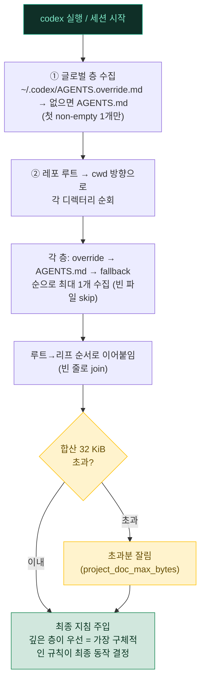
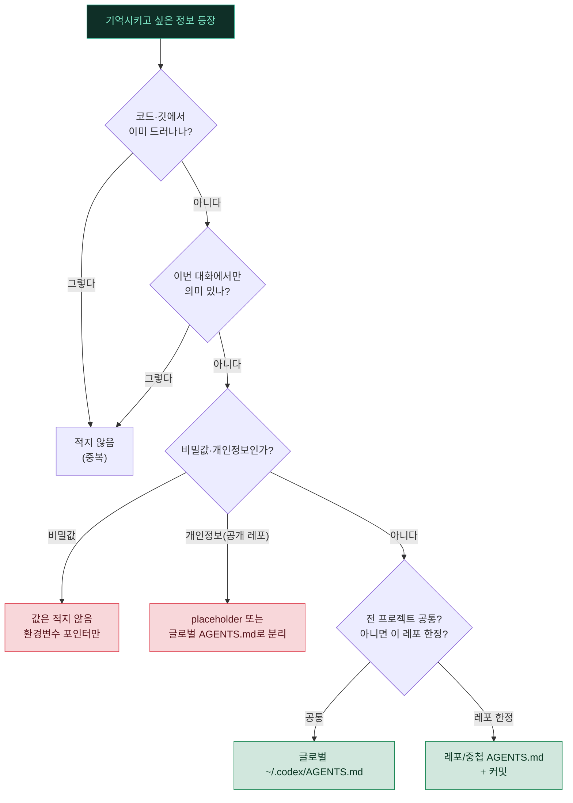

# 🧠 03. 메모리 & AGENTS.md — 세션을 넘는 기억

이 문서는 Codex CLI가 세션이 끝나도 사용자·프로젝트·작업 방식에 대한 맥락을 **지속적으로 유지**하게 만드는 방법을 설명합니다. Codex에는 Claude Code식 "한 사실 = 한 파일" 메모리 도구가 없습니다. 대신 두 축이 그 역할을 나눠 맡습니다 — **AGENTS.md 계층**(글로벌·레포·중첩)이 변하지 않는 지속 지침을 담고, **`/memories`** 슬래시가 세션 안에서의 메모리 사용·생성을 제어합니다. 여기에 `/import`로 기존 Claude Code 셋업까지 끌어올 수 있습니다.

---

## ❓ 왜 지속 기억이 필요한가 (문제 정의)

Codex 세션은 기본적으로 **휘발성(volatile)** 입니다. TUI를 닫거나 `codex exec` 프로세스가 끝나는 순간 다음과 같은 맥락이 사라집니다.

- "나는 한국어로 답변받기를 선호한다."
- "내 환경은 macOS이고, 셸은 zsh다." (Windows는 WSL2 안에서 동일)
- "이 모듈은 외부 의존성 문제로 이미 보류하기로 결정했다."

이런 맥락을 매 세션마다 다시 설명하는 것은 **시간 낭비이자 일관성 저하**의 원인입니다. 같은 결정을 두 번 내리거나, 이미 합의한 방침을 잊고 어긋난 작업을 하게 됩니다.

> [!NOTE]
> Codex의 지속 기억은 "대화를 더 똑똑하게" 만드는 기능이 아니라, **세션 사이의 단절을 메우는** 기능입니다. 한 번 정한 규약을 다음 세션이 그대로 이어받게 하는 것이 목표입니다.

> [!IMPORTANT]
> AGENTS.md는 **장기적으로 안정적인 지침**을 위한 것입니다. "지금 이 버그를 고치는 중"처럼 이번 대화에서만 의미 있는 정보는 대상이 아닙니다(자세한 기준은 아래 [무엇을 어디에](#-무엇을-어디에--저장-위치-결정) 표 참조).

---

## 💡 해법: AGENTS.md 계층 + `/memories`

Codex의 지속 기억은 두 가지 서로 다른 메커니즘으로 나뉩니다. 헷갈리지 않으려면 **"불변 지침"과 "세션 메모리"** 를 먼저 구분하는 것이 중요합니다.

| 축 | 무엇 | 어디에 | 성격 |
|---|---|---|---|
| 📜 AGENTS.md 계층 | 변하지 않는 나의 기본값·프로젝트 규약 | `~/.codex/AGENTS.md`(글로벌) + 레포/중첩 `AGENTS.md` | **파일로 커밋**, 팀 공유, 매 실행 재조립 |
| 🧠 `/memories` | 세션 중 메모리 사용·생성 방식 | Codex 내부 설정(슬래시로 제어) | **런타임 토글**, 대화 중 조정 |
| 📥 `/import` | 기존 셋업 끌어오기 | Claude Code 설정·프로젝트 파일·최근 채팅 | 일회성 마이그레이션 |

> [!TIP]
> `AGENTS.md`는 Claude Code의 `CLAUDE.md`에 정확히 대응합니다. Claude Code에서 넘어온다면 "CLAUDE.md에 적던 것을 AGENTS.md에 적는다"고 이해하면 대부분 맞습니다. 파일명·병합 규칙만 다릅니다.

---

## 🗂️ AGENTS.md 병합 규칙 (계층·우선순위)

AGENTS.md의 힘은 **여러 층이 하나로 합쳐진다**는 데 있습니다. 전역 취향을 글로벌에, 팀 규약을 레포 루트에, 하위 모듈 특칙을 중첩 디렉터리에 두면 Codex가 실행 시점마다 이들을 조립합니다.



### 우선순위 규칙 정리

1. **글로벌 층** — `~/.codex/AGENTS.override.md`가 있으면 그것이 우선, 없으면 `~/.codex/AGENTS.md`. 첫 non-empty 파일 하나만 사용합니다.
2. **프로젝트 층** — git 루트에서 현재 작업 디렉터리(cwd)까지 내려오며, 각 디렉터리에서 `AGENTS.override.md` → `AGENTS.md` → fallback 파일 순으로 **디렉터리당 최대 1개**를 수집합니다.
3. **결합 순서** — 수집된 조각을 **루트 → 리프 순서로 빈 줄을 끼워 이어 붙입니다.** 뒤에 오는(더 깊은) 내용이 앞을 덮으므로, **가장 구체적인 디렉터리의 지침이 최종 동작을 결정**합니다.
4. **크기 제한** — 합산 **32 KiB**(`project_doc_max_bytes` 기본값)에서 잘립니다. 빈 파일은 건너뜁니다.
5. **재조립** — **매 실행/세션 시작마다 처음부터 다시 조립**됩니다. 캐시가 없으므로 파일을 고치면 다음 실행에 곧바로 반영됩니다.

> [!TIP]
> 파일명을 `AGENTS.md`가 아닌 다른 이름으로 쓰고 싶다면 `config.toml`에 fallback을 등록합니다. 첫 번째로 발견되는 이름이 채택됩니다.
> ```toml
> project_doc_max_bytes = 32768                      # 기본 32 KiB
> project_doc_fallback_filenames = ["TEAM_GUIDE.md"] # AGENTS.md가 없을 때 대체 탐색
> ```

### `/init` — AGENTS.md scaffold 생성

빈 프로젝트에서 시작한다면 TUI에서 `/init`을 실행하세요. 현재 디렉터리에 `AGENTS.md` 골격을 만들어 줍니다. 여기에 빌드 명령·코드 규약·테스트 방법 같은 프로젝트 규약을 채우고 커밋하면, 팀 전체가 같은 지침을 공유하게 됩니다.

<details>
<summary>📄 AGENTS.md 최소 예시 (레포 루트)</summary>

```markdown
# 프로젝트 규약

## 언어·응답
- 모든 자연어 출력은 한국어로.
- 불필요한 자평("완벽합니다") 금지. 짧고 명확하게.

## 빌드·테스트
- 의존성 설치: `pnpm install`
- 테스트: `pnpm test` (변경 후 반드시 통과 확인)
- 린트: `pnpm lint --fix`

## 규칙
- 커밋 메시지는 Conventional Commits.
- 비가역 작업(삭제·일괄 변경)은 실행 전 요약 보고 후 대기.
```

바로 쓸 수 있는 완전한 템플릿은 [`../examples/AGENTS.md.example`](../examples/AGENTS.md.example)를 참고하세요.

</details>

> [!NOTE]
> `experimental_instructions_file` 설정은 위 AGENTS.md 병합 메커니즘과 **무관**합니다(문서화가 충분치 않은 별개 경로). 지속 지침은 AGENTS.md 계층으로 관리하세요.

---

## 🧭 무엇을 어디에 — 저장 위치 결정

같은 정보라도 어디에 두느냐가 다릅니다. **불변 기본값·프로젝트 규약은 AGENTS.md에, 세션 메모리 정책은 `/memories`로, 자격증명·휘발성 상태는 어디에도** 적지 않는 것이 원칙입니다.

| 성격 | 어디에 | 예시 | 이유 |
|---|---|---|---|
| 👤 사용자 불변 기본값 | 글로벌 `~/.codex/AGENTS.md` | "한국어 선호", "격식체 보고" | 모든 프로젝트에 걸쳐 안정적 |
| 📦 프로젝트 규약·결정 | 레포/중첩 `AGENTS.md` | 빌드·테스트 명령, "후보 A 대신 B 채택(라이선스)" | 코드와 함께 커밋·팀 공유 |
| 🧠 세션 메모리 정책 | `/memories` 슬래시 | 이번 세션에서 메모리 생성을 켤지/끌지 | 대화 중 조정하는 런타임 토글 |
| ⛔ 자격증명·비밀값 | **어디에도 안 적음** | API 키·토큰·비밀번호 | 평문 저장·유출 위험 (아래 경고) |
| ⛔ 휘발성 상태 | **어디에도 안 적음** | "지금 고치는 버그", "오늘은 짧게" | 세션 종료와 함께 무의미 |

> [!WARNING]
> AGENTS.md에 **API 키·토큰·비밀번호 같은 비밀값을 직접 적지 마십시오.** 프로젝트 AGENTS.md는 코드와 함께 커밋되어 공개 이력에 남습니다. 비밀값은 환경변수나 비밀 관리 도구에 두고, AGENTS.md에는 "어느 환경변수에서 가져오는지"만 가리킵니다(예: `<TOKEN>은 CODEX_API_KEY 환경변수 참조`).

> [!IMPORTANT]
> **공개 레포의 AGENTS.md에는 개인정보를 placeholder로.** 이름·이메일·사내 URL·내부 경로 등은 `<이름>`, `<사내-대시보드-URL>`처럼 `<...>` 플레이스홀더로 두거나, 개인 취향은 커밋되지 않는 글로벌 `~/.codex/AGENTS.md`(또는 로컬 전용 `AGENTS.override.md`)로 분리하세요. 프로젝트 AGENTS.md는 팀 전체가 읽는 문서입니다.

---

## 🧠 `/memories` — 세션 메모리 사용·생성 제어

`/memories` 슬래시 명령은 Codex의 **메모리 사용·생성 방식을 설정**합니다(TUI 설명: "Configure memory use and generation"). AGENTS.md가 "파일로 고정된 지침"이라면, `/memories`는 "이 세션이 메모리를 어떻게 다룰지"를 대화 중에 조정하는 런타임 스위치에 가깝습니다.

- 🔀 **사용(use)** — Codex가 축적된 메모리를 참조할지 여부를 제어합니다.
- ✍️ **생성(generation)** — Codex가 대화에서 기억할 만한 사실을 스스로 만들지 여부를 제어합니다.

> [!NOTE]
> `/memories`의 세부 동작·저장 위치는 **Codex 버전에 따라 다를 수 있습니다.** 본인 환경에서 `codex` 실행 후 `/memories`를 눌러 현재 옵션을 확인하세요. 반면 팀과 공유해야 하는 **재현 가능한 규약**은 `/memories`가 아니라 AGENTS.md에 적는 것이 안전합니다 — 파일이라 커밋·리뷰·롤백이 됩니다.

> [!TIP]
> 지침을 새로 정해야 할 가장 좋은 순간은 사용자가 같은 것을 **정정하거나 반복할 때**입니다. "아까도 말했는데" 또는 "매번 그렇게 해줘"라는 신호가 나오면, 그 규칙을 해당 층의 AGENTS.md에 한 줄로 적어 세션을 넘어 유지되게 하세요.

---

## 📥 `/import` — 기존 셋업 가져오기

이미 Claude Code나 다른 도구로 프로젝트를 설정해 두었다면, 처음부터 다시 쓰지 않아도 됩니다. `/import` 슬래시 명령은 다음을 Codex로 끌어옵니다.

- 🔁 **Claude Code 셋업** — 기존 `CLAUDE.md`/설정을 Codex 맥락으로 변환·반영
- 📁 **프로젝트 파일** — 관련 프로젝트 문서·컨텍스트
- 💬 **최근 채팅** — 직전까지의 대화 맥락

Claude Code에서 넘어오는 전형적 흐름은 이렇습니다.

1. 프로젝트 루트에서 `codex` 실행
2. `/import`로 기존 `CLAUDE.md`·셋업을 불러오기
3. `/init`로 AGENTS.md 골격 생성 → 불러온 규약을 정리해 채움
4. 개인 취향은 글로벌 `~/.codex/AGENTS.md`로, 팀 규약은 레포 `AGENTS.md`로 분리 후 커밋

> [!TIP]
> `/import` 직후에는 불러온 내용을 그대로 두지 말고, **불변 기본값(→ 글로벌)** 과 **프로젝트 규약(→ 레포)** 으로 갈라 배치하세요. 이 한 번의 정리가 이후 병합 결과를 예측 가능하게 만듭니다.

---

## ✅ 왜 이 구조가 좋은가

1. **파일 기반 = 리뷰·롤백 가능** — 지속 지침이 실제 파일(AGENTS.md)이므로 커밋·PR 리뷰·`git revert`가 그대로 됩니다. "왜 이 규약이 생겼나"가 git 이력에 남습니다.
2. **계층 분리** — 개인 취향(글로벌)·팀 규약(레포 루트)·모듈 특칙(중첩)이 물리적으로 분리됩니다. 하위 디렉터리에서 상위 규칙을 국소적으로 덮어쓸 수 있어, 모노레포에서도 각 패키지가 자기 규약을 갖습니다.
3. **매 실행 재조립** — 캐시가 없어 파일을 고치면 다음 실행에 즉시 반영됩니다. "옛 설정이 남아 있어서" 같은 함정이 적습니다.
4. **타이밍** — 사용자가 같은 것을 **정정하거나 반복할 때**가 규약화의 최적 시점입니다. 그 순간이 "이건 일회성이 아니라 안정적인 규칙"이라는 신호입니다.

> [!TIP]
> 32 KiB는 넉넉해 보이지만 층이 쌓이면 금방 찹니다. AGENTS.md는 **"코드에서 안 드러나는 결정과 규약"** 만 담고, 코드로 알 수 있는 사실은 빼세요. 잘림이 걱정되면 `/status`로 실제 주입된 지침 크기를 점검하세요.

---

## 🚫 무엇을 적으면 안 되나

AGENTS.md는 무한정 쌓는 곳이 아닙니다. 다음은 **적으면 안 되는** 대표 사례입니다.

| 적으면 안 되는 것 | 이유 | 대신 무엇을 |
|---|---|---|
| 코드 구조·과거 수정·깃 이력 | 코드·로그에서 이미 읽힘 (중복) | 그대로 코드/깃에서 확인 |
| 비밀값(토큰·키·비밀번호) | 평문 커밋·유출 위험 | 환경변수·비밀 관리 도구, 포인터만 |
| 이번 대화에서만 의미 있는 것 | 세션 종료와 함께 무의미 | 어디에도 저장 안 함 |
| 개인정보 원문(공개 레포) | 팀·외부에 그대로 노출 | `<...>` placeholder 또는 글로벌로 분리 |



> [!CAUTION]
> 중복·일회성 정보까지 AGENTS.md에 쌓으면 32 KiB 예산을 잡아먹고, Codex가 **무엇이 진짜 중요한지** 가려내기 어려워집니다. 지침의 가치는 양이 아니라 **신호 대 잡음비**에 있습니다.

> [!IMPORTANT]
> 사용자가 **"이거 기억해"** 라고 했더라도 위 표에 해당하면 그대로 적지 않습니다. 대신 **"이 중 무엇이 비자명(non-obvious)한가?"** 를 되물어, 코드·이력에서 드러나지 않는 핵심 한 줄만 추출해 알맞은 층의 AGENTS.md에 적습니다.

---

<div align="center">

[⬅️ 이전: 02. 스킬](02-skills.md) · [🏠 목차](../README.md) · [다음: 04. 자동 루틴 ➡️](04-automation.md)

</div>
