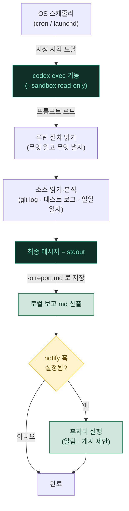

# 04. 자동 루틴 — codex exec · cron · notify

> 정해 둔 시각에 OS 스케줄러(cron/launchd)가 헤드리스 `codex exec`를 깨워, 미리 작성해 둔 절차를 사람 손 없이 수행하게 만드는 구조를 다룹니다. 일간·주간 보고 취합처럼 "매번 같은 일"을 스케줄러에 위임하는 방법, 읽기 전용 샌드박스로 안전하게 보고를 만드는 법, 그리고 `notify`로 턴 완료 후 후처리를 붙이는 법을 설명합니다.

---

## 📌 한눈에 보기

| 항목 | 내용 |
|---|---|
| 🎯 목적 | 반복 작업(보고·요약·트리아지)을 정해진 시각에 자동 수행 |
| 🧩 실행 명령 | `codex exec "<프롬프트>"` — 비대화/헤드리스 실행 |
| ⏰ 실행 주체 | OS 스케줄러 (Linux/WSL2 = cron, macOS = launchd) |
| 🛡️ 핵심 원칙 | **자동은 읽기(`--sandbox read-only`), 변경은 사람이** |
| 🔔 후처리 | `notify` — 턴 완료 시 외부 프로그램 실행 |
| 🌐 이식성 | 경로 하드코딩 금지 · Windows는 **WSL2 안에서 동일** |

---

## 🧠 개념 — 헤드리스 자동 루틴이란?

대화형 `codex`(TUI)는 사람이 앞에 앉아 승인 버튼을 누르는 것을 전제로 합니다. 반면 **`codex exec`**는 사람 없이 도는 것을 전제로 설계된 비대화 실행 모드입니다. 자동 루틴은 이 `codex exec`를 **cron / launchd**가 정해진 시각에 실행하도록 걸어 두는 구조입니다.

`codex exec`의 핵심 특성 세 가지를 먼저 이해해야 합니다.

| 특성 | 내용 |
|---|---|
| 📤 **출력 분리** | 진행 상황·로그는 **stderr**, 최종 메시지만 **stdout** → 리다이렉트·파이프로 결과만 깔끔히 수집 |
| 🚫 **승인 없음** | 승인 정책이 항상 `never`. 사람에게 묻지 않고, 막히면 실패를 모델에 바로 반환 |
| 🧱 **샌드박스 의존** | 승인이 없으므로 **안전은 오직 `--sandbox`가 담당**. 무엇을 허용할지 명령에서 못 박아야 함 |

> [!NOTE]
> 자동 루틴의 본질은 "스케줄러가 Codex를 대신 실행한다"는 점입니다. Codex가 스스로 시간을 재거나 백그라운드로 잠들어 있다가 깨어나는 것이 아니라, **OS가 정해진 시각에 새 `codex exec` 프로세스를 띄우는** 구조입니다. 그래서 프롬프트는 "이 실행이 시작되면 무엇을 읽고 무엇을 낼지"를 처음부터 끝까지 자족적으로 적어야 합니다.

### 동작 흐름

아래 다이어그램은 cron이 트리거되어 보고 파일을 산출하기까지의 전체 경로를 보여 줍니다. 자동 실행은 **읽기 전용**으로만 돌고, 외부 변경은 사람 확인 단계로 빠지는 것이 핵심입니다.



---

## 🚀 codex exec — 헤드리스 실행 기본기

자동화에 쓰는 주요 플래그를 먼저 정리합니다. 이 조합만 알면 대부분의 cron 루틴을 만들 수 있습니다.

| 플래그 | 의미 | 자동화에서의 쓰임 |
|---|---|---|
| `--sandbox <mode>` | 샌드박스 모드 | 보고 루틴은 `read-only` 고정 (아래 안전 절 참조) |
| `-o, --output-last-message <FILE>` | 최종 메시지를 파일로 | 보고 md를 바로 파일에 저장 |
| `--json` | 이벤트를 JSONL로 stdout | 로그 파싱·후처리 파이프라인 연결 |
| `-C, --cd <path>` | 작업 디렉터리 지정 | cron은 cwd가 불명확 → 대상 레포를 명시 |
| `--skip-git-repo-check` | git 저장소 밖 실행 허용 | 워크스페이스 루트가 git이 아닐 때 |
| `-m, --model <model>` | 모델 지정 | 보고엔 저렴·빠른 모델로 고정 가능 |

기본 사용 예:

```bash
# 최종 메시지만 stdout으로 → 파일 리다이렉트
codex exec --sandbox read-only "이 레포의 지난 24시간 커밋을 요약해줘" > report.txt

# 최종 메시지를 -o로 직접 저장 (진행 로그는 stderr로 흘려보냄)
codex exec --sandbox read-only -o ~/reports/daily.md \
  "오늘 변경된 파일과 열린 이슈를 표로 정리해줘" 2>/dev/null

# 파이프 입력과 조합 — 테스트 결과를 요약
npm test 2>&1 | codex exec --sandbox read-only "실패한 테스트만 골라 원인 추정과 함께 정리해줘"

# JSONL 이벤트 스트림으로 받아 후처리
codex exec --json --sandbox read-only "열린 버그를 심각도별로 트리아지" > events.jsonl
```

> [!TIP]
> stdout에는 **최종 메시지만** 나오므로 `> report.md`처럼 리다이렉트하면 곧바로 보고 파일이 됩니다. 진행 상황(어떤 파일을 읽는지 등)은 stderr로 나가니, cron 로그로 남기려면 `2>> ~/logs/codex-cron.log`로 따로 받으면 됩니다.

### 세션 재개(resume)

한 번 돈 루틴의 맥락을 이어 후속 실행을 하고 싶다면 `resume`을 씁니다.

```bash
codex exec resume --last "앞에서 만든 요약을 세 줄로 더 줄여줘"   # 직전 세션 이어서
codex exec resume <SESSION_ID> "지난 주 보고와 비교해줘"          # 특정 세션 이어서
```

> [!NOTE]
> 완전히 독립적인 매일 보고라면 `--ephemeral`(세션 미저장)로 깔끔히 끝내는 편이 낫습니다. 반대로 "어제 요약에 이어서 오늘 차이만"처럼 맥락 연속성이 필요할 때만 `resume`을 씁니다.

---

## 🛡️ 안전 — 읽기 전용으로 보고를 만든다

자동 루틴에서 가장 중요한 원칙입니다. `codex exec`는 **승인이 항상 `never`**이므로, 사람이 중간에 막을 수 없습니다. 즉 **샌드박스가 유일한 안전장치**입니다.

보고·요약·트리아지처럼 "읽어서 정리만" 하는 루틴은 예외 없이 `--sandbox read-only`로 돌립니다. 이 모드는 모든 파일을 읽을 수 있지만 **쓰기·네트워크가 차단**되므로, 루틴이 실수로 파일을 고치거나 외부로 무언가를 보낼 여지가 원천적으로 없습니다.

```bash
codex exec --sandbox read-only -o ~/reports/daily.md "..."   # 안전한 보고 생성
```

> [!WARNING]
> `codex exec`는 승인이 `never`라, `--sandbox workspace-write`나 `danger-full-access`를 무인 cron에 걸면 **아무도 확인하지 않는 상태에서 파일을 고치고 명령을 실행**합니다. 스케줄러가 돌리는 자동 루틴은 원칙적으로 `read-only`로 두고, 쓰기가 꼭 필요한 자동화는 이 문서 아래의 "쓰기가 필요할 때" 절의 가드를 반드시 함께 적용하세요.

<details>
<summary>✍️ 쓰기가 정말 필요할 때 (예: 보고를 레포에 커밋)</summary>

읽기 전용으로는 부족하고 파일을 만들어야 하는 자동화(예: 생성한 보고를 레포에 커밋)라면 `--sandbox workspace-write`가 필요합니다. 이때는 위험을 좁히는 가드를 함께 둡니다.

```bash
codex exec --sandbox workspace-write -C ~/proj \
  "reports/ 폴더 아래에만 daily.md를 쓰고, git add/commit 은 하지 마" 2>> ~/logs/codex.log
```

- **작업 범위를 프롬프트로 못 박기**: "이 폴더 밖은 건드리지 마"를 명시. (샌드박스가 물리적으로 막지만, 프롬프트로도 의도를 좁힘)
- **네트워크는 기본 차단 유지**: `workspace-write`도 네트워크는 기본 꺼짐 — 굳이 켜지 마세요.
- **`.git/`은 읽기 전용**: `workspace-write`에서도 `.git/`은 보호되어 `git commit`은 승인이 필요합니다. 승인이 없는 `exec`에서는 커밋이 막히므로, 커밋은 사람이 별도 단계로 하는 편이 안전합니다.
- **danger-full-access 금지**: 무인 스케줄러에서는 절대 쓰지 않습니다.

</details>

---

## 🗂️ 실제 루틴 예시 — 일간 · 주간 보고

같은 틀(`codex exec --sandbox read-only` + cron/launchd)로 정의하는 대표 루틴 두 가지입니다.

| 루틴 | ⏰ 시점 | 📋 하는 일 |
|---|---|---|
| 📝 **daily-report** | 평일 17:50 | 지난 24시간 커밋·변경·테스트 결과를 읽어 일일 보고 md 생성 |
| 📊 **weekly-report** | 금 18:00 | 한 주치 일일 보고를 취합해 주간 요약 md 생성 |

### 시간표로 보기

| 시각 | 월 | 화 | 수 | 목 | 금 |
|---|---|---|---|---|---|
| 17:50 | 📝 daily | 📝 daily | 📝 daily | 📝 daily | 📝 daily |
| 18:00 | | | | | 📊 weekly |

daily-report 스크립트의 뼈대는 다음과 같습니다. 전체 파일은 아래 [예시 링크](#-예시-스크립트-링크)에서 볼 수 있습니다.

```bash
#!/usr/bin/env bash
set -euo pipefail
REPO="$HOME/proj"
OUT="$HOME/reports/$(date +%F).md"

codex exec --sandbox read-only -C "$REPO" --skip-git-repo-check \
  -o "$OUT" \
  "지난 24시간의 커밋과 변경 파일을 읽고, 오늘 한 일 · 눈에 띄는 변경 · 남은 작업을 한국어 표로 정리해줘. 파일은 만들지 말고 요약 텍스트만." \
  2>> "$HOME/logs/codex-cron.log"
```

> [!IMPORTANT]
> cron이 실행하는 셸은 대화형 셸과 **환경(PATH·홈)이 다릅니다.** `codex` 바이너리를 절대 경로로 부르거나(`command -v codex`로 확인), 스크립트 앞부분에서 PATH를 명시하세요. 또 cron은 cwd가 불명확하므로 `-C "$REPO"`로 대상 디렉터리를 항상 지정하는 편이 안전합니다.

---

## ⏰ 스케줄러에 걸기 — cron / launchd

### 🐧 Linux · WSL2 — cron

`crontab -e`로 편집합니다. 형식은 `분 시 일 월 요일 명령`입니다.

```cron
# 평일(월~금) 17:50 — 일일 보고
50 17 * * 1-5  /home/<user>/scripts/daily-report.sh

# 금요일 18:00 — 주간 보고
0 18 * * 5     /home/<user>/scripts/weekly-report.sh
```

> [!NOTE]
> **Windows는 WSL2 안에서 동일합니다.** WSL2의 리눅스 배포판에서 위 `crontab`을 그대로 쓰면 됩니다. (WSL2에서 cron이 자동 기동하지 않는 배포판이라면 `service cron start`로 데몬을 먼저 띄워야 합니다.) 네이티브 Windows 작업 스케줄러 대신 WSL2 cron을 쓰는 것이 이 툴킷의 기본 전제입니다.

### 🍎 macOS — launchd

macOS는 cron 대신 launchd(LaunchAgents)를 권장합니다. `~/Library/LaunchAgents/com.codex.<name>.plist`를 만듭니다.

```xml
<?xml version="1.0" encoding="UTF-8"?>
<plist version="1.0">
<dict>
    <key>Label</key>
    <string>com.codex.<name></string>
    <key>ProgramArguments</key>
    <array>
        <string>/Users/<user>/scripts/daily-report.sh</string>
    </array>
    <key>StartCalendarInterval</key>
    <dict>
        <key>Hour</key><integer>17</integer>
        <key>Minute</key><integer>50</integer>
    </dict>
    <key>StandardErrorPath</key>
    <string>/Users/<user>/logs/codex-cron.log</string>
</dict>
</plist>
```

등록 후 `launchctl load ~/Library/LaunchAgents/com.codex.<name>.plist`로 적용합니다.

> [!WARNING]
> cron 등록·launchd 로드는 **시스템 설정 변경**입니다. 이 작업만큼은 자동화하지 말고, 사람이 직접 내용을 확인하며 등록·삭제하세요. 무인으로 스케줄러를 건드리면 의도치 않은 작업이 주기적으로 돌거나, 기존 작업을 덮어쓰는 사고로 이어질 수 있습니다.

---

## 🔔 notify — 턴 완료 후 후처리 붙이기

cron이 "언제 시작할지"를 담당한다면, `notify`는 "**끝난 뒤 무엇을 할지**"를 담당합니다. Codex가 한 턴을 마치면(`agent-turn-complete`) 지정한 프로그램을 실행해 줍니다.

`config.toml`에 등록합니다.

```toml
notify = ["python3", "/Users/<user>/.codex/notify.py"]
```

Codex는 이벤트가 나면 이 프로그램을 실행하며, **JSON을 마지막 argv 인자(`sys.argv[1]`)로 전달**합니다. 스키마(kebab-case 키):

```json
{
  "type": "agent-turn-complete",
  "thread-id": "b5f6c1c2-...",
  "turn-id": "12345",
  "cwd": "/Users/<user>/proj",
  "input-messages": ["지난 24시간 커밋 요약해줘 ..."],
  "last-assistant-message": "..."
}
```

핸들러의 뼈대(전체는 [예시 링크](#-예시-스크립트-링크) 참조):

```python
import json, sys

payload = json.loads(sys.argv[1])
if payload.get("type") != "agent-turn-complete":
    sys.exit(0)

msg = payload.get("last-assistant-message", "")
# 예: 데스크톱 알림 띄우기, 로그 적재, "게시할까요?" 제안 큐에 넣기 등
# (결제·발송·게시 같은 비가역 동작은 여기서 자동 실행하지 말 것)
```

> [!TIP]
> `notify`(외부 프로그램 실행)와 TUI 내부 알림은 별개입니다. 터미널 벨/OSC9 알림만 원하면 `[tui] notifications = ["agent-turn-complete"]`를 쓰세요. 후처리 로직(로그 적재·요약 전송 제안)을 붙이려면 위처럼 `notify` 프로그램을 씁니다.

> [!CAUTION]
> `notify` 프로그램 안에서 **메일 발송·노션 게시·구글시트 수정 같은 비가역·외부 동작을 무인 자동 실행하지 마세요.** notify는 "턴이 끝났다"는 신호를 받아 로그를 남기거나 사람에게 알리는 데까지만 쓰고, 실제 외부 변경은 사람이 확인 후 실행하는 것이 안전선입니다.

---

## 🧩 설계 패턴 (핵심)

자동 루틴을 안정적으로 운영하려면 프롬프트와 스크립트를 "어디서든·언제든 같은 결과"가 나오도록 작성해야 합니다.

### 1️⃣ 경로를 하드코딩하지 않는다

스크립트는 OS와 무관하게 동작해야 합니다. 대상 레포·출력 폴더를 셸 변수(`$HOME`, `$REPO`)로 두고 절대 경로 하드코딩을 피하면, Linux·WSL2·macOS 양쪽에서 같은 스크립트가 그대로 돕니다.

> [!WARNING]
> 경로를 하드코딩하면(`/Users/특정사용자/...`) 그 스크립트는 한 기계에 묶입니다. 다른 OS·계정에서 돌리는 순간 깨집니다. macOS는 한글 경로를 NFD로 저장하는 등 OS별 미묘한 차이도 있어, 경로 가정은 적을수록 안전합니다.

### 2️⃣ 자동은 읽기(read-only), 변경은 사람이

앞서 강조한 안전선을 설계 원칙으로 다시 못 박습니다. 루틴은 `--sandbox read-only`로 **읽고·분석하고·요약**하는 데까지만 자율적으로 하고, 외부 산출물을 실제로 바꾸는 행위는 사람 확인 뒤에만 합니다.

<details>
<summary>🧪 "읽기 vs 변경" 분류 예시</summary>

| 행위 | 분류 | 자동 루틴에서 |
|---|---|---|
| git log·테스트 로그·일일일지 읽기 | 읽기 | ✅ `read-only` 자동 |
| 결과를 표로 요약해 stdout/`-o`로 저장 | 읽기+로컬 산출 | ✅ 자동 |
| 레포 안 `reports/`에 md 커밋 | 변경 | 🤚 사람이 (또는 좁힌 workspace-write) |
| 구글시트 셀 값 수정 | 변경 | 🤚 사람 확인 |
| 노션 페이지 발행·전송 | 변경(외부) | 🤚 사람 확인 |
| 파일·디렉터리 삭제 | 변경(비가역) | 🤚 사람 확인 |

</details>

### 3️⃣ 일회성 vs 정규

| 종류 | 설명 | 방법 |
|---|---|---|
| 🔁 **정규** | 매일/매주 반복 | crontab / launchd에 상시 등록 |
| 1️⃣ **일회성** | 특정 시점만 한 번 | `at` 명령이나 임시 crontab 후 제거, 또는 그냥 손으로 `codex exec` 한 번 |

정의 방식(스크립트 본문)은 정규와 동일하므로, 잘 쓰던 일회성 스크립트가 반복 가치가 생기면 그대로 crontab에 올려 정규로 승격할 수 있습니다.

> [!NOTE]
> 자동화 후보의 판단 기준은 단순합니다. **"형식이 고정되어 있고, 자주 반복되며, 빼먹으면 손해인, 그리고 읽기만으로 끝나는 작업"**이면 좋은 후보입니다. 매번 판단이 달라지거나 결과가 비가역적인 작업은 자동화가 아니라 "제안 후 사람 실행" 대상입니다.

---

## 📎 예시 스크립트 링크

실제 루틴 스크립트의 전체 모습은 아래 예시에서 확인할 수 있습니다.

- [examples/scheduled-tasks/daily-report.sh](../examples/scheduled-tasks/daily-report.sh) — 일일 보고 `codex exec` 스크립트
- [examples/scheduled-tasks/weekly-report.sh](../examples/scheduled-tasks/weekly-report.sh) — 주간 보고 스크립트
- [examples/scheduled-tasks/crontab.example](../examples/scheduled-tasks/crontab.example) — cron 등록 예시(평일 daily · 금 weekly)
- [examples/notify.py](../examples/notify.py) — `agent-turn-complete` 후처리 핸들러

> [!TIP]
> 새 루틴을 만들 때는 위 스크립트를 복사해 `REPO`·`OUT` 변수와 프롬프트만 바꾸는 것이 가장 빠릅니다. 프롬프트는 "이 실행이 처음부터 끝까지 무엇을 읽고, 무엇을 요약하고, 무엇은 하지 말지(파일 쓰기·커밋 금지 등)"를 자족적으로 적어야 한다는 점을 잊지 마세요.

---

<div align="center">

[⬅️ 이전: 03. 메모리 & AGENTS.md](03-memory.md) · [🏠 목차](../README.md) · [다음: 05. MCP 서버 ➡️](05-mcp.md)

</div>
