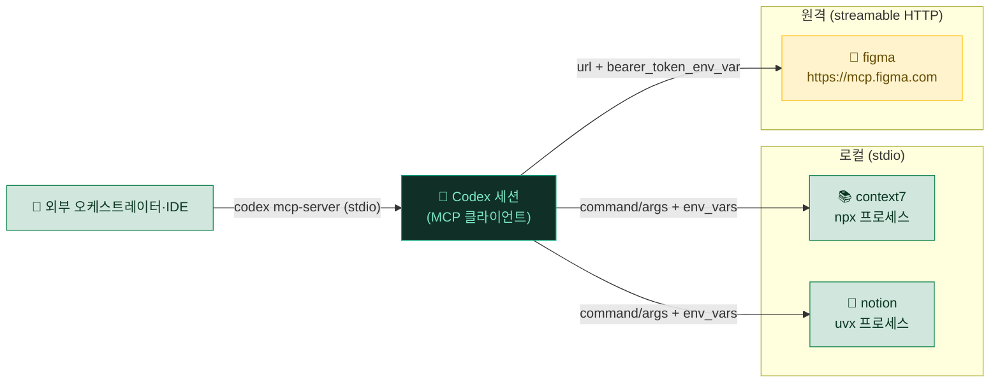

# 05. MCP 서버 — 외부 도구 연결

> Codex를 노션·문서 검색·디자인 도구 같은 **실제 외부 시스템**에 직접 연결하는 표준 프로토콜(MCP)과, `~/.codex/config.toml`에서 이를 어떻게 선언하고 인증하는지, 어떤 형태(stdio vs 원격 HTTP)를 언제 고르는지에 대한 실무 원칙을 정리합니다.

---

## 🔌 MCP란?

MCP(Model Context Protocol)는 Codex를 외부 도구·서비스에 연결하는 **표준 프로토콜**입니다. MCP 서버를 붙이면 Codex가 노션 페이지를 만들고, 최신 라이브러리 문서를 가져오고, 디자인 파일을 읽는 등 **실제 외부 시스템을 직접 다룹니다.**

직관적으로는 "Codex에 USB 포트를 다는 것"으로 이해하면 됩니다. Codex 본체는 그대로지만, 포트(MCP 서버)를 꽂는 순간 그 시스템의 기능이 Codex의 도구 목록에 그대로 노출됩니다.

| 구분 | 의미 | 형태 |
|---|---|---|
| 🔗 **선언** | `config.toml`에 서버 정의 또는 CLI로 추가 | `[mcp_servers.<name>]` / `codex mcp add` |
| 🧰 **도구 노출** | 각 MCP 서버가 자기 도구를 등록 | 세션 시작 시 도구 목록에 편입 |
| 🔑 **인증** | 토큰은 **환경변수 참조**로 주입 | `env_vars` / `bearer_token_env_var` |
| 👀 **확인** | 구성된 MCP 도구 목록 조회 | `/mcp` 슬래시 명령 |

> [!IMPORTANT]
> MCP 서버 정의는 `~/.codex/config.toml`에 들어가고, 이 파일은 **팀·백업으로 공유될 수 있습니다.** 따라서 토큰·시크릿은 **절대 값으로 적지 말고**, 반드시 환경변수 이름만 참조하도록 씁니다(`env_vars`, `bearer_token_env_var`). 실제 값은 셸 프로필·`.env`·비밀 관리자에 두고, 그 파일들은 동기화·git 추적에서 제외합니다.

---

## 🧩 config.toml `[mcp_servers.<name>]` — 두 가지 형태

Codex의 MCP 서버는 크게 두 종류입니다. **로컬에서 프로세스로 띄우는 stdio 서버**와, **원격 엔드포인트에 붙는 streamable HTTP 서버**입니다.

### 🖥️ stdio 서버 (로컬 프로세스)

Codex가 지정한 `command`를 자식 프로세스로 실행하고 표준입출력으로 통신합니다. `npx`·`uvx`로 배포되는 대부분의 MCP가 여기 해당합니다.

```toml
# ~/.codex/config.toml
[mcp_servers.context7]
command = "npx"
args = ["-y", "@upstash/context7-mcp"]
env_vars = ["CONTEXT7_TOKEN"]      # 이 env 이름을 자식 프로세스로 전달
startup_timeout_sec = 20           # 기동 대기 (기본 10초)
tool_timeout_sec = 60              # 개별 도구 호출 타임아웃 (기본 60초)
```

| 키 | 필수 | 의미 |
|---|---|---|
| `command` | ✅ | 실행할 바이너리 (`npx`, `uvx`, 절대경로 등) |
| `args` | | 명령 인자 배열 |
| `env` | | 자식에게 넘길 `KEY = "값"` 맵(값 직접 지정) |
| `env_vars` | | **현재 셸의 env 중 이 이름들만** 자식으로 전달(값을 config에 안 남김) |
| `cwd` | | 자식 프로세스 작업 디렉터리 |
| `startup_timeout_sec` | | 서버 기동 대기 한도(기본 10) |
| `tool_timeout_sec` | | 각 도구 호출 타임아웃(기본 60) |

> [!TIP]
> 토큰을 config에 노출하지 않으려면 `env`(값 직접)보다 **`env_vars`(이름만 참조)**를 우선하세요. 셸 프로필에서 `export CONTEXT7_TOKEN=<token>`으로 값을 관리하면, config.toml에는 이름만 남아 백업·커밋에 시크릿이 새지 않습니다.

### 🌐 streamable HTTP 서버 (원격)

원격 호스팅 MCP에 붙습니다. 인증은 **Bearer 토큰을 담은 환경변수 이름**으로 지정합니다.

```toml
[mcp_servers.figma]
url = "https://mcp.figma.com/mcp"
bearer_token_env_var = "FIGMA_OAUTH_TOKEN"   # 이 env의 값이 Authorization: Bearer 로
startup_timeout_sec = 20

[mcp_servers.figma.http_headers]
X-Workspace = "<workspace-id>"               # 고정 헤더

[mcp_servers.figma.env_http_headers]
X-Trace = "TRACE_ID"                         # env 값을 헤더로 (이름 → 헤더값)
```

| 키 | 필수 | 의미 |
|---|---|---|
| `url` | ✅ | 원격 MCP 엔드포인트 |
| `bearer_token_env_var` | | 이 **환경변수 값**을 `Authorization: Bearer`로 전송 |
| `http_headers` | | 고정 HTTP 헤더 맵 |
| `env_http_headers` | | `헤더이름 = "ENV_NAME"` — env 값을 헤더로 주입 |

공통 키(양쪽 모두): `enabled`(서버 on/off), `enabled_tools` / `disabled_tools`(노출할 도구 화이트/블랙리스트).

> [!WARNING]
> 인증 토큰은 **환경변수로만** 주입합니다. `config.toml`이나 git에 **평문 토큰을 절대 적지 마세요.** streamable HTTP 서버는 `bearer_token_env_var`로 env 이름만 참조하고, stdio 서버는 `env_vars`로 필요한 env만 전달합니다. 실수로 커밋된 토큰은 저장소 이력에 영구히 남아, 이력을 지우고 토큰을 폐기·재발급해야 합니다.

<details>
<summary>📖 stdio vs HTTP — 언제 무엇을 고르나</summary>

- **stdio(로컬)**: 서버 코드가 npm/PyPI로 배포되고 로컬에서 돌릴 수 있을 때. 네트워크 왕복이 없어 지연이 낮고, 인증도 로컬 env로 단순합니다. 대신 실행 환경(Node/Python)이 로컬에 있어야 합니다.
- **HTTP(원격)**: 벤더가 호스팅하는 MCP(디자인·SaaS 연동 등)나 OAuth가 필요한 서비스. 로컬 런타임이 필요 없고 항상 최신이지만, 네트워크·인증 상태에 의존합니다.
- **샌드박스 상호작용**: `workspace-write`에서 네트워크는 기본 차단이므로, 원격 HTTP MCP가 필요하면 `[sandbox_workspace_write].network_access = true` 또는 승인이 필요할 수 있습니다(01장 참조).
- `startup_timeout_sec`를 넉넉히 두면 `npx`가 처음 패키지를 받아오는 콜드스타트나 원격 핸드셰이크 지연에서 타임아웃 실패를 줄일 수 있습니다.

</details>

---

## 🧰 `codex mcp` CLI — config를 손대지 않고 관리

`config.toml`을 직접 편집하는 대신 CLI로 서버를 추가·조회·삭제할 수 있습니다. 추가 명령은 `~/.codex/config.toml`에 기록됩니다.

```bash
codex mcp list                 # 등록된 MCP 서버 목록
codex mcp get <name>           # 특정 서버 설정 보기
codex mcp remove <name>        # 서버 제거
codex mcp login <name>         # OAuth 로그인(지원 서버)
codex mcp logout <name>        # 로그아웃

# stdio 서버 추가 (-- 뒤가 실제 command/args)
codex mcp add context7 --env CONTEXT7_TOKEN=<token> -- npx -y @upstash/context7-mcp

# 원격 HTTP 서버 추가 (--env 는 stdio 전용)
codex mcp add figma --url https://mcp.figma.com/mcp --bearer-token-env-var FIGMA_OAUTH_TOKEN
```

| 명령 | 하는 일 |
|---|---|
| `codex mcp add <name> [opts] -- <cmd>` | stdio 서버를 config에 추가 |
| `codex mcp add <name> --url <URL>` | streamable HTTP 서버 추가 |
| `codex mcp list` | 등록 서버 일람 |
| `codex mcp get <name>` | 단일 서버 상세 |
| `codex mcp remove <name>` | 서버 삭제 |
| `codex mcp login` / `logout <name>` | 원격 서버 인증/해제 |

> [!NOTE]
> `--env KEY=VALUE`는 **stdio 서버 전용**입니다. 원격 HTTP 서버의 인증은 `--bearer-token-env-var <ENV>`로 지정하세요. TUI 안에서는 `/mcp` 슬래시 명령으로 현재 구성된 MCP 도구 목록을 언제든 확인할 수 있습니다.

---

## 🔁 Codex를 MCP 서버로 노출하기

Codex는 MCP **클라이언트**일 뿐 아니라, 자기 자신을 다른 프로그램에 붙일 수 있는 **MCP 서버**로도 동작합니다. 다른 에이전트·IDE·오케스트레이터가 Codex를 하나의 도구처럼 호출하는 구조를 만들 때 씁니다.

```bash
codex mcp-server        # Codex를 stdio MCP 서버로 실행
```

> [!TIP]
> 이 방향(Codex ← 외부 클라이언트)은 상위 오케스트레이터에서 Codex를 서브 도구로 감싸거나, MCP를 지원하는 편집기에 Codex를 연결할 때 유용합니다. 명령 이름은 하이픈이 붙은 `codex mcp-server`이며, `codex mcp serve` 형태는 없습니다(버전에 따라 다를 수 있음 — `codex mcp --help`로 확인).

### 🗺️ 연결 구조 한눈에

Codex 한 세션이 여러 MCP 서버(로컬 stdio·원격 HTTP)를 동시에 물고, 동시에 자신도 서버로 노출될 수 있습니다.



---

## 🎯 도구 선택 원칙 (중요)

같은 일을 할 수 있는 경로가 여러 개일 때, **비용·정확도 순**으로 선택합니다. 핵심 직관은 "API에 가까울수록 빠르고 정확하고, 화면·수작업에 가까울수록 느리고 깨지기 쉽다"는 것입니다.

1. **🥇 전용 MCP가 있으면 그걸 쓴다** — 노션·디자인·문서 검색처럼 API 기반 도구가 가장 빠르고 정확합니다. 결과가 구조화되어 돌아오고, 화면 상태와 무관하게 동작합니다.
2. **🥈 문서·최신 API는 문서 검색 MCP** — 학습 데이터에 없는 최신 라이브러리 문법은 Context7류 문서 MCP로 **환각 없이** 가져옵니다.
3. **🥉 그 외 셸로 되는 일은 그냥 셸** — 전용 MCP가 없고 로컬 CLI로 되는 작업이면 MCP를 새로 붙이기보다 Codex의 명령 실행(샌드박스+승인)으로 처리하는 편이 가볍습니다.

> [!NOTE]
> 이 순서는 **"무엇이 가능한가"가 아니라 "무엇이 연결되어 있는가"**의 문제입니다. 전용 MCP 도구가 에러를 내면 더 느리거나 부작용 큰 경로로 몰래 우회하지 말고, **원인을 디버깅하거나 보고**합니다. 예를 들어 노션 MCP가 일시적으로 실패한다고 해서 임의의 웹 자동화로 우회하기 시작하면, 느리고 깨지기 쉬운 데다 실패 원인도 가려집니다.

> [!TIP]
> 도구가 너무 많아지면 매 세션마다 모든 스키마를 컨텍스트에 싣게 되어 **토큰을 잡아먹습니다.** 자주 안 쓰는 서버는 `enabled = false`로 꺼 두거나, `disabled_tools`로 서버 안 일부 도구만 숨기면 노출 면적을 줄일 수 있습니다.

---

## 🔒 보안 가드 (필수)

MCP는 Codex에게 **실제 외부 시스템을 조작할 권한**을 주는 만큼, 아래 가드는 선택이 아니라 필수입니다.

> [!CAUTION]
> **토큰·시크릿은 config·git에 평문으로 두지 않습니다.**
> - stdio는 `env_vars`, HTTP는 `bearer_token_env_var`로 **환경변수 이름만** 참조합니다.
> - 실제 값은 셸 프로필·비밀 관리자에 두고, `~/.codex/auth.json`과 함께 **동기화·백업·커밋에서 제외**합니다.
> - 이미 커밋된 토큰은 이력에서 지우고 **즉시 폐기·재발급**합니다.

> [!CAUTION]
> **결제·발송·생성 트리거는 항상 사용자 확인을 받습니다.**
> - 외부 시스템에 대한 **결제·메일 발송·콘텐츠 게시** 같은 비가역 행위는 자율 실행 금지입니다.
> - 단순 **조회·기록 갱신**은 자율로 진행해도 됩니다. 경계선은 **가역성**입니다.

> [!CAUTION]
> **금융 행위는 Codex가 직접 실행하지 않습니다.**
> - 거래·송금·주문·이체는 **사용자가 직접** 수행합니다.
> - 보고서 작성·분류는 도와도, **돈을 움직이는 최종 트리거는 누르지 않습니다.**

<details>
<summary>🛡️ 왜 이렇게까지 보수적인가 (근거)</summary>

- MCP 도구는 **부작용이 즉시 외부에 반영**됩니다. 잘못된 메일 한 통, 잘못된 주문 하나는 되돌리기 어렵습니다.
- 특히 **프롬프트 인젝션** 위험이 있습니다. MCP 서버가 반환한 문서·페이지·이슈 본문에 숨겨진 지시문이 Codex의 행동을 유도할 수 있으므로, 외부 입력에서 온 지시·링크는 **데이터로만** 취급하고 명령으로 실행하지 않습니다.
- Codex의 **샌드박스·승인 계층**(01장)은 MCP 위에서도 그대로 작동합니다. 원격 HTTP MCP를 붙였다면 네트워크 접근이 승인 대상이 될 수 있으니, MCP 자체의 인증뿐 아니라 실행 권한 경계도 함께 점검하세요.

</details>

---

## 🔧 연결 방법 & 점검

1. 셸 프로필에 토큰 export: `export FIGMA_OAUTH_TOKEN=<token>` (값은 커밋 금지).
2. `~/.codex/config.toml`에 `[mcp_servers.<name>]` 추가하거나 `codex mcp add ...` 실행. 전체 예시는 [`../examples/config.toml`](../examples/config.toml) 참조.
3. `codex mcp list`로 등록 확인, 필요하면 `codex mcp login <name>`.
4. TUI에서 `/mcp`로 도구가 실제로 노출됐는지 확인.

<details>
<summary>🧭 연결 후 점검 체크리스트</summary>

| 점검 항목 | 확인 방법 |
|---|---|
| 서버가 목록에 떴는가 | `codex mcp list` / TUI `/mcp` |
| 인증이 완료됐는가 | `codex mcp get <name>` 상태, 필요 시 `codex mcp login` |
| 도구가 실제 노출되는가 | `/mcp`에 해당 서버 도구가 보이는지 |
| 토큰이 평문으로 안 남았는가 | config에 값이 아닌 **env 이름만** 있는지 |
| 시크릿 파일이 추적에서 빠졌는가 | `auth.json`·`.env`가 `.gitignore`·백업 제외에 포함됐는지 |
| 기동 타임아웃이 충분한가 | 콜드스타트 실패 시 `startup_timeout_sec` 상향 |

</details>

> [!NOTE]
> 양 머신(예: 회사 ↔ 집)을 쓴다면 토큰은 **머신마다 따로** 셸 프로필에 두고, `config.toml`만 동기화합니다. config에는 env 이름만 있으므로 안전하게 공유되고, 실제 값은 각 머신 로컬에만 존재합니다. 동기화 전략은 [08. 양 머신 동기화](08-sync-infra.md)에서 다룹니다.

---

<div align="center">

[⬅️ 이전: 04. 자동 루틴](04-automation.md) · [🏠 목차](../README.md) · [다음: 06. 추론 강도 & 컨텍스트 관리 ➡️](06-reasoning-context.md)

</div>
