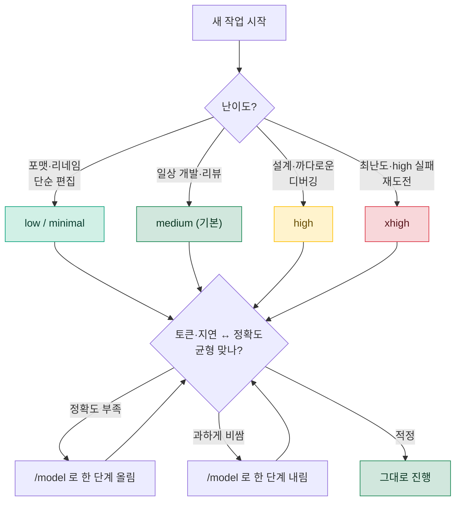
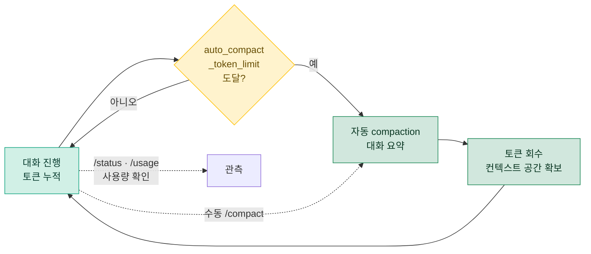

# 06. 추론 강도 & 컨텍스트 관리

## 🧠 추론 강도란? (model_reasoning_effort)

`model_reasoning_effort`는 Codex가 답을 만들기 전에 **얼마나 깊게 생각할지**를 정하는 설정입니다. 강도를 낮추면 숨은 추론에 쓰는 토큰과 지연이 줄어들고, 높이면 어려운 문제에서 정확도가 올라갑니다. 즉 **"토큰·속도 ↔ 정확도"의 다이얼**을 손에 쥐는 셈입니다.

핵심은 한 가지입니다. 모든 작업이 같은 양의 사고를 요구하지는 않습니다. 변수 이름 바꾸기나 포맷 정리에 최고 강도로 오래 추론하는 것은 순수한 낭비이고, 반대로 까다로운 동시성 버그를 최저 강도로 훑으면 엉뚱한 답이 나옵니다. 추론 강도는 이 불일치를 작업 단위로 맞춰 주는 손잡이입니다.

> [!NOTE]
> Claude Code에서는 이런 토큰 절약을 `caveman` 같은 **외부 플러그인**으로 붙였지만, Codex는 추론 강도·컨텍스트 압축을 모두 **내장 기능**으로 제공합니다. 마켓플레이스 설치도, 별도 훅도 필요 없습니다. 이 문서의 모든 것은 `config.toml`과 슬래시 명령만으로 동작합니다.

> [!IMPORTANT]
> 추론 강도(`model_reasoning_effort`)와 출력 길이(`model_verbosity`)는 **다른 축**입니다. 전자는 "얼마나 생각하는가"(정확도·숨은 토큰), 후자는 "얼마나 길게 말하는가"(눈에 보이는 설명문 길이)를 조절합니다. 두 축을 나눠 생각하면 튜닝이 훨씬 명확해집니다. → 뒤의 [출력 길이 절](#-model_verbosity--출력-길이는-별도-축) 참고.

| 항목 | 내용 |
|:---|:---|
| ⚙️ 설정 키 | `model_reasoning_effort` (`config.toml`) |
| 🎚️ 값 | `minimal` · `low` · `medium` · `high` · `xhigh` |
| 🔀 세션 중 전환 | `/model` (모델과 추론 강도를 함께 고름) |
| 🗂️ 플랜 모드 별도 | `plan_mode_reasoning_effort` |
| 🔗 관련 축 | `model_verbosity`(출력 길이), `model_context_window`(윈도우 크기) |

---

## 📊 강도 레벨 표

강도는 다섯 단계입니다. 낮을수록 빠르고 저렴하며, 높을수록 깊게 파고듭니다.

| 레벨 | 사고 깊이 | 토큰·지연 | 정확도(난제) | 권장 용도 |
|:---|:---:|:---:|:---:|:---|
| ⚪ `minimal` | 거의 없음 | 최소 | 낮음 | 기계적 변환, 포맷·리네임, 대량 반복 |
| 🟢 `low` | 얕음 | 낮음 | 보통 | 단순 편집, 명확한 수정, 빠른 반복 |
| 🟡 `medium` | 균형 | 중간 | 좋음 | 일상 개발·리뷰 (**기본값**) |
| 🟠 `high` | 깊음 | 높음 | 매우 좋음 | 설계·아키텍처, 까다로운 디버깅 |
| 🔴 `xhigh` | 최대 | 최대 | 최고 | 가장 어려운 난제, `high`가 실패한 재도전 |

> [!TIP]
> **기본은 `medium`으로 두고, 어려울 때만 `high`로 올리세요.** 처음부터 `xhigh`를 상시로 켜 두면 쉬운 작업에서 토큰과 시간을 태웁니다. 탐색·설계 단계에서만 올리고, 반복 편집으로 넘어가면 다시 내리는 식의 운영이 실용적입니다. 강도는 `/model`로 세션 도중 언제든 바꿀 수 있습니다.

### 같은 작업, 강도별 동작 차이

아래는 동일한 요청("이 함수의 간헐적 실패 원인을 찾아 줘")이 강도에 따라 어떻게 달라지는지를 개념적으로 보여 줍니다.

<details>
<summary>📝 강도별 동작 비교 펼쳐 보기</summary>

**`low`**
> 눈에 띄는 후보 한두 개를 빠르게 짚고 바로 수정안 제시. 표면적 원인이 맞으면 가장 빠르고 싸다. 숨은 상호작용이 원인이면 놓칠 수 있음.

**`medium` (기본)**
> 관련 코드 경로를 몇 갈래 따라가며 가설을 몇 개 세우고 가장 그럴듯한 것을 검증. 대부분의 일상 버그에 충분.

**`high`**
> 경쟁 상태·경계 조건·호출자까지 폭넓게 추적하고 반례를 스스로 만들어 확인. 토큰·시간을 더 쓰지만 까다로운 원인을 잡아낼 확률이 크게 오름.

**`xhigh`**
> `high`로도 재현이 안 잡히거나 여러 요인이 얽힌 난제를 위한 최대 깊이. 가장 비싸고 느리지만, 마지막 카드로 쓰기 좋음.

</details>

> [!NOTE]
> 위 차이는 "표현 길이"가 아니라 **사고의 깊이·범위**입니다. 강도를 올린다고 답이 길어지는 게 아니라, 더 많은 경우의 수를 따져 본 뒤 결론을 냅니다. 답의 장황함은 `model_verbosity`로 따로 조절합니다.

---

## 🎚️ 언제 올리고 언제 내리나

작업의 성격에 강도를 맞추는 것이 절약과 정확도를 동시에 얻는 길입니다.

| 상황 | 권장 강도 | 이유 |
|:---|:---:|:---|
| 포맷·린트 정리, 리네임, import 정렬 | `minimal` ~ `low` | 사고가 거의 불필요 — 토큰·지연만 아낌 |
| 명확한 버그 수정, 작은 기능 추가 | `low` ~ `medium` | 답이 뻔한 편, 빠른 반복이 이득 |
| 일반적인 개발·코드 리뷰·리팩터링 | `medium` | 대부분의 작업에 적정 균형 (기본) |
| 아키텍처 설계, 트레이드오프 판단 | `high` | 여러 대안을 깊게 비교해야 함 |
| 재현 어려운 버그, 동시성·성능 난제 | `high` ~ `xhigh` | 폭넓은 추적·반례 생성이 필요 |
| `high`로도 못 푼 문제 재도전 | `xhigh` | 마지막 카드, 최대 깊이 |
| 긴 반복 편집 세션 | 다시 내림(`low`/`medium`) | 어려운 구간을 지나면 낭비 방지 |

> [!TIP]
> "탐색·설계는 올리고, 실행·반복은 내린다"를 기본 리듬으로 삼으세요. 어려운 구간에서 `/model`로 `high`를 켜고 해법이 잡히면 다시 `medium`으로 내리는 것이, 세션 전체를 한 강도로 고정하는 것보다 거의 항상 유리합니다.

---

## ⚖️ 강도 ↔ 비용/정확도 트레이드오프

작업 난이도에 따라 강도를 고르는 판단 흐름입니다. 핵심은 "부족하면 올리고, 충분하면 내린다"는 되먹임 고리입니다.



> [!NOTE]
> 가장 먼저 갈리는 분기는 **작업 난이도**입니다. 여기서 고른 초기 강도는 확정값이 아니라 출발점입니다. 결과를 보고 `/model`로 한 단계씩 올리거나 내리며 그 세션의 적정점을 찾는 것이 실전 운영입니다.

---

## 🗣️ model_verbosity — 출력 길이는 별도 축

`model_verbosity`(`low`/`medium`/`high`)는 **눈에 보이는 답의 길이**를 조절합니다. 추론 강도가 "얼마나 생각하는가"라면, verbosity는 "얼마나 풀어 설명하는가"입니다. 혼자 빠르게 작업할 때는 `low`로 군더더기 설명을 줄이고, 학습·문서화가 목적이면 `high`로 자세히 받는 식으로 씁니다.

| 값 | 출력 | 어울리는 상황 |
|:---|:---|:---|
| `low` | 요점만 짧게 | 혼자 하는 반복 작업, 토큰 절약 |
| `medium` | 적당한 설명 | 일반 작업 (기본) |
| `high` | 근거·대안까지 상세 | 학습, 리뷰 근거 남기기, 공유 문서 |

> [!IMPORTANT]
> 두 축을 조합하면 세밀한 튜닝이 됩니다. 예를 들어 **`high` 추론 + `low` verbosity**는 "깊게 생각하되 결론만 짧게" — 어려운 문제를 정확히 풀되 출력 토큰은 아끼는, 개인 작업에 유용한 조합입니다. 반대로 **`medium` 추론 + `high` verbosity**는 "적당히 풀되 자세히 설명" — 온보딩·문서화에 맞습니다.

---

## 🔄 컨텍스트 관리 — /compact & 자동 compaction

긴 세션에서는 대화가 쌓이며 컨텍스트 윈도우가 차 오릅니다. 창이 가득 차면 오래된 맥락이 밀려나거나 응답 품질이 흔들립니다. Codex는 이를 두 가지로 다룹니다.

- 🧹 **`/compact` (수동)** — 지금까지의 대화를 **요약본으로 압축**해 토큰을 회수합니다. 핵심 결정·상태는 요약으로 남기고 장황한 중간 로그를 걷어내, 세션을 이어 가면서도 공간을 되찾습니다.
- ⚙️ **자동 compaction** — `model_auto_compact_token_limit`에 도달하면 Codex가 **스스로 요약**합니다. 사용자가 매번 신경 쓰지 않아도 긴 세션이 알아서 유지됩니다.
- 📐 **`model_context_window`** — 모델의 컨텍스트 윈도우 크기입니다. 자동 요약 시점 계산의 기준이 되며, 커스텀/프록시 모델을 쓸 때 명시해 둘 수 있습니다.



> [!TIP]
> 큰 맥락 전환이 있을 때(예: 한 기능을 끝내고 다른 파일로 넘어갈 때) **직접 `/compact`를 치면** 오래된 세부를 미리 정리해 뒤 작업의 품질이 좋아집니다. 자동 compaction만 믿기보다, 논리적 경계에서 손수 압축하는 습관이 도움이 됩니다.

> [!WARNING]
> compaction은 **요약이므로 정보 손실을 동반**합니다. 특정 줄 번호, 정확한 에러 메시지, 방금 합의한 세부 규칙처럼 무손실이 중요한 값은 압축 전에 파일이나 `AGENTS.md`에 적어 두세요. 요약 뒤에는 그 디테일이 사라졌을 수 있습니다. → [03. 메모리 & AGENTS.md](03-memory.md)

---

## 🗂️ plan_mode_reasoning_effort — 계획은 더 깊게

`plan_mode_reasoning_effort`는 **플랜 모드(`/plan`)에서만** 적용되는 별도 강도입니다. 계획 수립은 실행보다 넓게 내다봐야 하는 국면이라, 평소 실행 강도는 `medium`으로 두고 **계획할 때만 `high`**로 올리는 구성이 유용합니다.

```toml
model_reasoning_effort = "medium"     # 평소 실행
plan_mode_reasoning_effort = "high"   # 계획 세울 때만 더 깊게
```

> [!NOTE]
> 이렇게 나눠 두면 "설계는 신중하게, 실행은 가볍게"가 자동으로 굴러갑니다. `/plan`으로 들어가면 깊은 강도로 큰 그림을 그리고, 실제 편집 단계로 나오면 다시 가벼운 강도로 반복합니다. 서브에이전트·플랜 모드 운영은 [09. 서브에이전트 & 병렬 실행](09-subagents.md) 참고.

---

## 💡 왜 조절하나

- **비용·속도** — 숨은 추론도 토큰입니다. 쉬운 작업을 낮은 강도로 처리하면 같은 결과를 더 빠르고 저렴하게 얻습니다. 반대로 어려운 작업에서 강도를 아끼면 오답을 고치느라 오히려 더 많은 왕복이 듭니다.
- **정확도 확보** — 정말 어려운 문제는 `high`/`xhigh`가 만드는 깊은 추론이 결정적입니다. "한 번에 제대로"가 여러 번의 얕은 시도보다 총비용이 낮은 경우가 많습니다.
- **컨텍스트 수명 연장** — `/compact`와 자동 compaction으로 긴 세션을 유지하면, 세션을 새로 시작하며 맥락을 다시 설명하는 비용이 사라집니다. 장시간 디버깅·탐색에서 체감이 큽니다.
- **출력 밀도 조절** — `model_verbosity`로 설명 길이를 줄이면 단위 토큰당 정보 밀도가 올라가고, 스크롤을 덜 내려도 핵심이 보입니다.

> [!TIP]
> 강도는 "항상 최고로 켜 두는 것"이 아니라 "상황에 맞춰 다이얼을 돌리는" 도구로 보세요. 어려운 탐색에는 강하게, 반복 실행에는 약하게 — 이렇게 선택적으로 쓰는 것이 비용과 정확도를 동시에 잡는 방법입니다.

---

## ⚙️ 설정 예시 (config.toml)

```toml
# ── 추론 강도 ────────────────────────────────
model_reasoning_effort = "medium"       # minimal | low | medium | high | xhigh
plan_mode_reasoning_effort = "high"     # 플랜 모드에서만 더 깊게

# ── 출력 길이(별도 축) ───────────────────────
model_verbosity = "low"                 # low | medium | high — 설명문 길이

# ── 컨텍스트 관리 ────────────────────────────
model_auto_compact_token_limit = <토큰수>   # 이 값 넘으면 자동 요약 (버전에 따라 기본값 다름)
model_context_window = <토큰수>             # 커스텀/프록시 모델 시 명시
```

<details>
<summary>💻 세션 중 전환 & 관측 명령 펼쳐 보기</summary>

| 명령 | 기능 |
|:---|:---|
| `/model` | 모델과 추론 강도를 함께 선택·전환 |
| `/compact` | 지금까지의 대화를 요약해 토큰 회수 |
| `/status` | 현재 모델·강도·샌드박스 등 세션 상태 |
| `/usage` | 토큰 사용량 확인 |
| `/plan` | 플랜 모드 진입(→ `plan_mode_reasoning_effort` 적용) |

- CLI에서 한 번만 다른 강도로 실행하려면 오버라이드를 씁니다:
  `codex --config model_reasoning_effort='"high"' "어려운 리팩터링"`
- 헤드리스(`codex exec`)에서도 동일하게 `--config`로 강도를 지정할 수 있습니다. → [04. 자동 루틴](04-automation.md)

> [!NOTE]
> 설정값·기본값은 Codex 버전에 따라 다를 수 있습니다. 본인 버전에서 `codex --help`, `/status`, `/model`로 실제 지원 값을 확인하세요. `model_auto_compact_token_limit`·`model_context_window`의 기본값도 모델·버전에 따라 달라집니다.

</details>

---

## ⚠️ 주의사항

> [!WARNING]
> 강도·verbosity·컨텍스트 설정을 함께 조율할 때 흔한 함정입니다.
>
> - 🔺 **`xhigh` 상시 고정 금지** — 쉬운 작업까지 최대 강도로 돌리면 토큰·지연이 급증합니다. 기본은 `medium`, 필요할 때만 올리세요.
> - 🔻 **난제에 `minimal`·`low` 금지** — 얕은 추론으로 까다로운 버그를 훑으면 그럴듯하지만 틀린 답이 나오기 쉽습니다. 오답 수정 왕복이 절약분을 삼킵니다.
> - 🧹 **compact 전 무손실 값 보존** — 요약은 디테일을 지웁니다. 정확한 값은 미리 파일/`AGENTS.md`에 남기세요.

> [!CAUTION]
> `model_verbosity`를 `low`로 낮추면 답이 짧아져 혼자 작업할 때는 편하지만, **공유 산출물(PR 설명·보고서·온보딩 문서)** 은 근거가 필요합니다. 공유할 결과를 만들 때는 verbosity를 올리거나 정상 길이로 되돌려, 협업자가 맥락을 잃지 않도록 하세요. 추론 강도를 낮추는 것과 출력을 줄이는 것은 별개이니, "짧게"가 필요할 뿐 "덜 정확하게"가 필요한 게 아니라면 강도는 유지하고 verbosity만 내리는 편이 안전합니다.

---

<div align="center">

[⬅️ 이전: 05. MCP 서버](05-mcp.md) · [🏠 목차](../README.md) · [다음: 07. config.toml · 프로필 · 백업 ➡️](07-config-backup.md)

</div>
