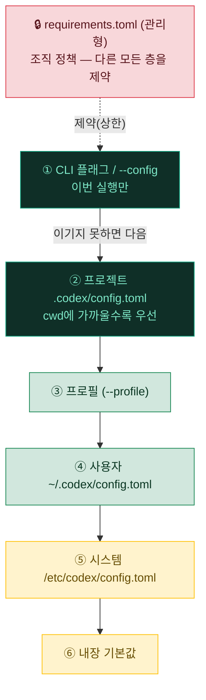

# 07. ⚙️ config.toml · 프로필 · 백업

이 문서는 Codex CLI 환경의 동작을 정의하는 `~/.codex/config.toml`, 모델·승인·샌드박스를 한 이름으로 묶는 **프로필**, 그리고 설정 자산을 지키는 백업 체계를 다룹니다. 핵심 목표는 단 하나입니다. **언제든 환경을 그대로 재현할 수 있게 만드는 것**입니다.

> [!NOTE]
> 설정·`AGENTS.md`·스킬은 한 번 만들고 끝나는 파일이 아니라 시간이 갈수록 가치가 누적되는 자산입니다. 그래서 "어떻게 정의하는가"만큼이나 "어떻게 잃지 않는가"가 중요합니다. 이 문서는 두 측면을 함께 설명합니다. (Windows는 별도 절차 없이 **WSL2 안에서 동일**하게 적용됩니다.)

---

## 🗂️ config.toml — 환경의 단일 진실

`~/.codex/config.toml`은 모델·추론 강도·승인 정책·샌드박스·MCP 서버·훅·알림 등 Codex 동작 전반을 한곳에서 정의하는 파일입니다(홈은 `CODEX_HOME`, 기본 `~/.codex`). 동작을 좌우하는 스위치가 여기 모여 있기 때문에, 이 파일 하나로 환경을 재현할 수 있도록 관리하는 것이 셋업 전체의 출발점입니다.

> [!TIP]
> 설정을 여기저기 흩뜨리지 말고 `config.toml`에 모으면, 새 머신을 세팅할 때 이 파일 하나만 옮겨도 대부분의 동작이 그대로 따라옵니다. "설정이 어디 있더라"를 찾아 헤매는 비용이 사라지는 것이 가장 큰 이점입니다.

### 🔑 자주 쓰는 주요 키

| 키 | 예시 값 | 무엇을 하나 |
|---|---|---|
| 🤖 `model` | `"gpt-5.2-codex"` | 기본 모델 (`-m`로 세션별 오버라이드) |
| 🧠 `model_reasoning_effort` | `minimal`~`xhigh` | 추론 강도([06-reasoning-context.md](06-reasoning-context.md)) |
| 🛡️ `approval_policy` | `on-request` | 승인 정책([01-sandbox-approvals.md](01-sandbox-approvals.md)) |
| 📦 `sandbox_mode` | `workspace-write` | 샌드박스 경계([01-sandbox-approvals.md](01-sandbox-approvals.md)) |
| ✍️ `[sandbox_workspace_write]` | `network_access = false` | 추가 쓰기 경로·네트워크 허용 |
| 🔌 `[mcp_servers.NAME]` | `command`/`url` | MCP 서버 등록([05-mcp.md](05-mcp.md)) |
| 🧳 `[profiles.NAME]` | 아래 참고 | 설정 묶음(모델·승인·샌드박스) |
| 🪝 `[hooks]` | `PreToolUse` 등 | 라이프사이클 훅([01-sandbox-approvals.md](01-sandbox-approvals.md)) |
| 🔔 `notify` | `["python3", "..."]` | 턴 완료 외부 알림([04-automation.md](04-automation.md)) |
| 🖥️ `[tui]` | `notifications`, `theme` | 터미널 알림·테마·애니메이션 |
| 🔗 `file_opener` | `"vscode"` | 인용을 클릭 가능한 링크로(vscode/cursor/windsurf/none) |
| 🗃️ `[history]` | `persistence = "save-all"` | 히스토리 저장 방식·`max_bytes` |
| 🌱 `[shell_environment_policy]` | `inherit = "core"` | 하위 프로세스에 넘길 환경변수 정책 |
| 🔎 `web_search` | `"live"` | 웹 검색 도구(CLI `--search`) |

전체 예시는 저장소의 [examples/config.toml](../examples/config.toml)에서 확인할 수 있습니다.

> [!IMPORTANT]
> 위 표의 값은 "이 셋업이 선택한 기본값"이며 정답이 아닙니다. 예를 들어 `model_reasoning_effort`를 `high`로 두면 난제 정확도는 오르지만 토큰·지연이 늘고, `sandbox_mode`를 `workspace-write`로 열면 편해지지만 그만큼 경계가 넓어집니다. 각 항목은 자신의 작업 방식과 리스크 허용치에 맞춰 조정하는 것이 맞습니다.

<details>
<summary>📄 config.toml 최소 형태 예시 (placeholder)</summary>

```toml
# 모델 / 추론 강도
model = "gpt-5.2-codex"
model_reasoning_effort = "medium"

# 안전 — 승인 + 샌드박스 (자세한 내용은 01-sandbox-approvals.md)
approval_policy = "on-request"
sandbox_mode   = "workspace-write"

[sandbox_workspace_write]
network_access = false        # 네트워크는 기본 차단

# 알림 / UX
notify      = ["python3", "<~/.codex/notify.py 경로>"]
file_opener = "vscode"

[tui]
notifications = ["agent-turn-complete"]

# MCP 서버 (자세한 내용은 05-mcp.md)
[mcp_servers.context7]
command = "npx"
args    = ["-y", "@upstash/context7-mcp"]

# 프로필 — 아래 '프로필' 절 참고
[profiles.readonly]
approval_policy = "untrusted"
sandbox_mode    = "read-only"
```

> 경로·식별자는 머신마다 다르므로 `<...>` placeholder로 표기했습니다. 실제 값은 각자의 환경에 맞춰 채웁니다. 모델 ID는 버전에 따라 다를 수 있습니다.

</details>

> [!TIP]
> 파일을 직접 열지 않고도 한 줄로 값을 바꿀 수 있습니다. 세션 한정 오버라이드는 `codex --config model='"gpt-5.2-codex"'` 또는 축약 플래그 `codex -m gpt-5.2-codex`를 쓰면 됩니다. 상시로 굳히려면 그때 `config.toml`에 적습니다.

---

## 🧳 프로필 — 모델·승인·샌드박스 묶음

같은 작업이라도 상황에 따라 "안전하게 훑어보기"와 "마음껏 자동화"를 오가고 싶을 때가 많습니다. 매번 플래그를 길게 붙이는 대신, 자주 쓰는 조합을 **프로필**이라는 이름으로 묶어 두면 `--profile <이름>` 한 번으로 전환됩니다.

프로필을 정의하는 방법은 두 가지입니다.

| 방식 | 위치 | 언제 쓰나 |
|---|---|---|
| 📁 인라인 | `config.toml`의 `[profiles.NAME]` | 대부분의 경우 — 한 파일에서 관리 |
| 📄 별도 파일 | `~/.codex/<name>.config.toml` | 프로필이 커지거나 파일 단위로 나눠 관리하고 싶을 때 |

```toml
# ~/.codex/config.toml

[profiles.readonly]         # 읽기·질문만 — 리뷰/탐색용
approval_policy = "untrusted"
sandbox_mode    = "read-only"

[profiles.auto]             # 워크스페이스 자동 — 실작업용
approval_policy = "on-request"
sandbox_mode    = "workspace-write"
model_reasoning_effort = "high"
```

```bash
codex --profile readonly            # 리뷰 모드로 시작
codex --profile auto "리팩터링 실행"  # 자동 모드로 시작
```

> [!TIP]
> 프로필은 "역할별 프리셋"이라고 생각하면 쉽습니다. 낯선 저장소를 처음 열 때는 `readonly`, 내가 신뢰하는 프로젝트에서 반복 작업할 때는 `auto` — 이렇게 두어 개만 만들어 두어도 매번 승인·샌드박스 플래그를 손으로 맞추는 수고가 사라집니다.

> [!NOTE]
> 프로필은 값을 **묶어 줄 뿐**, 최종 우선순위는 아래의 레이어 규칙을 따릅니다. 즉 `--profile auto`를 써도 CLI에서 `--sandbox read-only`를 덧붙이면 그쪽이 이깁니다. 프로필은 "기본 묶음", CLI는 "이번만 예외"입니다.

---

## 🪜 설정 우선순위 — 어떤 값이 이기는가

값이 여러 곳에 흩어져 있으면 "왜 이 설정이 안 먹지?"가 생깁니다. Codex는 **높은 층이 낮은 층을 덮어쓰는** 명확한 순서를 갖고 있으니, 이 순서만 외워 두면 대부분의 혼란이 사라집니다.



높음 → 낮음 순서를 글로 옮기면 다음과 같습니다.

1. **CLI 플래그 / `--config`** — 이번 실행에만 적용되는 최우선 오버라이드.
2. **프로젝트 `.codex/config.toml`** — 작업 디렉터리(cwd)에 가까운 것이 더 우선.
3. **프로필** — `--profile <name>`으로 활성화한 묶음.
4. **사용자 `~/.codex/config.toml`** — 나의 전역 기본값.
5. **시스템 `/etc/codex/config.toml`** — 머신 전역.
6. **내장 기본값** — 아무것도 안 정했을 때.

> [!IMPORTANT]
> `requirements.toml`(관리형)은 이 사다리의 바깥에서 **상한을 씌우는 제약 계층**입니다. 조직이 관리형 정책으로 특정 값을 강제하거나 훅을 잠그면(`allow_managed_hooks_only = true` 등), 아래 어떤 층에서 무엇을 적어도 그 제약을 넘을 수 없습니다. 회사 지급 장비에서 "내 config가 무시된다" 싶으면 이 계층을 먼저 의심하세요.

---

## 🗄️ ~/.codex 레이아웃

`~/.codex/` 안에는 성격이 전혀 다른 파일들이 함께 살고 있습니다. **무엇을 백업하고 무엇을 절대 커밋하면 안 되는지**를 가르는 기준이 되므로, 각 항목의 성격을 알아 두세요.

| 경로 | 성격 | 백업 |
|---|---|---|
| 📝 `config.toml` | 환경 설정의 단일 진실 | ✅ 포함 |
| 📌 `AGENTS.md` | 글로벌 지침([03-memory.md](03-memory.md)) | ✅ 포함 |
| 💬 `prompts/` | 커스텀 프롬프트(레거시, 스킬 권장) | ✅ 포함 |
| 🧩 `~/.agents/skills` (또는 레거시 `~/.codex/skills`) | 스킬([02-skills.md](02-skills.md)) | ✅ 포함 |
| 🪝 `hooks.json` | 라이프사이클 훅(있다면) | ✅ 포함 |
| 🔐 `auth.json` | **자격증명(토큰)** | ❌ **절대 제외** |
| 🧾 `history.jsonl` | 입력 히스토리(재현 불필요·민감) | ❌ 제외 |
| 🗂️ `sessions/` | 세션 로그(재개용, 용량 큼) | ❌ 제외 |
| 🧠 `.system` | 내부 캐시 | ❌ 제외 |

---

## 💾 백업 — 설정 유실 방지

설정·`AGENTS.md`·스킬은 시간이 쌓일수록 자산이 되고, 한 번 날아가면 복구 비용이 큽니다. 그래서 **정기 아카이브(tar/zip) 백업**을 자동화합니다. 사람이 기억해서 누르는 백업은 결국 잊히기 때문에, 자동화가 핵심입니다. (스케줄 등록은 [04-automation.md](04-automation.md)의 cron/`launchd` 절차를, 두 머신 동기화는 [08-sync-infra.md](08-sync-infra.md)를 참고하세요.)

### 📦 백업 범위 (포함 / 제외)

| 대상 | 포함 여부 | 비고 |
|---|---|---|
| `~/.codex/config.toml` | ✅ 포함 | 환경 설정 일체 |
| `~/.codex/AGENTS.md` | ✅ 포함 | 글로벌 지침 |
| `~/.codex/prompts/` | ✅ 포함 | 커스텀 프롬프트 |
| `~/.agents/skills`(또는 `~/.codex/skills`) | ✅ 포함 | 스킬 자산 |
| `~/.codex/auth.json` | ❌ **제외** | 토큰 유출 방지 (의도적 제외) |
| `~/.codex/history.jsonl` | ❌ 제외 | 재현 불필요·민감 |
| `~/.codex/sessions/` · `.system` | ❌ 제외 | 세션 로그·캐시 |

예시 스크립트는 [examples/backup-codex-config.sh](../examples/backup-codex-config.sh)에 있습니다. 핵심은 "포함할 것만 골라 담고, 자격증명은 이름으로 명시 제외"하는 것입니다.

```bash
# ~/.codex 에서 설정 자산만 골라 tar 로 묶기 (auth.json·history·sessions 제외)
tar -czf "<백업경로>/codex-config-$(date +%F).tar.gz" \
  -C "$HOME" \
  --exclude='.codex/auth.json' \
  --exclude='.codex/history.jsonl' \
  --exclude='.codex/sessions' \
  --exclude='.codex/.system' \
  .codex/config.toml .codex/AGENTS.md .codex/prompts .agents/skills
```

> [!WARNING]
> **`auth.json`은 절대 백업 아카이브나 git에 넣지 마세요.** 이 파일은 로그인 토큰을 담고 있어, 백업본이나 커밋이 어딘가로 새는 순간 인증 토큰까지 함께 새어 나갑니다. 다른 모든 것을 백업하면서도 이 파일 하나만은 일부러 제외하는 것은 편의가 아니라 **보안 결정**입니다. 설정 저장소를 만든다면 `.gitignore`에 `auth.json`, `history.jsonl`, `sessions/`를 반드시 넣으세요.

> [!CAUTION]
> `history.jsonl`과 `sessions/`도 제외 대상입니다. 재현에 필요 없을뿐더러 과거 대화·경로·명령이 그대로 남아 **민감 정보가 섞여 있을 수 있기** 때문입니다. 용량도 빠르게 커지므로 백업에서 빼는 편이 여러모로 안전합니다.

### ♻️ 보관 정책 — 롤링 윈도우

백업은 무한히 쌓이면 디스크를 잠식합니다. **최근 N개만 유지**하고 그보다 오래된 아카이브는 자동 삭제하는 롤링 윈도우를 권장합니다. 예를 들어 주 1회 백업에 8개 보관이면 약 8주분의 복구 창이 남습니다.

> [!IMPORTANT]
> **왜 이렇게 설계하는가**를 정리하면 다음과 같습니다.
> - 🔒 **자격증명 제외** — 아카이브가 새더라도 인증 토큰은 새지 않도록, `auth.json`을 일부러 뺍니다.
> - ♻️ **롤링 윈도우** — 무한 축적을 막으면서도 한참 전 설정으로 되돌아갈 충분한 복구 창을 남깁니다.
> - 👀 **백업 정지 감지** — `SessionStart` 훅으로 "마지막 백업 N일 전 ⚠️"를 띄우면, 어떤 이유로 백업이 멈춰도 사람이 바로 알아챕니다. 조용히 멈춰 있다가 정작 필요할 때 백업이 없는 사고를 예방합니다. (훅 작성은 [01-sandbox-approvals.md](01-sandbox-approvals.md) 참고)

---

## 🔧 복구

복구 절차는 단순합니다. 백업 아카이브를 풀어 `~/.codex/`에 덮어쓰면 됩니다.

```bash
# 1) 백업 아카이브 압축 해제
tar -xzf <백업파일.tar.gz> -C <복구_임시폴더>

# 2) ~/.codex/ 및 ~/.agents/ 에 덮어쓰기
cp -r <복구_임시폴더>/.codex/*  ~/.codex/
cp -r <복구_임시폴더>/.agents/* ~/.agents/ 2>/dev/null || true

# 3) Codex 첫 실행 → 재로그인 (Sign in with ChatGPT)
codex
```

> [!CAUTION]
> 백업에는 의도적으로 `auth.json`이 **들어 있지 않습니다.** 따라서 복구만으로는 인증이 따라오지 않으며, 복구 후 `codex`를 처음 실행할 때 **재로그인**(Sign in with ChatGPT)해야 정상 동작합니다. "복구했는데 로그인이 풀려 있다"는 버그가 아니라 설계대로의 동작입니다. (headless 환경이라면 `CODEX_API_KEY` 환경변수로 대체합니다.)

> [!TIP]
> 백업을 가끔 한 번씩 실제로 풀어 보면서 "이 아카이브만으로 환경이 정말 되살아나는가"를 점검하면 더 안전합니다. 한 번도 풀어 본 적 없는 백업은 정작 필요한 순간에 비어 있거나 손상돼 있어도 알 길이 없기 때문입니다. 복구 후 `codex --config` 없이 그냥 `codex`를 띄워 프로필·MCP·훅이 그대로 뜨는지 눈으로 확인하는 것이 가장 확실한 검증입니다.

---

<div align="center">

[⬅️ 이전: 06. 추론 강도 & 컨텍스트](06-reasoning-context.md) · [🏠 목차](../README.md) · [다음: 08. 양 머신 동기화 ➡️](08-sync-infra.md)

</div>
