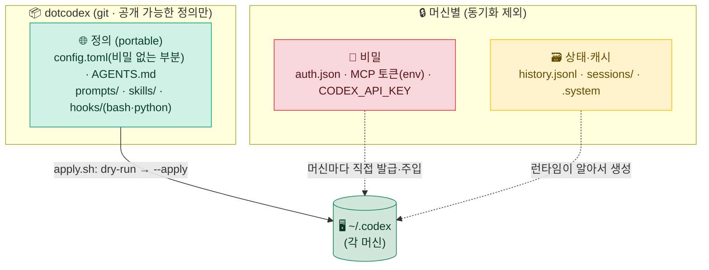
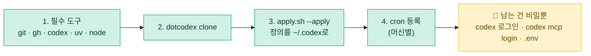

# 🔄 08. 양 머신 동기화 — 회사 ↔ 집

> [!NOTE]
> 어느 컴퓨터에서 `codex`를 켜도 **같은 글로벌 지침(AGENTS.md)·스킬·프롬프트·훅·설정**이 따라오게 만드는 패턴입니다.
> 핵심은 단 하나 — **portable한 "정의"는 git으로 동기화하고, 자격증명·런타임 상태는 절대 동기화하지 않는다.**

---

## 🧩 문제 — `~/.codex`를 통째로 올리면 안 되는 이유

회사와 집, 두 머신의 `~/.codex`(`CODEX_HOME`)를 일치시키고 싶습니다. 그런데 이 디렉터리에는 **성격이 완전히 다른 세 종류**가 한데 섞여 있습니다.

| 종류 | 예 | 동기화하면 |
|---|---|---|
| 🌐 **정의(portable)** | `config.toml`·`AGENTS.md`·`prompts/`·스킬·훅 | ✅ 어느 머신에서나 같은 뜻 — 올려야 함 |
| 🔐 **비밀(자격증명)** | `auth.json`·MCP 토큰·`CODEX_API_KEY` | ❌ 공개 저장소에 오르면 **즉시 토큰 유출** |
| 🗃️ **상태·캐시** | `history.jsonl`·`sessions/`·`.system` | ❌ 머신별 런타임 산물 — 덮어쓰면 충돌 |

> [!WARNING]
> `~/.codex/`를 **통째로 git에 올리는 것은 위험**합니다. `auth.json`(ChatGPT 로그인/ API 키)이 함께 커밋되면 토큰이 그대로 새어 나가고, `history.jsonl`·`sessions/`는 머신 간 덮어쓰기로 대화·세션 상태를 망가뜨립니다. **무엇을 올리고 무엇을 뺄지 선별이 전부**입니다.

> [!NOTE]
> **Windows는 WSL2 안에서 동일**합니다. Codex는 Windows에서 WSL2를 경유하므로 `~/.codex`는 리눅스 홈(`/home/<user>/.codex`)에 있습니다. `C:\Users\...`가 아닙니다. 즉 회사가 Windows여도 실제로는 **양쪽 다 리눅스/맥 홈** — 훅·스크립트는 어디서나 **bash/python** 하나로 통일됩니다(PowerShell 분기 불필요).

---

## 🗂️ 해법 — `dotcodex` 패턴

정의를 git 저장소(`dotcodex/`)에 모아두고, `apply` 스크립트가 현재 머신의 `~/.codex`로 심링크·복사합니다. 비밀·상태는 저장소에 **아예 들어가지 않습니다**.

```
dotcodex/
├── config.toml               # 비밀 없는 부분만 (모델·승인·샌드박스·프로필·MCP 정의)
├── AGENTS.md                 # 글로벌 지침 (머신 무관)
├── prompts/                  # 커스텀 프롬프트 (레거시 — 스킬 권장, but portable)
├── skills/                   # ~/.agents/skills로 배포될 스킬 정의
├── hooks/
│   ├── hooks.json            # PreToolUse/SessionStart 등 (bash·python 핸들러)
│   └── *.py / *.sh           # 양 머신 동일 언어
├── scheduled-tasks/          # cron 정의 (등록만 머신별)
├── .env.example              # 토큰 "이름"만; 값은 각 머신에서 채움
├── .gitignore                # auth.json · .env · sessions/ · history.jsonl 차단
└── scripts/
    ├── bootstrap.sh          # 새 머신 첫 세팅 (clone → apply → env 안내)
    └── apply.sh              # dry-run → --apply, ~/.codex로 반영
```

> [!TIP]
> 디렉터리 이름은 자유입니다(`<dotcodex>` 자리). 중요한 건 이름이 아니라 **경계** — "동기화할 정의 / 제외할 비밀·상태"의 2분할, 그리고 그 경계를 `.gitignore`로 못 박는 것입니다.

---

## 🎯 동기화 범위 결정 (핵심)

이 패턴의 성패는 "무엇을 올리고 무엇을 뺄지"를 정확히 가르는 데 달려 있습니다. 판단 기준은 단 한 문장입니다.

> **정의는 동기화, 상태·비밀은 머신별.**

### ✅ 동기화하는 것 (정의)

| 항목 | 이유 |
|---|---|
| 🌐 글로벌 `AGENTS.md` | OS와 무관한 순수 지침 (→ [03. 메모리 & AGENTS.md](03-memory.md)) |
| ⚙️ `config.toml`(비밀 없는 부분) | 모델·승인·샌드박스·프로필·MCP **정의** — 머신 독립 |
| 🧩 스킬(`~/.agents/skills`) | 작업 절차 정의 — 머신 독립 (→ [02. 스킬](02-skills.md)) |
| 📝 `prompts/` | 커스텀 프롬프트 정의 (deprecated이나 portable) |
| 🪝 훅(`hooks.json` + bash/python) | 양 머신 동일 언어 — 그대로 동작 (→ [01. 샌드박스·승인·훅](01-sandbox-approvals.md)) |
| ⏰ `scheduled-tasks/` 정의 | cron 정의 자체는 portable (등록만 머신별, → [04. 자동 루틴](04-automation.md)) |
| 💾 백업 스크립트 | 환경 보존 로직 (→ [`../examples/backup-codex-config.sh`](../examples/backup-codex-config.sh)) |
| 📁 프로젝트 `AGENTS.md`·`.codex/skills` | 코드와 함께 이미 git — 팀 공유 |

### ❌ 동기화하지 않는 것 (비밀·상태)

| 항목 | 이유 | 대처 |
|---|---|---|
| `auth.json` | 🔥 자격증명(ChatGPT 로그인/API 키) | 머신마다 `codex` 실행 후 최초 로그인 |
| MCP 토큰(`bearer_token_env_var`/`env`) | 🔐 비밀 | 각 머신 **env로 주입** + `codex mcp login <name>` |
| `CODEX_API_KEY` 등 환경변수 | 🔐 비밀 | 셸 프로필·시크릿 매니저에 머신별 저장 |
| `history.jsonl` | 🗃️ 로컬 대화 기록 | 동기화 안 함 |
| `sessions/` | 🗃️ 세션 롤아웃 상태 | 동기화 안 함 |
| `.system` 캐시 | 🔁 런타임 캐시 | 동기화 안 함(런타임이 재생성) |

> [!IMPORTANT]
> **공개(또는 팀 공유) dotfiles에는 개인정보·토큰을 절대 넣지 마세요.** `config.toml`을 동기화할 수 있는 유일한 이유는, Codex가 비밀을 **값이 아니라 환경변수 "이름"으로 참조**하기 때문입니다 — `bearer_token_env_var = "FIGMA_OAUTH_TOKEN"`처럼요. 실제 토큰 문자열을 `config.toml`에 인라인으로 박는 순간 이 안전장치가 무너집니다.

> [!CAUTION]
> `auth.json`은 파일명이 평범해 실수로 커밋하기 쉽습니다. `.gitignore`에 `auth.json`·`.env`·`sessions/`·`history.jsonl`을 **가장 먼저** 넣고, 첫 커밋 전에 `git status`로 스테이징 목록을 눈으로 확인하세요. **이름이 아니라 내용으로 판단**해야 합니다.

---

## 🧭 동기화 범위 — 한눈에 보기

`dotcodex`(git)에는 정의만 담기고, 비밀·상태는 각 머신에서 따로 채워져 `~/.codex`에서 합류합니다.



---

## 🧵 경로 하드코딩을 피하라

동기화되는 정의가 특정 머신의 절대경로에 묶이면, 다른 머신에서 조용히 깨집니다. 두 가지 원칙으로 막습니다.

- **`CODEX_HOME` / `$HOME` 상대경로 사용** — 훅 명령은 절대경로 대신 저장소 루트 기준으로 씁니다.

  ```toml
  # config.toml — ✅ 이식 가능
  [[hooks.PreToolUse]]
  matcher = "^Bash$"

  [[hooks.PreToolUse.hooks]]
  type = "command"
  command = '/usr/bin/env python3 "$(git rev-parse --show-toplevel)/.codex/hooks/guard-bash.py"'
  timeout = 30
  ```

  `command = "/Users/alice/.codex/hooks/guard-bash.py"`처럼 홈 절대경로를 박으면 집 머신(`/home/...` 또는 다른 사용자명)에서 실행되지 않습니다. (→ [`../examples/hooks/hooks.json`](../examples/hooks/hooks.json))

- **머신마다 다른 절대경로는 정의에서 분리** — 예: `[sandbox_workspace_write].writable_roots = ["/Users/you/.pyenv/shims"]`처럼 머신 고유 경로는 동기화 파일에 넣지 말고, **머신별 프로필 파일**(`~/.codex/<name>.config.toml`, gitignore 대상)로 빼거나 그 머신에서만 추가합니다. (→ [07. config.toml · 프로필 · 백업](07-config-backup.md))

> [!TIP]
> "이 값이 다른 머신에서도 같은 의미인가?"를 물어보세요. 홈 절대경로·사용자명·토큰처럼 머신에 묶인 값이면 정의 밖으로 빼고, 지침·매처·타임아웃처럼 어디서나 같은 뜻이면 그대로 동기화합니다.

---

## 🔑 비밀은 env로 주입

`config.toml`은 토큰의 **이름**만 알고, **값**은 각 머신의 셸이 채웁니다. 저장소에는 `.env.example`(이름 목록)만 두고, 실제 `.env`는 gitignore합니다.

```toml
# dotcodex/config.toml (동기화됨) — 값이 아니라 env 이름만 참조
[mcp_servers.figma]
url = "https://mcp.figma.com/mcp"
bearer_token_env_var = "FIGMA_OAUTH_TOKEN"

[mcp_servers.context7]
command = "npx"
args = ["-y", "@upstash/context7-mcp"]
env_vars = ["LOCAL_TOKEN"]     # 이 이름의 env를 서버로 전달
```

```bash
# 각 머신 로컬에만 존재 (git 추적 X) — 예: ~/.codex/.env 또는 셸 프로필
export FIGMA_OAUTH_TOKEN="<figma-oauth-token>"
export LOCAL_TOKEN="<context7-token>"
export CODEX_API_KEY="<headless용-api-키>"   # headless(codex exec)에서만 필요
```

> [!NOTE]
> OAuth 방식 MCP는 값을 직접 넣는 대신 머신마다 `codex mcp login <name>`으로 로그인하는 편이 안전합니다. 서버 목록·상태는 [05. MCP 서버](05-mcp.md)의 `codex mcp list`로 확인하세요.

---

## 🔁 적용 흐름

한 머신에서 정의를 고치고, 다른 머신에서 받아 적용하는 일상 루프입니다.

```bash
# ── 1) 한 머신에서 정의 수정 → dotcodex로 옮기고 커밋 ──
cp -r ~/.agents/skills/<my-new-skill> dotcodex/skills/
git add dotcodex/ && git commit -m "feat(dotcodex): add <my-new-skill>" && git push

# ── 2) 다른 머신에서 받아서 적용 ──
git pull
cd dotcodex/scripts && ./apply.sh          # dry-run: 무엇이 어디로 갈지 미리보기
./apply.sh --apply                         # 확인 후 실제 반영
```

> [!WARNING]
> `apply` 스크립트는 항상 **dry-run(미리보기) → `--apply`** 2단계로 실행하세요.
> dry-run은 *무엇이 어디로 복사·덮어써지는지*만 출력하고 실제 변경은 하지 않습니다. 출력을 눈으로 확인한 뒤에야 `--apply`로 반영하세요. 이 습관 하나가 **로컬 커스터마이즈를 실수로 덮어쓰는 사고**를 막습니다.

<details>
<summary>📋 2단계 적용이 막아주는 실제 실수 사례</summary>

- **로컬 전용 수정 유실** — 한 머신에서만 임시로 손본 훅이 있는데 dry-run 없이 적용하면 조용히 덮어써집니다. dry-run 출력에 "overwrite"로 찍히면 멈추고 먼저 커밋하세요.
- **경로 오인** — `apply`를 잘못된 작업 디렉터리에서 실행해 엉뚱한 위치에 깔리는 경우. dry-run의 대상 경로를 보면 즉시 압니다.
- **비밀 유입** — dry-run이 `auth.json`이나 `.env`를 복사 대상으로 잡으면, `.gitignore`/`apply.sh` 제외 목록이 새고 있다는 신호입니다. 반영 전에 바로잡으세요.

</details>

---

## 🚀 새 머신 첫 세팅 자동화

`bootstrap.sh --apply` 한 번으로 새 머신을 처음부터 세팅합니다. (Windows라면 **WSL2 안에서** 동일하게 실행합니다.)

```bash
git clone <your-dotcodex-repo> ~/dotcodex
cd ~/dotcodex/scripts && ./bootstrap.sh --apply
```

이 한 줄이 순서대로 수행하는 일은 다음과 같습니다.



> [!IMPORTANT]
> 자동화가 끝나면 **수동으로 남는 일은 비밀 발급뿐**입니다 — `codex` 로그인(`auth.json` 생성), `codex mcp login <name>`, `.env` 채우기, cron 등록. 이것들은 *구조적으로 동기화에서 빠진* 항목이라 새 머신에서 한 번씩 직접 발급하는 것이 정석입니다. 자동화가 못 해서가 아니라 **하면 안 되기 때문에** 남겨둔 것입니다.

---

## 💎 이 패턴의 가치

<table>
<tr>
<td width="33%" valign="top">

### 1️⃣ 이사 비용 제로화

새 머신에서 `bootstrap.sh` **한 번**이면 동일 환경이 복원됩니다. 며칠에 걸쳐 손으로 맞추던 설정이 한 줄로 끝납니다.

</td>
<td width="33%" valign="top">

### 2️⃣ 단일 진실 소스

정의 변경은 **오직 dotcodex에서**. 양쪽 머신을 손으로 맞추다 생기는 **drift(설정 어긋남)**가 구조적으로 사라집니다.

</td>
<td width="33%" valign="top">

### 3️⃣ 구조적 안전

`auth.json`·토큰은 **설계 단계에서** 동기화 대상에서 빠집니다. "실수로 토큰을 커밋"하는 일이 *애초에 일어날 수 없는* 구조입니다.

</td>
</tr>
</table>

> [!IMPORTANT]
> 이 패턴의 가장 큰 가치는 *편리함*이 아니라 **안전이 기본값(default)이 된다**는 점입니다. 비밀을 빼는 것이 "조심해야 할 일"이 아니라 "구조상 그렇게 될 수밖에 없는 일"로 바뀝니다.

---

<div align="center">

[⬅️ 이전: 07. config.toml · 프로필 · 백업](07-config-backup.md) · [🏠 목차](../README.md) · [다음: 09. 서브에이전트 & 병렬 실행 ➡️](09-subagents.md)

</div>
