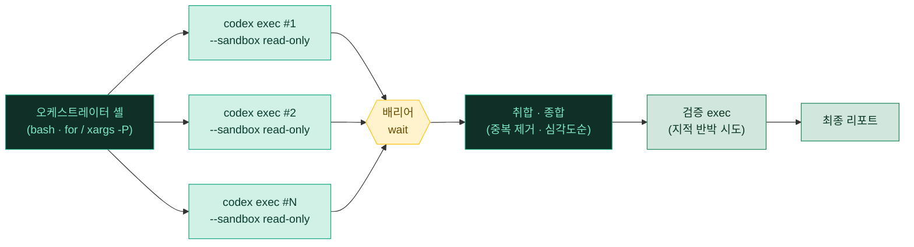
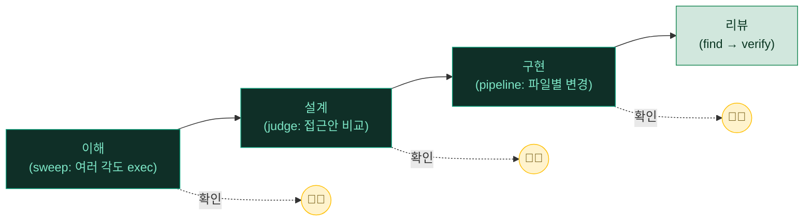

# 09. 서브에이전트 & 병렬 실행

> 큰 작업을 한 세션이 통째로 짊어지는 대신, 여러 프로세스·서브에이전트로 **분산·검증·종합**하는 계층입니다. 단, Codex에는 이걸 코드로 못 박아 주는 1급 오케스트레이터가 없습니다 — **셸(bash)이 그 자리를 대신합니다.**

---

## 🧭 한눈에 보기

| 항목 | 내용 |
|---|---|
| 🎯 목적 | 단일 컨텍스트로는 버거운 작업을 여러 갈래로 쪼개 동시에 처리하고 결과를 합칩니다 |
| 🛠️ 도구 | **`codex exec` 팬아웃**(셸 병렬) + 대화형 서브에이전트(`/agent`·`/subagents`) + `/plan`·`/goal` |
| 🔀 제어 흐름 | Claude Code의 Workflow 같은 도구는 없음 → **bash 루프·`wait`·`xargs -P`**로 직접 명시 |
| ⚠️ 비용 | 병렬 프로세스 수만큼 토큰·API 사용량이 곱해집니다 — 필요할 때만 |
| 🔒 안전 | 병렬 headless는 승인이 항상 `never` → **반드시 read-only 또는 격리 워크스페이스** |

---

## 🤔 무엇인가 — 정직한 출발점

솔직하게 짚고 갑니다. **Codex에는 Claude Code의 Workflow/Task 같은 "결정적(deterministic) 멀티에이전트 오케스트레이터"가 없습니다.** 몇 개의 에이전트를 띄우고 결과를 어떻게 합칠지 코드로 못 박아 주는 1급 도구가 기본 제공되지 않는다는 뜻입니다.

대신 Codex는 **세 개의 실전 축**으로 같은 목적지에 도달합니다.

| 축 | 무엇 | 어디서 |
|---|---|---|
| 🐚 **`codex exec` 팬아웃** | 여러 프롬프트를 병렬 프로세스로 띄워 리뷰·리서치·마이그레이션을 분산 | **셸(bash)** — 이 문서의 핵심 |
| 🧵 **대화형 서브에이전트** | 하나의 TUI 세션 안에서 보조 에이전트 스레드를 띄우고 전환 | `/agent`·`/subagents`, 훅 `SubagentStart`/`SubagentStop` |
| 🗺️ **계획 구조화** | 작업을 목표·단계로 먼저 구조화한 뒤 실행 | `/plan`(플랜 모드), `/goal`(목표 설정) |

여기서 "결정적"이 핵심입니다. 일반 에이전트 호출은 모델이 매 단계 무엇을 할지 스스로 판단하지만, 팬아웃 스크립트는 **"몇 개의 `codex exec`를 띄우고, 그 출력을 어떻게 모으고, 언제 멈출지"를 bash가 못 박습니다.** 제어 흐름은 셸이 보장하고, 각 단계의 판단만 모델에게 맡기는 구조입니다.

### 언제 쓰나

| 동기 | 설명 | 대표 상황 |
|---|---|---|
| 🔍 **포괄성** | 코드베이스를 여러 관점으로 동시에 훑어야 할 때 | 보안·성능·스타일을 각기 다른 `codex exec`가 병렬 점검 |
| ✅ **확신** | 독립적 검증·반론으로 결과를 확정해야 할 때 | 첫 exec의 지적을 두 번째 exec가 반박 시도 |
| 📦 **규모** | 한 컨텍스트에 안 들어가는 대규모 작업 | 마이그레이션·감사·전수 리뷰(파일 수백 개) |

> [!NOTE]
> 위 세 가지는 모두 **"단일 세션으로는 한계가 명확한"** 상황입니다. 한 세션의 컨텍스트 창은 유한하고(→ [06. 추론 강도 & 컨텍스트 관리](06-reasoning-context.md)), 한 관점으로 훑으면 사각지대가 생기며, 스스로 낸 결론은 스스로 반박하기 어렵습니다. 팬아웃은 이 세 한계를 **프로세스 분산**으로 푸는 도구입니다.

---

## 🐚 codex exec 팬아웃 — 실무의 핵심

`codex exec`는 비대화(headless) 실행이라 **진행상황은 stderr, 최종 메시지만 stdout**으로 나옵니다. 즉 리다이렉트·파이프에 그대로 태울 수 있어 병렬화의 최소 단위가 됩니다. 파일 목록을 여러 프로세스로 나눠 던지고, `wait`으로 모은 뒤, 마지막 exec에 취합을 맡기는 것이 기본 골격입니다.

```bash
#!/usr/bin/env bash
# review-fanout.sh — 변경 파일들을 여러 codex exec로 병렬 리뷰 후 취합
set -euo pipefail

OUT="$(mktemp -d)"
FILES="$(git diff --name-only origin/main...HEAD)"

# 1) 팬아웃 — 파일마다 read-only headless 리뷰를 백그라운드로 띄운다
for f in $FILES; do
  codex exec --sandbox read-only \
    "$f 파일만 보고 정확성·보안 이슈를 bullet로. 확신 없으면 '불확실'로 표기." \
    > "$OUT/$(echo "$f" | tr '/' '_').md" 2>/dev/null &
done

# 2) 배리어 — 모든 백그라운드 프로세스 종료 대기
wait

# 3) 취합 — 개별 리포트를 하나로 모아 최종 종합 exec에 넘긴다
cat "$OUT"/*.md | codex exec --sandbox read-only \
  "아래 파일별 리뷰들을 중복 제거하고 심각도순으로 종합하라."
```

파일이 수백 개면 무한정 `&`로 띄우지 말고 **동시 실행 수를 제한**하세요. `xargs -P`가 가장 간단합니다.

```bash
# 동시 4개까지만 — 각 파일을 read-only exec로 리뷰
printf '%s\n' $FILES | xargs -P 4 -I{} sh -c \
  'codex exec --sandbox read-only "{} 파일의 이슈를 bullet로" > "'"$OUT"'/$(echo {} | tr / _).md" 2>/dev/null'
```

### 🗺️ 흐름을 그림으로

오케스트레이터 셸이 파일 목록을 N개의 `codex exec`로 팬아웃하고, `wait` 배리어에서 모은 뒤, 취합·검증 단계로 좁혀 내려갑니다.



> [!WARNING]
> **병렬 headless는 승인 프롬프트가 없습니다.** `codex exec`의 승인 정책은 항상 `never`라, 여러 프로세스를 동시에 돌리면 아무도 "이거 실행할까요?"라고 묻지 않습니다. 그러므로 팬아웃은 **반드시 다음 둘 중 하나**여야 합니다.
> - `--sandbox read-only` — 파일 읽기만, 쓰기·네트워크 차단(리뷰·리서치·감사에 적합).
> - 쓰기가 필요하면 **프로세스마다 격리된 워크스페이스**(예: 파일별 `git worktree`나 별도 복제 디렉터리)에서 `--sandbox workspace-write`. 같은 디렉터리에 여러 exec가 동시에 쓰면 서로의 변경을 덮어씁니다.
>
> 절대로 여러 exec를 `--dangerously-bypass-approvals-and-sandbox`(`--yolo`)로 병렬 실행하지 마세요. 승인 계층 상세는 [01. 샌드박스·승인·훅](01-sandbox-approvals.md) 참고.

> [!TIP]
> **검증 단계(find → verify)를 한 겹 더 얹으면 오탐이 줄어듭니다.** 첫 exec가 이슈 후보를 뽑고, 그 후보를 **처음 보는 두 번째 exec**가 코드로 다시 검증해 반박에 실패한 것만 남깁니다. 단일 세션은 자기 지적을 스스로 의심하기 어렵지만, 프로세스를 분리하면 "그럴듯하지만 틀린" 지적을 걸러낼 수 있습니다.
>
> ```bash
> # find → verify: 두 번째 exec에는 '근거'가 아니라 코드 위치만 넘긴다
> issues="$(codex exec --sandbox read-only 'src/auth.ts의 취약점 후보를 파일:라인과 함께 나열')"
> printf '%s\n' "$issues" | codex exec --sandbox read-only \
>   '다음 각 지적을 코드로 직접 재검증해 진짜만 남겨라. 근거는 스스로 다시 확인할 것.'
> ```
>
> 핵심 주의: 검증자에게 원래 지적의 "근거"를 통째로 넘기면 그대로 수긍해 버립니다. **코드 위치만 주고 독립적으로 재판단**하게 해야 검증의 의미가 삽니다.

<details>
<summary>📖 팬아웃으로 옮겨온 대표 패턴 4가지</summary>

| 패턴 | 무엇 | codex exec로는 |
|---|---|---|
| 🔎➡️✅ **find → verify** | 발견 이슈를 독립 검증자가 반박, 살아남은 것만 확정 | exec 2단(발견 → 검증) 파이프 |
| ⚖️ **judge panel** | N개 독립 접근을 만들고 병렬 채점 후 종합 | 접근별 exec 팬아웃 → 채점 exec |
| 🔁 **loop-until-dry** | 새 발견이 K회 연속 0건일 때까지 반복 | bash `while` + 카운터 + 상한 |
| 🌐 **multi-modal sweep** | 서로 다른 검색 각도의 에이전트 병렬 | 각도별 프롬프트를 각 exec에 배정 |

- **judge panel** — 채점 기준(rubric)을 프롬프트에 명시하지 않으면 채점자마다 잣대가 달라 종합이 무의미해집니다.
- **loop-until-dry** — 종료 조건이 느슨하면 무한히 돕니다. `K`값과 **최대 반복 상한**을 함께 두세요(`--ephemeral`로 세션 미저장 권장).
- **multi-modal sweep** — 각도가 겹치면 같은 결과만 중복 수집됩니다. 호출 그래프·문자열 패턴·타입 시그니처처럼 **직교하는** 각도를 의도적으로 배정하세요.

</details>

---

## 🧵 대화형 서브에이전트 & 계획

셸 팬아웃이 "배치·자동화"라면, 대화형 TUI 안에서도 보조 에이전트를 다룰 수 있습니다. 탐색·설계처럼 빠른 반복이 중요한 초기 단계에 어울립니다.

| 도구 | 용도 |
|---|---|
| `/agent`·`/subagents` | 활성 에이전트 스레드를 띄우거나 전환 |
| `/plan` | 플랜 모드로 전환 — 실행 전에 단계를 먼저 세움 |
| `/goal` | 현재 작업의 목표를 설정·편집 |
| 훅 `SubagentStart` / `SubagentStop` | 서브에이전트 시작·종료 시점에 개입(로깅·정책 검사 등) |

> [!NOTE]
> `SubagentStart`/`SubagentStop`은 훅 이벤트로 실제 존재하지만, 훅 시스템 자체가 신규·문서화가 덜 된 영역입니다. 본인 Codex 버전에서 `codex --help` 또는 `/hooks`로 지원 여부를 먼저 확인하세요(버전에 따라 다를 수 있음). 훅 등록 방법은 [01. 샌드박스·승인·훅](01-sandbox-approvals.md) 참고.

> [!TIP]
> 대규모 변경 전에는 `/plan`으로 단계를 먼저 세우고 `/goal`로 목표를 고정한 뒤 팬아웃으로 내려가는 흐름이 안전합니다. 계획을 사람이 한 번 확인하고 나면, 잘못된 방향으로 수십 개 프로세스를 굴리는 사고를 막을 수 있습니다.

---

## 🚫 언제 쓰지 말아야 하나

팬아웃은 프로세스 수만큼 토큰·API를 곱해 씁니다. **명확한 규모·확신·포괄성 사유가 있을 때만** 꺼내세요. 일반 작업은 단일 `codex` 세션이나 인라인으로 충분합니다.

> [!WARNING]
> 다음 신호가 보이면 팬아웃을 **꺼내지 마세요**. 비용 대비 효용이 거의 없거나 오히려 손해입니다.
>
> | 🚩 신호 | 더 나은 선택 |
> |---|---|
> | 사용자가 병렬화를 요청하지 않음 | 단일 세션 또는 인라인 처리 |
> | 한 컨텍스트에 충분히 들어가는 작업 | 그냥 대화형 `codex`로 직접 |
> | 단계 간 강한 의존(앞 결과로 다음을 정함) | 순차 exec가 더 단순·안전 |
> | 빠른 반복·탐색이 중요한 초기 단계 | 대화형 단일 세션 |
> | 토큰·시간 예산이 빠듯함 | 분산의 고정 오버헤드가 부담 |

> [!CAUTION]
> "혹시 빠를까?" 하는 막연한 기대로 모든 작업을 팬아웃에 태우는 것은 안티패턴입니다. 프로세스 기동·출력 직렬화·취합에는 고정 비용이 있어, 작은 작업에서는 단일 세션보다 **느리고 비쌉니다.** 게다가 병렬 exec는 승인 없이 도니, 잘못 설계하면 실수도 병렬로 커집니다. 분명한 사유가 있을 때만 정당화됩니다.

---

## ✂️ 작은 단위로 끊어 쓰기

대형 작업은 한 번에 거대한 스크립트로 짜기보다, **이해 → 설계 → 구현 → 리뷰**를 각각의 팬아웃/세션으로 순차 실행하고 사이사이 결과를 확인하며 진행하는 게 안전합니다.



> [!IMPORTANT]
> 단계 사이마다 사람이 결과를 확인하는 **체크포인트(🧑‍💻)**를 두면, 잘못된 방향으로 프로세스를 더 굴리기 전에 멈출 수 있습니다. 특히 구현 단계는 read-only가 아니라 쓰기가 일어나므로, 구현 팬아웃은 **파일·모듈별로 겹치지 않게** 나누고(격리 워크스페이스) 결과를 한 번 검토한 뒤 병합하세요. "한 번에 다 짠다"보다 "작게 끊고 자주 확인한다"가 비용·안전 양쪽에서 유리합니다.

<details>
<summary>🧱 단계별로 어떤 패턴을 얹으면 좋은가</summary>

| 단계 | 어울리는 패턴 | 이유 |
|---|---|---|
| 이해 | 🌐 multi-modal sweep | 여러 각도로 훑어 사각지대를 줄임 (모두 read-only) |
| 설계 | ⚖️ judge panel | 후보 접근안을 넓게 펼쳐 비교 |
| 구현 | 🟢 pipeline | 파일·모듈별 독립 변경을 빠르게 흘림 (격리 워크스페이스) |
| 리뷰 | 🔎➡️✅ find → verify | 지적을 독립 검증해 오탐 제거 (read-only) |

자동화 루틴으로 엮는 방법(예: 야간 리뷰 팬아웃을 cron으로)은 [04. 자동 루틴](04-automation.md)을, 팬아웃 결과를 팀과 공유하는 config·프로필 관리는 [07. config.toml · 프로필 · 백업](07-config-backup.md)을 참고하세요.

</details>

---

## 📎 참고

이 영역은 Codex 버전·환경에 따라 가용성이 다릅니다(`/agent`·`/subagents`·훅은 신규 기능). 기본 작업에는 과합니다 — "포괄적 감사", "대규모 마이그레이션"처럼 규모·확신이 필요할 때 꺼내는 도구로 두세요.

> [!NOTE]
> `codex exec` 팬아웃은 별도 기능 활성화가 필요 없는 **순수 셸 패턴**이라 가장 이식성이 높습니다. 반면 대화형 서브에이전트·훅은 버전에 따라 없을 수 있으니, 보이지 않으면 `codex --help`로 먼저 확인하세요. 어느 쪽이든 이 문서가 거듭 강조하듯 **병렬 실행은 "꺼내 쓰는 무거운 도구"이지 기본값이 아닙니다.** Windows에서는 WSL2 안에서 동일하게 동작합니다.

---

<div align="center">

[⬅️ 이전: 08. 양 머신 동기화](08-sync-infra.md) · [🏠 목차](../README.md) · [다음: 10. 확장 생태계 ➡️](10-ecosystem.md)

</div>
