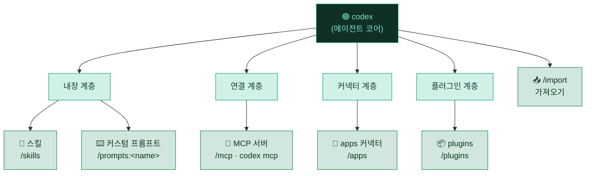

# 🧩 10. 확장 생태계 — skills · MCP · apps · plugins

> Codex의 능력을 늘리는 방법은 하나가 아닙니다. **절차를 캡슐화**하는 스킬, **외부 시스템을 조작**하는 MCP, **서비스를 연결**하는 커넥터(apps), 그리고 **묶음으로 배포**되는 플러그인 — 계층마다 역할과 켜는 방법이 다릅니다. 이 문서는 그 지도를 그립니다.

---

## 🗺️ 개념 — Codex 확장 4계층

Codex의 확장 수단은 "어디까지 손을 뻗느냐"로 나누면 이해가 쉽습니다. 안쪽은 Codex가 스스로 따르는 **절차·설정**, 바깥쪽은 Codex가 붙는 **외부 시스템·배포 단위**입니다.

| 계층 | 슬래시 | 무엇인가 | 손이 닿는 범위 |
|---|---|---|---|
| 🧠 **내장** | `/skills`, `/prompts:<name>` | 작업 절차·재사용 프롬프트를 파일로 캡슐화 | Codex 내부 (내 규칙) |
| 🔌 **연결(MCP)** | `/mcp` | 외부 도구·데이터를 툴로 노출 | 로컬 프로세스·원격 서버 |
| 🧩 **커넥터(apps)** | `/apps` | 서드파티 서비스를 계정 단위로 연결 | 인증된 SaaS 커넥터 |
| 📦 **플러그인** | `/plugins` | 위 요소를 한 묶음으로 설치·발견 | 배포 패키지 |
| 📥 **가져오기** | `/import` | 기존 셋업·최근 대화를 끌어오기 | 다른 툴·과거 세션 |

> [!NOTE]
> 이 네 계층은 서로 배타적이지 않습니다. 하나의 플러그인이 스킬 + MCP 커넥터를 함께 담을 수도 있고, MCP 서버 하나를 `/apps` 커넥터로 로그인해 쓸 수도 있습니다. 계층은 "**켜는 창구**"의 구분이라고 보는 편이 정확합니다.

### 확장 계층 지도



---

## 🧭 무엇을 언제 쓰나

가장 자주 헷갈리는 지점입니다. "이 일을 스킬로 만들까, MCP로 붙일까?"를 아래 기준으로 가르세요.

| 도구 | 핵심 질문 | 대표 예 | 어디서 관리 |
|---|---|---|---|
| 🧠 **스킬** | "이 **절차**를 반복하나?" | 일일 보고 작성, PR 리뷰 체크리스트 | `.agents/skills/*/SKILL.md` |
| ⌨️ **커스텀 프롬프트** | "이 **한 방 명령**을 자주 치나?" | `/prompts:review` (deprecated → 스킬 권장) | `~/.codex/prompts/*.md` |
| 🔌 **MCP** | "외부 **시스템을 조작**해야 하나?" | 라이브러리 문서 조회, 브라우저 자동화 | `[mcp_servers.*]` |
| 🧩 **apps(커넥터)** | "특정 **SaaS 계정**에 로그인해 붙나?" | GitHub·Figma·이슈 트래커 연결 | `/apps` (계정 인증) |
| 📦 **플러그인** | "여러 요소를 **한 번에** 깔고 싶나?" | 팀 공통 워크플로 번들 | `/plugins` |
| ⚙️ **프로필** | "모델·승인·샌드박스 **묶음**을 전환하나?" | 읽기전용 ↔ 자동 모드 | `[profiles.*]` |

> [!TIP]
> **판단 규칙 한 줄**: *내가 할 일의 순서*가 핵심이면 스킬, *외부 무언가를 건드리는 것*이 핵심이면 MCP/커넥터, *설정 자체를 갈아끼우는 것*이 핵심이면 프로필입니다.

---

## 🧠 내장 계층 — 스킬 & 커스텀 프롬프트

Codex에 **기본으로 들어있는** 확장 수단입니다. 외부 연결 없이, 파일 몇 개로 동작을 바꿉니다.

<details>
<summary>🧠 <b>스킬(Skills)</b> — 작업 절차 캡슐화 (펼치기)</summary>

- 위치: 프로젝트 `.agents/skills`(cwd→레포 루트로 스캔, 중첩 OK) 및 `<repo>/.codex/skills`, 사용자 `~/.agents/skills`, 레거시 `~/.codex/skills`(하위호환), 관리자 `/etc/codex/skills`.
- 형식: `SKILL.md` = YAML frontmatter(`name`, `description` 필수) + Markdown 절차 본문. 선택 폴더 `scripts/`·`references/`·`assets/`.
- 호출: 명시적(`$skill` 참조 또는 `/skills` UI) 또는 암시적(작업이 `description`과 매칭되면 Codex가 자동 선택).

```markdown
---
name: daily-report
description: 하루 작업을 회고해 일일 보고 마크다운을 생성할 때 발동
---

1. `git log --since=midnight` 로 오늘 커밋 수집
2. 변경 파일을 기능 단위로 묶어 요약
3. `## 오늘 한 일` 형식으로 정리
```

자세한 내용과 예시는 → [02-skills.md](02-skills.md), 실전 스킬은 → [../examples/skills/daily-report/SKILL.md](../examples/skills/daily-report/SKILL.md)

</details>

<details>
<summary>⌨️ <b>커스텀 프롬프트</b> — 재사용 슬래시 명령 (deprecated) (펼치기)</summary>

- 위치: `~/.codex/prompts/*.md`. 파일명이 곧 명령 이름, `/prompts:<name>` 로 호출.
- 인자: `$1`~`$9`, `$ARGUMENTS`, 명명형 `$FILE`(대문자, `FILE=값` 전달). frontmatter `description`/`argument-hint`.
- 세션 시작 시 로드 → 추가·편집 후 **재시작** 필요.

> [!WARNING]
> 커스텀 프롬프트는 **현재 docs에서 deprecated**입니다. 재사용 절차는 **스킬로 만드는 것을 권장**합니다. 신규 자동화는 스킬로 시작하세요.

예시(마이그레이션 안내 포함) → [../examples/prompts/review.md](../examples/prompts/review.md)

</details>

---

## 🔌 연결 계층 — MCP (로컬 · 원격)

외부 도구·데이터를 **툴**로 노출하는 표준 프로토콜입니다. "Codex가 스스로 못 하는 일"을 붙이는 자리입니다.

| 유형 | 필수 키 | 예 | 쓰임 |
|---|---|---|---|
| 🖥️ **로컬(stdio)** | `command` | `npx -y @upstash/context7-mcp` | 로컬 프로세스로 실행되는 도구 |
| 🌐 **원격(HTTP)** | `url` | `https://mcp.figma.com/mcp` | 인증 토큰으로 붙는 원격 서버 |

```toml
# 로컬 stdio 서버
[mcp_servers.context7]
command = "npx"
args = ["-y", "@upstash/context7-mcp"]
env_vars = ["LOCAL_TOKEN"]

# 원격 streamable HTTP 서버
[mcp_servers.figma]
url = "https://mcp.figma.com/mcp"
bearer_token_env_var = "FIGMA_OAUTH_TOKEN"
startup_timeout_sec = 20
```

CLI로도 추가·조회합니다.

```bash
codex mcp add context7 -- npx -y @upstash/context7-mcp   # stdio 추가
codex mcp add figma --url https://mcp.figma.com/mcp \
  --bearer-token-env-var FIGMA_OAUTH_TOKEN               # HTTP 추가
codex mcp list                                           # 구성된 서버 목록
```

> [!TIP]
> Codex **자체를 MCP 서버로** 노출하려면 `codex mcp-server`(stdio)를 씁니다. 다른 에이전트가 Codex를 하나의 툴처럼 부를 수 있습니다.

MCP 전반(키·인증·툴 필터링)은 → [05-mcp.md](05-mcp.md)

---

## 🧩 커넥터 계층 — `/apps`

`/apps`는 **서드파티 서비스를 계정 단위로 연결**하는 커넥터 창구입니다. MCP가 "프로토콜 배관"이라면, 커넥터는 그 배관 위에 **로그인·권한**을 얹은 사용자 경험입니다.

- `/apps`: 사용 가능한 커넥터를 보고 로그인/해제합니다.
- 인증이 필요한 원격 MCP 서버는 `codex mcp login <name>` / `codex mcp logout <name>` 로 토큰 수명주기를 관리합니다.

> [!NOTE]
> `/apps` 커넥터 카탈로그는 **발전 중인 영역**입니다. 어떤 커넥터가 노출되는지는 Codex 버전·계정 플랜에 따라 다를 수 있음 → 본인 환경에서 `/apps`로 실제 목록을 확인하세요.

---

## 📦 플러그인 계층 — `/plugins`

`/plugins`는 스킬·커넥터·설정 등을 **한 묶음으로 설치·발견**하는 배포 단위입니다. "앱 스토어에서 앱 하나 깔듯" 여러 확장 요소를 한 번에 얻는 경로입니다.

- `/plugins`: 설치 가능한 플러그인을 **발견**하고, 설치/제거합니다.
- 플러그인 하나가 여러 계층(스킬 + MCP 커넥터 + 프롬프트)을 동시에 담을 수 있습니다.

> [!IMPORTANT]
> 플러그인/커넥터 생태계는 **아직 정착 중인 신흥 기능**입니다. 이 문서는 "이런 창구가 있다"까지만 정직하게 안내하며, 구체적 카탈로그·설치 문법은 **버전에 따라 다를 수 있음**. 반드시 본인 Codex에서 `/plugins`·`/apps`로 실제 동작을 확인하세요.

> [!WARNING]
> 플러그인은 **훅·스크립트 등 임의 코드를 실행**할 수 있습니다. 외부(특히 비공식) 플러그인을 켜기 전에:
> - 📜 저장소 **라이선스**가 본인·조직 정책에 맞는지 확인
> - 🔎 **소스를 직접 확인**하고 신뢰할 수 있는 **버전(태그/커밋) 고정**
> - 🔐 설정에 **토큰·키 실제 값 직접 기입 금지** (환경변수·`<placeholder>` 분리)

---

## 📥 가져오기 — `/import`

이미 다른 툴에서 세팅해 둔 것이 있다면 처음부터 다시 만들 필요가 없습니다.

- `/import`: **Claude Code 셋업·프로젝트 파일·최근 채팅**을 Codex로 끌어옵니다.
- 마이그레이션 시 기존 규칙을 AGENTS.md로, 재사용 절차를 스킬로 옮기는 출발점이 됩니다.

> [!TIP]
> 다른 툴의 `CLAUDE.md` 성격 규칙은 Codex의 `AGENTS.md`에 대응됩니다. `/import` 후 → [03-memory.md](03-memory.md)에서 AGENTS.md 조립 규칙을 확인해 정리하세요.

---

## ⚙️ 묶음 on/off — 프로필 + config

"어떤 확장을 언제 켜느냐"는 결국 **config.toml**과 **프로필**로 수렴합니다. MCP 서버·도구는 config에서 개별 토글하고, 모델·승인·샌드박스 같은 **운영 묶음**은 프로필로 전환합니다.

```toml
# 개별 MCP 서버·도구 토글
[mcp_servers.context7]
command = "npx"
args = ["-y", "@upstash/context7-mcp"]
enabled = true
disabled_tools = ["expensive_tool"]

# 운영 묶음을 이름으로 — codex --profile <name>
[profiles.readonly]
approval_policy = "untrusted"
sandbox_mode = "read-only"

[profiles.auto]
approval_policy = "on-request"
sandbox_mode = "workspace-write"
```

```bash
codex --profile readonly    # 조사·리뷰용 안전 묶음
codex --profile auto        # 워크스페이스 자동 실행 묶음
```

> [!NOTE]
> 확장을 **레포별로** 다르게 켜고 싶으면 프로젝트 `.codex/config.toml`(신뢰된 프로젝트)을 두면 됩니다. 설정 우선순위·백업은 → [07-config-backup.md](07-config-backup.md)

<details>
<summary>💡 <b>운영 팁</b> — "소스는 넓게, 활성은 좁게" (펼치기)</summary>

- MCP 서버·플러그인은 **등록만 해두고** 필요할 때 `enabled`로 켜는 운영이 편합니다. 등록 자체는 거의 비용이 없습니다.
- 상시 켜 두는 것은 **매 세션 실제로 쓰는 것**으로 최소화하세요. 툴이 많을수록 컨텍스트·지연이 늘어납니다.
- 실제로 무엇이 켜져 있는지는 → [11-inventory.md](11-inventory.md)의 커버리지 맵에서 한눈에 확인하세요.

</details>

---

## 🔗 관련 문서

| 주제 | 문서 |
|---|---|
| 🧠 스킬 만들기·발동 | [02-skills.md](02-skills.md) |
| 🔌 MCP 서버 상세 | [05-mcp.md](05-mcp.md) |
| ⚙️ config·프로필·백업 | [07-config-backup.md](07-config-backup.md) |
| 🗺️ 실제 활성 목록 | [11-inventory.md](11-inventory.md) |

---

<div align="center">

[⬅️ 이전: 09. 서브에이전트 & 병렬 실행](09-subagents.md) · [🏠 목차](../README.md) · [다음: 11. 전체 인벤토리 ➡️](11-inventory.md)

</div>
