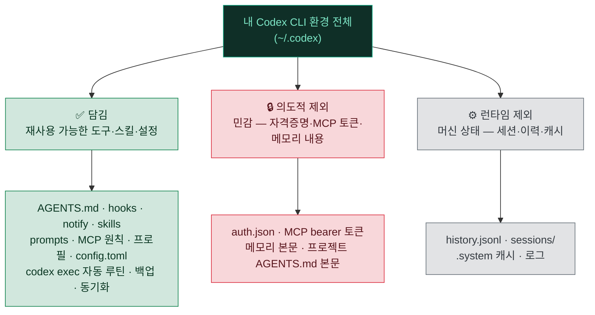

# 🗺️ 11. 전체 인벤토리 & 커버리지 맵

> **"내 Codex 셋업 전부가 여기 담겼나?"** 에 대한 정직한 답입니다.
> `~/.codex/`의 모든 구성요소를 ✅ 담김 / 🔒 의도적 제외(민감) / ⚙️ 런타임 제외(상태) 로 분류해 빠짐없이 매핑합니다.

---

## 🎯 한 줄 요약

이 저장소는 **재사용 가능한 도구·스킬·설정 패턴은 모두 담고**, **개인·회사에 종속된 민감 자산과 머신 런타임 상태는 의도적으로 뺐습니다.** 즉 "방법론과 도구"는 전부, "내 데이터와 비밀"은 전혀.

---

## 📋 `~/.codex/` 구성요소별 커버리지

| 구성요소 | 처리 | 위치 / 사유 |
|---|:---:|---|
| `config.toml` (전역 설정) | ✅ 담김 | [examples/config.toml](../examples/config.toml) · [07](07-config-backup.md) |
| `AGENTS.md` (전역 지침) | ✅ 담김 | [examples/AGENTS.md.example](../examples/AGENTS.md.example) · [03](03-memory.md) |
| `hooks.json` / `[hooks]` (라이프사이클 훅) | ✅ 담김 | [examples/hooks/](../examples/hooks) · [01](01-sandbox-approvals.md) |
| `notify` (턴 완료 외부 알림) | ✅ 담김 | [examples/notify.py](../examples/notify.py) · [01](01-sandbox-approvals.md) |
| `skills/` · `~/.agents/skills` (스킬) | ✅ 담김 | [examples/skills/](../examples/skills) · [02](02-skills.md) |
| `prompts/` (커스텀 프롬프트, deprecated) | ✅ 담김 | [examples/prompts/](../examples/prompts) · [02](02-skills.md) |
| `[profiles.*]` (모델·승인·샌드박스 묶음) | ✅ 담김 | [07](07-config-backup.md) (프로필 설계) |
| MCP 서버 **목록/원칙** | ✅ 담김 | [05](05-mcp.md) |
| `sandbox_mode` · `approval_policy` (안전 계층) | ✅ 담김 | [01](01-sandbox-approvals.md) (프리셋·`/permissions`) |
| `model_reasoning_effort` · `/compact` (컨텍스트) | ✅ 담김 | [06](06-reasoning-context.md) |
| `codex exec` 자동 루틴 (cron) | ✅ 담김 | [examples/scheduled-tasks/](../examples/scheduled-tasks) · [04](04-automation.md) |
| 메모리 **구조/규칙** (`/memories`) | ✅ 담김 | [03](03-memory.md) (형식·우선순위·인덱스) |
| 메모리 **본문 내용** | 🔒 제외 | 회사·프로젝트 사실 → 민감 |
| 프로젝트 `AGENTS.md` **본문** | 🔒 제외 | 실제 레포·경로·규약 포함 (구조만 공유) |
| `auth.json` (로그인 자격증명) | 🔒 제외 | 절대 공유·커밋 금지 |
| MCP **bearer 토큰** (`bearer_token_env_var`) | 🔒 제외 | 머신별 발급 자격증명 |
| 프로젝트 종속 `codex exec` 루틴 | 🔒 제외 | 실제 프로젝트 식별·경로·KPI 포함 |
| `history.jsonl` | ⚙️ 제외 | 입력 이력 (머신 로컬 상태) |
| `sessions/` | ⚙️ 제외 | 세션 런타임 (재개용 기록) |
| `.system` 캐시 · 로그 | ⚙️ 제외 | 캐시·텔레메트리 |

---

## 📦 `examples/` 파일 표 (실제로 담긴 것)

문서에서 참조하는 복붙 가능한 예제 파일들입니다. 모두 `~/.codex/` 기준 상대 경로와 `<...>` placeholder만 쓰도록 정리했습니다.

| 파일 | 처리 | 대응 문서 / 역할 |
|---|:---:|---|
| [examples/config.toml](../examples/config.toml) | ✅ 담김 | [07](07-config-backup.md) — 샌드박스·승인·MCP·프로필 통합 예 |
| [examples/AGENTS.md.example](../examples/AGENTS.md.example) | ✅ 담김 | [03](03-memory.md) — 전역 지침 스캐폴드 |
| [examples/hooks/hooks.json](../examples/hooks/hooks.json) | ✅ 담김 | [01](01-sandbox-approvals.md) — 훅 이벤트 매처 구성 |
| [examples/hooks/guard-bash.py](../examples/hooks/guard-bash.py) | ✅ 담김 | [01](01-sandbox-approvals.md) — `PreToolUse` 위험명령 정책 |
| [examples/hooks/session-context.sh](../examples/hooks/session-context.sh) | ✅ 담김 | [01](01-sandbox-approvals.md) — `SessionStart` 컨텍스트 주입 |
| [examples/notify.py](../examples/notify.py) | ✅ 담김 | [01](01-sandbox-approvals.md) · [04](04-automation.md) — `agent-turn-complete` 핸들러 |
| [examples/skills/daily-report/SKILL.md](../examples/skills/daily-report/SKILL.md) | ✅ 담김 | [02](02-skills.md) — 스킬 형식·frontmatter 예 |
| [examples/prompts/review.md](../examples/prompts/review.md) | ✅ 담김 | [02](02-skills.md) — 커스텀 프롬프트(deprecated 안내) |
| [examples/scheduled-tasks/daily-report.sh](../examples/scheduled-tasks) | ✅ 담김 | [04](04-automation.md) — `codex exec` 일일 루틴 |
| [examples/scheduled-tasks/weekly-report.sh](../examples/scheduled-tasks) | ✅ 담김 | [04](04-automation.md) — 주간 요약 루틴 |
| [examples/scheduled-tasks/crontab.example](../examples/scheduled-tasks) | ✅ 담김 | [04](04-automation.md) — cron 등록 예 |
| [examples/backup-codex-config.sh](../examples/backup-codex-config.sh) | ✅ 담김 | [07](07-config-backup.md) — 설정 백업(민감 파일 제외) |

> [!NOTE]
> 훅·백업·자동 루틴 스크립트는 모두 **bash/python**입니다. Windows에서는 별도 PowerShell 판이 아니라 **WSL2 안에서 동일하게** 실행하면 됩니다. 개인 절대 경로·작업명은 전부 `<...>`로 치환되어 있어 그대로 복사해도 안전합니다.

---

## 🔄 양 머신 동기화 인프라

| 항목 | 처리 | 비고 |
|---|:---:|---|
| 동기화 **패턴·구조** | ✅ 담김 | [08](08-sync-infra.md) (정의/상태 분리·apply 흐름·bootstrap) |
| 동기화 **범위 결정 규칙** | ✅ 담김 | ✅/❌ 표 + "정의는 동기화, 상태는 머신별" |
| 실제 `apply-*` 스크립트 원본 | 🔒 제외 | 개인 저장소 URL·경로 포함 → 패턴만 문서화 |

> [!WARNING]
> 동기화 대상에 `auth.json`·`history.jsonl`·`sessions/`·`.system` 캐시를 **절대 넣지 마세요.** 자격증명 유출과 머신 상태 충돌의 원인입니다. 동기화하는 것은 "정의"(config.toml·AGENTS.md·skills·prompts)뿐입니다. → 상세는 [08](08-sync-infra.md).

---

## 🚫 의도적으로 뺀 것 (그리고 왜)

> [!IMPORTANT]
> 아래는 "빠뜨린" 것이 아니라 **공유 목적상 일부러 뺀** 것입니다. 이 저장소의 목적은 *Codex 셋업에 쓴 도구·방법 공유*이지, *내 데이터·작업물 공개*가 아닙니다.

| 뺀 것 | 이유 |
|---|---|
| 🏢 회사·프로젝트 코드, 프로젝트 `AGENTS.md` 본문 | 기밀. 이 저장소의 공유 대상이 아님 (구조·규약 패턴만 공유) |
| 🧠 메모리 파일 본문 | 회사·프로젝트 사실 포함 (형식·우선순위 규칙만 공유) |
| 🔐 `auth.json`·MCP bearer 토큰 | 보안. 머신마다 직접 로그인·발급이 정석 |
| 🆔 노션/시트 ID, 이메일, 계정명 | 개인·내부 식별자 → `<...>` placeholder 치환 |
| 📅 프로젝트 종속 `codex exec` 루틴 | 실제 경로·KPI·일정 포함 |
| 🗃️ `history.jsonl`·`sessions/`·`.system` 캐시 | 머신 런타임 상태 (공유 무의미·충돌 유발) |

---

## ✅ 그래서, 전부 담겼나?

> [!TIP]
> **재사용 가능한 모든 것은 담겼습니다.** 누군가 이 저장소만 보고도 AGENTS.md·훅·notify·스킬·프롬프트·MCP·프로필·`codex exec` 자동화·백업·동기화 체계를 자기 `~/.codex/`에 그대로 재현할 수 있습니다.
> **개인·회사에 묶인 것은 하나도 담기지 않았습니다.** `auth.json`·MCP 토큰·메모리 내용·프로젝트 코드는 설계상 제외됩니다.

새로 추가한 도구·스킬이 생기면 이 인벤토리에 한 줄 추가하는 것으로 "무엇이 공유 범위에 들어왔는지"를 계속 추적할 수 있습니다.

---

[⬅️ 이전: 10. 확장 생태계](10-ecosystem.md) · [🏠 목차](../README.md) · [🏠 메인으로](../README.md)

